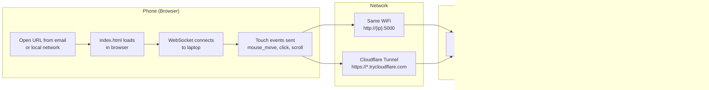
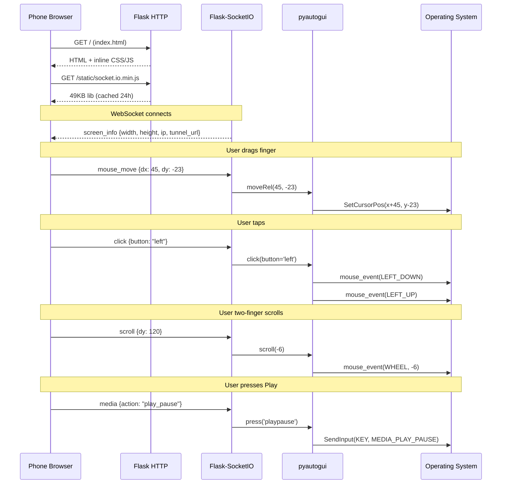
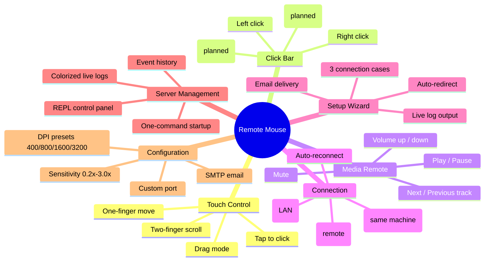
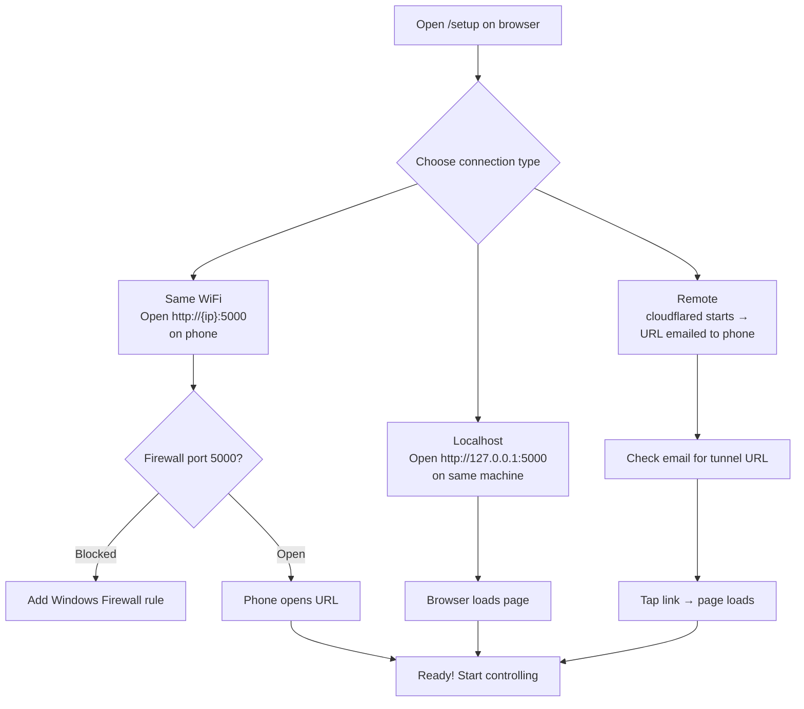

# Remote Mouse

**Author:** learnerforge  
**Version:** v1.0.0  
**License:** MIT

Turn your phone into a wireless mouse and media remote for your laptop. **Zero installation on the phone** — just open a URL in the browser.

---

## Overview

Remote Mouse is a client-server application that lets you control your laptop's mouse cursor and media playback from any phone or tablet with a modern browser. The laptop runs a Python server (Flask + Socket.IO) that receives touch events over WebSocket and translates them into OS-level mouse actions via `pyautogui`.

### How It Works



### Data Flow



---

## Features



| Feature | What it does |
|---------|-------------|
| **Touchpad** | Touch and drag to move cursor. Tap to click. Two-finger scroll. |
| **Left/Right Click** | Dedicated buttons at the bottom for precise clicks. |
| **Drag Mode** | Hold left button while dragging for selections, moving windows. |
| **Media Controls** | Play/Pause, Next/Previous, Volume up/down/mute. |
| **DPI Presets** | 400/800/1600/3200 DPI buttons with real-time switching. |
| **Sensitivity** | Adjustable speed slider (0.2x to 3.0x). |
| **Tunnel URL delivery** | Auto-emails Cloudflare URL to your phone. |
| **Local fallback** | If cloudflared missing, use local network IP directly. |
| **Zero phone setup** | No app store, no installation, no permissions. Just a browser. |
| **Auto-reconnect** | WebSocket reconnects with exponential backoff (1s → 5s max). |
| **Live action log** | All events printed to terminal with colorized output. |
| **Setup wizard** | 3-step `/setup` page: pick case → email → watch logs → go. |
| **REPL control panel** | Interactive terminal with `status`, `log`, `clear`, `help`. |
| **Local socket.io** | 49KB library served from laptop — no CDN, no 3-minute load. |

---

## Project Structure

```
Remote_Mouse/
  src/                    Python source
    server.py               Flask + Flask-SocketIO + pyautogui + cloudflared
    cli.py                  REPL control panel, subprocess manager
    email_service.py        SMTP sender (importable + CLI)
  frontend/               Web frontend
    index.html              Main mouse control (touchpad, media, link)
    setup.html              3-step setup wizard
    static/
      socket.io.min.js      Socket.IO v4.7.5 (49KB, served locally)
  docs/                   Documentation
    ARCHITECTURE.md         System architecture with Mermaid diagrams
    CONFIGURATION.md        Configuration reference with Mermaid diagrams
    PROTOCOL.md             WebSocket protocol with sequence diagrams
    TROUBLESHOOTING.md      Issue resolution with decision trees
    COMPARISON.md           Wired mouse vs Remote Mouse spec comparison
  scripts/                Legacy launchers
    start.ps1               Windows PowerShell launcher
    start.sh                Linux/macOS Bash launcher
  .env.example            SMTP config template (copy to .env)
  AGENTS.md               LLM agent conventions
  requirements.txt        Python dependencies
  events.log              Runtime event log (gitignored)
  .tunnel_url             Cloudflare tunnel URL (gitignored)
```

---

## What You Need

| Requirement | Required | Notes |
|-------------|----------|-------|
| **Python 3.10+** | Yes | Server and CLI runtime |
| **pip packages** | Yes | `flask`, `flask-socketio`, `pyautogui`, `eventlet`, `colorama` |
| **cloudflared** | For remote access | Download from Cloudflare — creates HTTPS tunnel |
| **SMTP account** | For email delivery | Gmail with App Password recommended |
| **Windows Firewall rule** | For LAN access | Port 5000 inbound — auto-suggested by setup wizard |

---

## Quick Start

### 1. Install dependencies

```bash
pip install -r requirements.txt
```

### 2. (Optional) Configure SMTP email

```bash
cp .env.example .env
```

Edit `.env` with your SMTP credentials. For Gmail you need an App Password (enable 2FA → https://myaccount.google.com/apppasswords). See `docs/CONFIGURATION.md` for provider examples.

### 3. Start the server

**Recommended — CLI with control panel:**
```bash
python src/cli.py
```

This starts the server as a subprocess, opens the setup wizard in your browser, and gives you a REPL with colorized live logs.

**Direct server (no CLI):**
```bash
python src/server.py
```

**Using launcher scripts:**
```powershell
# Windows
.\scripts\start.ps1

# Linux/macOS
./scripts/start.sh
```

### 4. Connect your phone

The setup wizard at `http://localhost:5000/setup` walks through 3 cases:



**Manual URL options:**
- **Same WiFi:** `http://{laptop-ip}:5000` (find IP with `ipconfig` / `ip addr`)
- **Remote:** Copy the `https://*.trycloudflare.com` URL from the CLI output
- **Localhost:** `http://127.0.0.1:5000` (same machine)

---

## Use Cases

| Scenario | Why Remote Mouse |
|----------|-----------------|
| **Presentations** | Control slides from across the room. No clicker needed. |
| **Media PC** | Laptop plugged into TV. Phone becomes media remote. |
| **Couch browsing** | Navigate laptop from the sofa without getting up. |
| **Smart TV / Projector** | Laptop as media source, phone as control surface. |
| **Accessibility** | Touch gestures as alternative to physical mouse. |
| **Temporary replacement** | Left your mouse at home? Your phone works. |
| **Remote support** | Control your laptop from another location via tunnel. |

---

## Keyboard Shortcuts (Available via Protocol)

These key combos are supported server-side and can be added to the frontend:

| Action | Keys | pyautogui call |
|--------|------|----------------|
| Switch apps | `Alt+Tab` | `hotkey('alt', 'tab')` |
| Show desktop | `Win+D` | `hotkey('win', 'd')` |
| Task view | `Win+Tab` | `hotkey('win', 'tab')` |
| Lock screen | `Win+L` | `hotkey('win', 'l')` |
| Cancel | `Escape` | `press('esc')` |
| Confirm | `Enter` | `press('enter')` |
| Activate | `Space` | `press('space')` |

---

## Performance

| Scenario | Latency | Notes |
|----------|---------|-------|
| **Same WiFi (local)** | ~5–15 ms | Best experience. Both devices on same network. |
| **Cloudflare tunnel** | ~50–200 ms | Depends on internet speed and distance to Cloudflare edge. |
| **Phone hotspot** | ~30–100 ms | Phone connects to laptop's hotspot. No external network needed. |
| **Different continents** | ~200–500 ms | Tunnel works globally but latency adds up. |

### Why it's fast

- **Local socket.io (49 KB):** Served from laptop's `/static/`. No CDN download over metered connection — saves 3+ minutes on first load.
- **WebSocket-first transport:** Instant bidirectional communication. Falls back to HTTP long-polling only if WebSocket is blocked.
- **pyautogui.PAUSE = 0:** Removes pyautogui's built-in 100ms delay between calls.
- **Client-side sensitivity scaling:** Delta values are pre-scaled on the phone — server only does `moveRel()`.
- **Dead zone filtering:** Movements under 1px are discarded before sending.

---

## Documentation Index

| File | What it covers |
|------|----------------|
| `docs/ARCHITECTURE.md` | System architecture, component diagrams, data flow, threading model |
| `docs/CONFIGURATION.md` | All config options: .env, server settings, frontend tunables, file paths |
| `docs/PROTOCOL.md` | WebSocket event reference, REST API, sequence diagrams |
| `docs/TROUBLESHOOTING.md` | Decision trees for connection, mouse, media, email, tunnel, CLI issues |
| `docs/COMPARISON.md` | 30-spec comparison vs wired mouse with scores and Mermaid charts |

---

## Common Commands

```bash
# Verify code compiles
python -m py_compile src/server.py
python -m py_compile src/cli.py
python -m py_compile src/email_service.py

# Test email config
python src/email_service.py --test

# Send a specific URL via email
python src/email_service.py --send https://tunnel.trycloudflare.com

# Check port usage (Windows)
netstat -ano | findstr :5000
```

---

## Contributing

This project is designed to be minimal and self-contained:
- **Frontend:** Single HTML file, vanilla JS, no build tools
- **Backend:** Three Python files, no database, no auth
- **Dependencies:** Five pip packages + cloudflared binary (optional)

Read `docs/ARCHITECTURE.md` first to understand the data flow, then `docs/PROTOCOL.md` for the WebSocket event system. See `AGENTS.md` for LLM agent conventions if using AI-assisted development.

---

## Version History

| Version | Date | Changes |
|---------|------|---------|
| v5.0.1 | 2026-06 | Two-finger scroll fix, orphan code cleanup, project restructuring |
| v5.0.0 | 2026-06 | Initial full release, all core features |
| v1.0.0 | Current | DPI presets added (400/800/1600/3200) |
| Planned | Future | 120 versions across 30 specs — see `docs/COMPARISON.md` and `version_control.md` |

---

## License

MIT License — see `LICENSE` for details.
