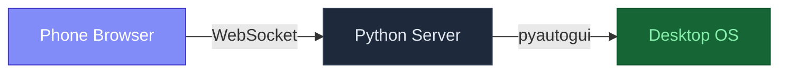
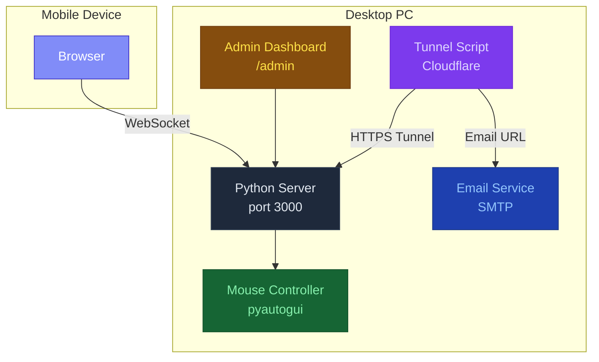
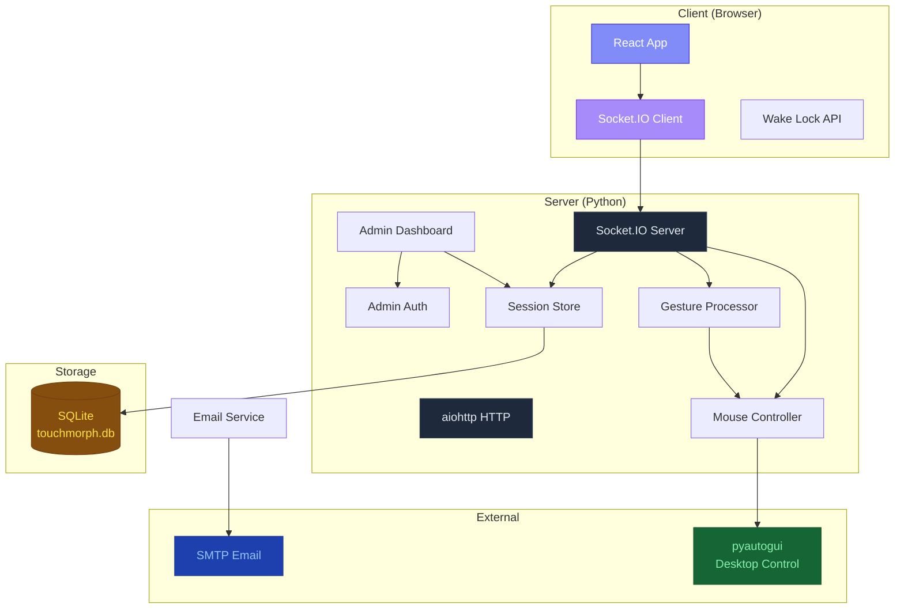
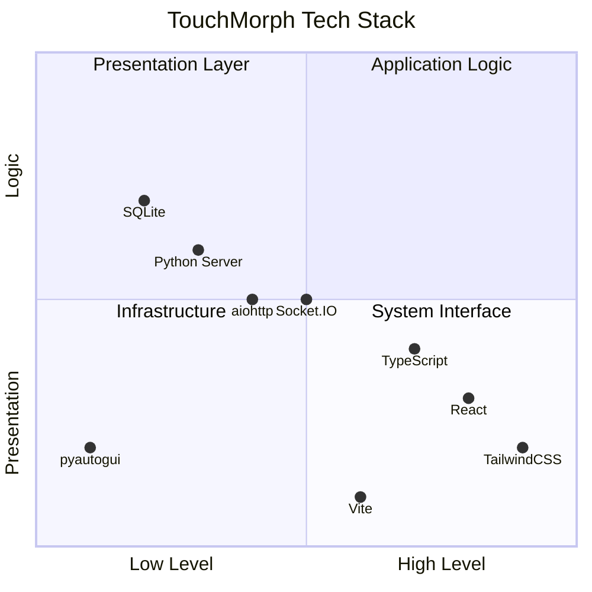
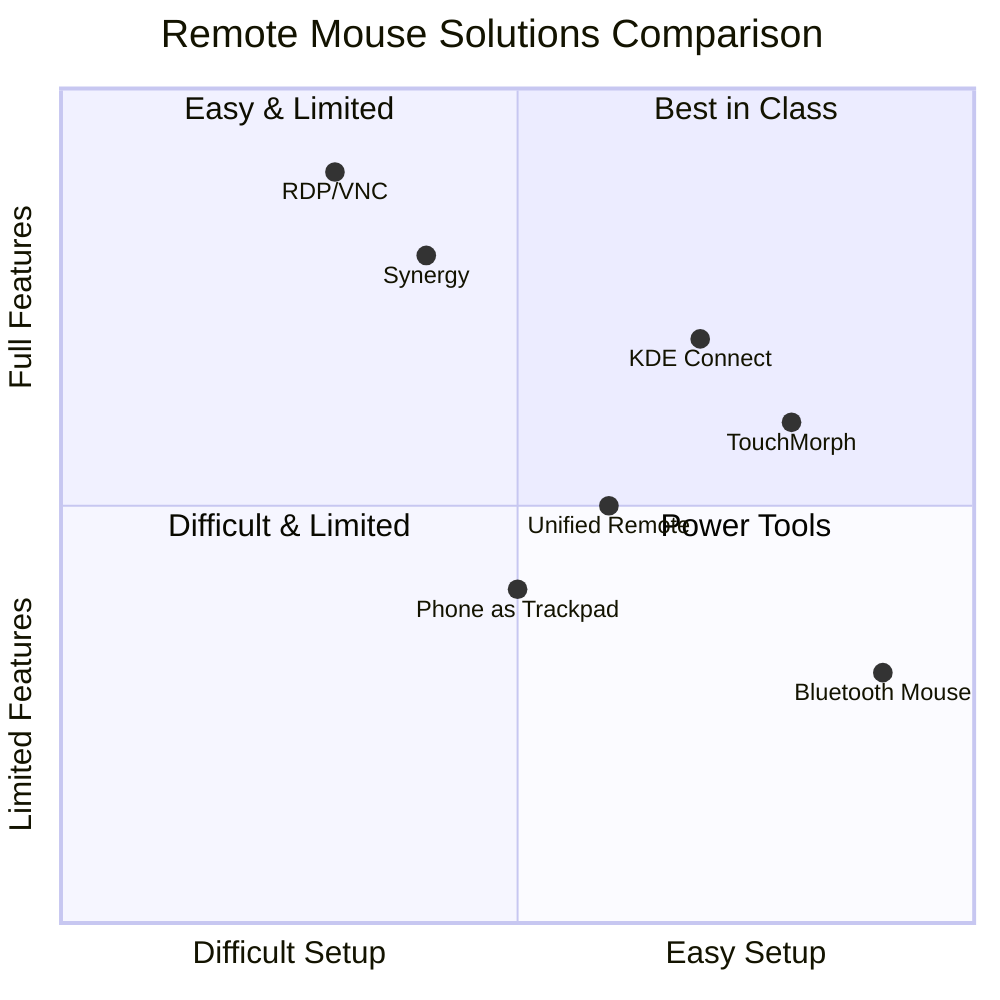
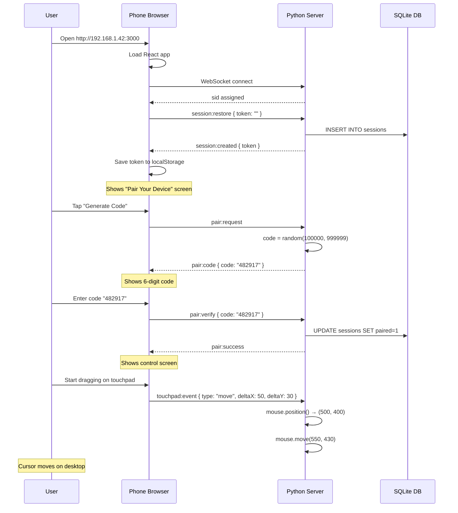
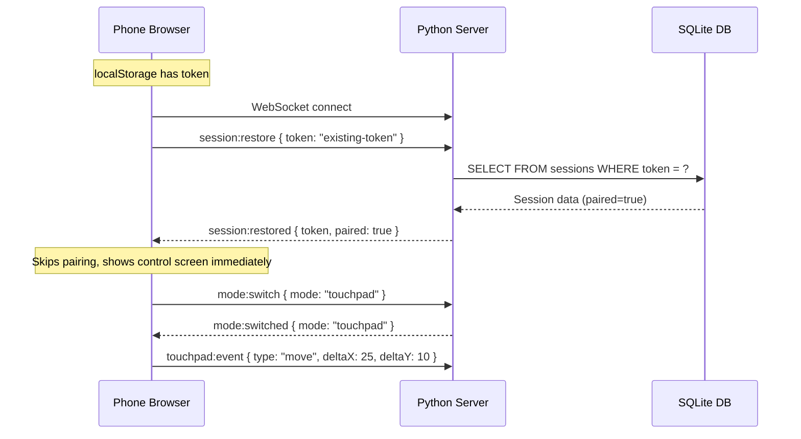

# TouchMorph

Browser-based remote mouse and touchpad. Turn your phone into a wireless input device for your PC — no app installation required.



---

## Features

- **No installation on phone** — works in any modern browser (Chrome, Safari, Firefox)
- **5 input modes** — Mouse, Touchpad, Air Mouse, Presentation, Media Controller
- **Gesture recognition** — pinch-to-zoom, 2F/3F/4F swipes, long-press drag, shake detection
- **Smart Scroll** — momentum-based scrolling with configurable sensitivity and natural scroll
- **Session persistence** — stays paired across page refreshes, background tabs, and network interruptions
- **Secure pairing** — 6-digit code system ensures only authorized devices connect
- **Admin dashboard** — web-based dashboard at `/admin` to monitor connected devices, view event logs, and kick unauthorized devices
- **Audit logging** — structured audit trail with categories, severity levels, IP tracking, and filterable query API
- **Rate limiting + input validation** — 60 events/sec cap, payload type/bounds checking, invalid action rejection
- **Auto-cleanup** — stale sessions purged after 24h, logs trimmed to 1000 rows
- **Graceful shutdown** — notifies connected clients before server stops
- **Admin authentication** — optional password protection for the dashboard
- **HTTPS tunnel** — integrated Cloudflare Tunnel support with email delivery of the tunnel URL
- **Cross-platform** — Python backend runs on Windows, Linux, and macOS



---

## Quick Start

```bash
# 1. Install Python dependencies
pip install -r server/requirements.txt

# 2. Install client dependencies
cd client && npm install && cd ..

# 3. Build the client and start the server
python start.py
```

The terminal shows the URL to open on your phone:

```
[TouchMorph] Connect from another device: http://192.168.1.42:3000
```

Open that URL in your phone's browser. Tap **Generate Code**, then enter the code on your phone to pair.

---

## Requirements

| Component | Requirement |
|-----------|-----------|
| **Python** | 3.10 or later |
| **Node.js** | 18 or later (for client build) |
| **Desktop OS** | Windows, Linux, or macOS |
| **Phone** | Any device with a modern web browser |
| **Network** | Both devices on the same LAN (or Cloudflare Tunnel for remote access) |

---

## Documentation

| File | Content |
|------|---------|
| [wiki/01-Getting-Started.md](wiki/01-Getting-Started.md) | Detailed setup walkthrough with screenshots |
| [wiki/02-Architecture.md](wiki/02-Architecture.md) | System architecture, data flow, and design decisions |
| [wiki/03-API-Reference.md](wiki/03-API-Reference.md) | WebSocket events, HTTP API endpoints, and payload formats |
| [wiki/04-Deployment.md](wiki/04-Deployment.md) | LAN deployment, Cloudflare Tunnel, Docker, systemd |
| [wiki/05-Development.md](wiki/05-Development.md) | Dev mode, project structure, testing, contributing |
| [wiki/06-Troubleshooting.md](wiki/06-Troubleshooting.md) | Common issues, port conflicts, macOS permissions |

---

## Project Structure

```
Remote_Mouse/
├── client/                         # React + Vite + TypeScript frontend
│   ├── dist/                       # Production build (generated)
│   ├── src/
│   │   ├── components/             # Reusable UI components
│   │   │   ├── BottomNav.tsx       # 6-tab navigation bar
│   │   │   └── ...
│   │   ├── hooks/
│   │   │   └── useSocket.ts        # Socket.IO + screen dimensions
│   │   └── pages/
│   │       ├── MouseMode.tsx        # Pointer + clicks + drag
│   │       ├── TouchpadMode.tsx     # Relative move + smart scroll
│   │       ├── AirMouseMode.tsx     # Gyro-based pointer
│   │       ├── PresentationMode.tsx # Slide control + laser pointer
│   │       ├── MediaController.tsx  # Play/pause/vol keys
│   │       └── Settings.tsx         # Sensitivity, gesture ref, about
│   ├── index.html
│   ├── package.json
│   ├── vite.config.ts
│   ├── tailwind.config.js
│   └── tsconfig.json
├── server/                         # Python aiohttp + Socket.IO backend
│   ├── main.py                     # Entry point, routes, admin auth, cleanup task
│   ├── socket_handler.py           # WebSocket event handlers (35+ events)
│   ├── session_store.py            # SQLite persistence + audit logging
│   ├── mouse_controller.py         # pyautogui wrapper (mouse, media, system)
│   ├── gesture_processor.py        # Multi-touch gesture engine
│   ├── email_service.py            # SMTP email sender
│   ├── config.py                   # Environment configuration
│   ├── requirements.txt            # Python dependencies
│   └── touchmorph.db               # SQLite database (auto-created)
├── scripts/
│   ├── start-tunnel.ps1            # Cloudflare Tunnel (Windows)
│   └── start.sh                    # Cloudflare Tunnel (Linux)
├── wiki/
│   ├── 01-Getting-Started.md
│   ├── 02-Architecture.md
│   ├── 03-API-Reference.md
│   ├── 04-Deployment.md
│   ├── 05-Development.md
│   └── 06-Troubleshooting.md
├── start.py                        # One-command launcher
├── .env.example                    # Environment configuration template
├── README.md
└── LICENSE
```



---

## Configuration

Copy `.env.example` to `.env` and edit:

```env
# Server
TOUCHMORPH_HOST=0.0.0.0
TOUCHMORPH_PORT=3000

# Email (optional — for Cloudflare Tunnel URL delivery)
SMTP_HOST=smtp.gmail.com
SMTP_PORT=587
SMTP_USER=your.email@gmail.com
SMTP_PASS=your-app-password
EMAIL_FROM=your.email@gmail.com
EMAIL_TO=recipient@example.com

# Admin dashboard (optional — leave blank for open access)
ADMIN_PASSWORD=
ADMIN_SECRET=touchmorph-dev-secret-change-me
```

---

## Tech Stack



| Layer | Technology | Purpose |
|-------|-----------|---------|
| **Backend** | Python 3.10+ | Application server |
| **HTTP + WebSocket** | aiohttp + python-socketio | Request handling and real-time communication |
| **Desktop Control** | pyautogui | Mouse movement, clicks, scrolling |
| **Database** | SQLite (via sqlite3) | Session persistence and event logging |
| **Frontend** | React 18 + TypeScript | Browser UI |
| **Build Tool** | Vite 5 | Development server and production bundling |
| **Styling** | TailwindCSS 3 | Responsive dark-theme UI |
| **Real-time Client** | socket.io-client 4 | WebSocket transport from browser |
| **Tunnel** | cloudflared | Secure HTTPS tunnel for remote access |
| **Email** | smtplib (stdlib) | Tunnel URL delivery |

---

## License

MIT — see [LICENSE](LICENSE).

Copyright (c) 2026 Ganesh Bakkera

---

## FAQ

### Do I need to install anything on my phone?

No. TouchMorph runs entirely in the browser. Open the URL and it works.

### How is this different from a Bluetooth mouse?

| Feature | TouchMorph | Bluetooth Mouse |
|---------|-----------|-----------------|
| Range | Entire Wi-Fi network | ~10 meters |
| Setup | Open URL in browser | Pair via Bluetooth settings |
| Batteries | Phone's battery | AA/AAA or rechargeable |
| Multi-device | Any browser on the network | One mouse per receiver |
| Cost | Free | $10-$100+ |
| Gestures | Touchpad + mouse modes | Physical buttons only |

### How secure is the pairing?

The 6-digit pairing code has 1,000,000 combinations. It is generated server-side, transmitted over WebSocket, and invalidated after use. Combined with the UUID session token (122 bits of entropy), unauthorized access is computationally infeasible within the lifetime of a session.

### Can I control multiple computers?

Each computer runs its own TouchMorph server on its own port. A phone can connect to different computers by changing the URL. Each connection gets its own session and pairing.

### What happens if I close the browser tab?

The session token is saved in localStorage. When you reopen the page, the token is restored and the device remains paired. You don't need to re-pair.

### Does it work over the internet?

Yes — use the Cloudflare Tunnel feature. The `start-tunnel.ps1` (Windows) or `start.sh` (Linux/macOS) script creates a secure HTTPS tunnel. The URL can be emailed via SMTP.

### Why is there no keyboard support yet?

The WebSocket protocol and server architecture are designed to be extensible. Keyboard events can be added by creating a new event type (e.g., `keyboard:event`) and adding corresponding pyautogui calls. See the [Development Guide](wiki/05-Development.md) for a walkthrough.

---

## Changelog

### v1.0.0 — Initial Release

- **Server:** Python aiohttp + python-socketio backend with SQLite persistence
- **Client:** React 18 + TypeScript + Vite + TailwindCSS
- **5 input modes:** Mouse (absolute), Touchpad (relative + smart scroll), Air Mouse (gyro), Presentation, Media Controller
- **Gesture engine:** Multi-touch tracking, pinch detection, 2F/3F/4F swipes, long-press drag, shake detection
- **Mouse mode:** Absolute cursor movement with left/right/double-click buttons, hold/drag support
- **Touchpad mode:** 1-finger move, 2-finger scroll, tap-to-click, edge scrolling
- **Smart Scroll:** Momentum-based scrolling with configurable sensitivity, natural scroll toggle, decay tuning
- **Air Mouse:** Gyroscope-based pointer with auto-calibration, dead zone, absolute/relative modes
- **Presentation mode:** Slide navigation, start/exit/black/white, laser pointer hold
- **Media Controller:** Play/pause, next/prev, volume up/down/mute
- **System shortcuts:** Alt+Tab, task view, show desktop, lock, copy/paste/cut/undo/redo/select all/save/find/esc/enter
- **Session persistence:** UUID v4 tokens in localStorage, survives tab eviction
- **Secure pairing:** 6-digit one-time code, 1M combinations
- **Admin dashboard:** Real-time device monitoring, event logs, device kick
- **Audit logging:** Structured audit_logs table with category, severity, IP, detail (JSON), paginated API
- **Input validation:** Payload type checking, button/direction whitelists, bounds clamping
- **Rate limiting:** 60 events/sec per session with warning logging
- **Auto-cleanup:** Stale sessions purged after 24h, logs trimmed to 1000 rows
- **Graceful shutdown:** Notifies connected clients before exit
- **Admin auth:** Optional HMAC-signed cookie authentication
- **Port fallback:** Auto-detects available port (3000 → 3009)
- **Cloudflare Tunnel:** PowerShell and bash scripts with email delivery
- **Email service:** SMTP with HTML formatting, retry logic, and --test flag
- **One-command launch:** `python start.py` builds client + starts server
- **Wake Lock API:** Prevents phone screen from sleeping during use
- **Heartbeat:** 25-second ping interval for connection stability

### Planned

- QR code generation for zero-typing discovery
- mDNS/Bonjour discovery for automatic LAN detection
- Multi-monitor coordinate mapping
- Keyboard input support
- Dark/light theme toggle
- Device naming in admin dashboard

---

## Comparison with Alternatives



| Solution | Platform | Cost | Setup Time | Features |
|----------|----------|------|------------|----------|
| **TouchMorph** | Browser + Python | Free | 2 minutes | Mouse + touchpad |
| Bluetooth Mouse | Hardware | $10+ | Instant | Only cursor |
| RDP/VNC | Full remote desktop | Free | 10 minutes | Full desktop |
| KDE Connect | Android only | Free | 5 minutes | Mouse + keyboard + files |
| Unified Remote | Dedicated app | Free/$4 | 3 minutes | Mouse + media + power |
| Synergy | KVM software | Free/$29 | 15 minutes | Multi-PC control |

---

## Badges

```
Platform:  Windows | Linux | macOS
Phone:     Android | iOS | Any Browser
Backend:   Python 3.10+
Frontend:  React 18 | TypeScript | Vite 5 | TailwindCSS 3
Transport: WebSocket (Socket.IO) | HTTP (aiohttp)
Database:  SQLite
Tunnel:    Cloudflare Tunnel (cloudflared)
License:   MIT
```

---

## Project Status

TouchMorph is actively maintained. The core feature set (mouse + touchpad control) is stable. New features are being added based on user feedback. The architecture is designed to be extensible — adding keyboard support, gesture recognition, and new input modes requires minimal changes to the existing code.

---

## Support

- **Bug reports:** Open an issue on GitHub
- **Feature requests:** Open an issue with the "enhancement" label
- **Documentation:** See the wiki/ directory for detailed guides
- **Questions:** Reach out via GitHub discussions

---

## Acknowledgments

- Built with [aiohttp](https://docs.aiohttp.org/) — async HTTP server
- Real-time communication via [python-socketio](https://python-socketio.readthedocs.io/)
- Desktop control via [pyautogui](https://pyautogui.readthedocs.io/)
- Frontend built with [React](https://react.dev/) + [Vite](https://vitejs.dev/) + [TailwindCSS](https://tailwindcss.com/)
- Secure tunnels via [Cloudflare Tunnel](https://developers.cloudflare.com/cloudflare-one/connections/connect-networks/)
- Session management via [SQLite](https://www.sqlite.org/)

---

## Use Cases

### Presentation Remote

Control slides during a presentation:
- Open TouchMorph on your phone
- Pair with the presentation laptop
- Use tap to advance slides (tap = left click)
- Walk around the room freely — no need to stay near the laptop

### Media Center Control

Use your phone as a wireless trackpad for a media center PC:
- Navigate Netflix/YouTube with 1-finger move
- Scroll through playlists with 2-finger scroll
- Tap to select

### Second Screen Input

Replace a broken or missing mouse/trackpad:
- Laptop with broken trackpad → Use phone as replacement
- Tablet in desktop mode → No Bluetooth mouse needed
- PC without peripherals → Install TouchMorph and use phone

### Remote Support

Help a non-technical family member:
- Install TouchMorph on their PC (once)
- Start the Cloudflare Tunnel
- Email the URL
- Control their PC from your phone to show them how to do something

---

## Quick Reference Card

```bash
# ┌─────────────────────────────────────────────────────┐
# │                 TOUCHMORPH QUICK START              │
# ├─────────────────────────────────────────────────────┤
# │ 1. pip install -r server/requirements.txt           │
# │ 2. cd client && npm install && npm build && cd ..   │
# │ 3. python start.py                                  │
# │ 4. Open http://<LAN-IP>:3000 on phone               │
# │ 5. Tap "Generate Code", enter code on phone         │
# │ 6. Use touchpad or mouse mode                       │
# ├─────────────────────────────────────────────────────┤
# │ TUNNEL:  .\scripts\start-tunnel.ps1                 │
# │ EMAIL:   python server/email_service.py --send URL  │
# │ TEST:    python server/email_service.py --test      │
# │ ADMIN:   http://localhost:3000/admin                │
# │ HEALTH:  curl http://localhost:3000/health          │
# └─────────────────────────────────────────────────────┘
```

---

## Deep Dive: How It Works

### Step-by-Step: Phone Connects for the First Time



### Step-by-Step: Returning User



---

## Performance Tips

### For Best Responsiveness

| Tip | Why | How |
|-----|-----|-----|
| Use WiFi 5/6 | WebSocket latency is <5ms on good WiFi | Connect both devices to 5 GHz band |
| Avoid USB tethering | Phone-to-PC latency via USB is variable | Use WiFi or Ethernet for server |
| Disable VPN on phone | VPN adds 20-100ms latency | Disable before using TouchMorph |
| Keep server on Ethernet | Wired connection is most stable | Use Ethernet for the PC, WiFi for the phone |
| Close unused apps | Reduces phone CPU throttling | Close other apps during use |

### For Battery Efficiency

| Tip | Why |
|-----|-----|
| Reduce screen brightness | Phone screen+Wake Lock is the biggest battery drain |
| Use mouse mode over touchpad | Touchpad sends more events per second |
| Disable Wake Lock if not needed | Firefox doesn't support it, Chrome does |
| Stop server when not in use | Saves ~25MB RAM and negligible CPU |

---

## Terminal UI Reference

### Server Startup

```
[TouchMorph] Server running on 0.0.0.0:3000
[TouchMorph] Dashboard: http://localhost:3000/admin
[TouchMorph] Connect from another device: http://192.168.1.42:3000

  ⚠  Client app not built. Run one of these:
     python start.py      # builds + starts in one command
     cd client && npm install && npm run build
     Then restart the server.

[TouchMorph] Shutting down ...  (on Ctrl+C)
```

### Tunnel Startup (Windows)

```
TouchMorph - Cloudflare Tunnel

Starting tunnel to localhost:3000 ...

╔════════════════════════════════════════════════╗
║  SECURE HTTPS TUNNEL ACTIVE                   ║
║                                                ║
║  https://abc123.trycloudflare.com
║                                                ║
╚════════════════════════════════════════════════╝

Email sent (if SMTP configured).
Press Ctrl+C to stop the tunnel.
```

### Log Output

```
[TouchMorph] Client connected: abc123 from 192.168.1.100
[TouchMorph] Session restored for abc123: a1b2c3d4-...
[TouchMorph] Pairing code generated for abc123: 482917
[TouchMorph] Device paired: abc123
[TouchMorph] Mode switched: abc123 -> touchpad
[TouchMorph] Client disconnected: abc123
```

---

## Metrics and Instrumentation

The server does not currently expose Prometheus metrics, but can be extended:

```python
# Future: Prometheus metrics endpoint
from prometheus_client import Counter, Histogram, generate_latest

MOUSE_MOVES = Counter("touchmorph_mouse_moves_total", "Total mouse move events")
CLICKS = Counter("touchmorph_clicks_total", "Total clicks", ["button"])
EVENT_LATENCY = Histogram("touchmorph_event_latency_seconds", "Event processing latency")

# In socket_handler.py
@sio.on("click:left")
async def on_click_left(sid):
    CLICKS.labels(button="left").inc()
    # ...
```

---

## Advanced Configuration: Multiple Instances

Run multiple TouchMorph instances for different purposes:

```bash
# Instance 1: Main PC control (port 3000)
TOUCHMORPH_PORT=3000 python start.py

# Instance 2: Second monitor control (port 3001)
cp .env .env-monitor2
echo "TOUCHMORPH_PORT=3001" >> .env-monitor2
TOUCHMORPH_PORT=3001 python server/main.py
```

Each instance has its own database, sessions, and admin dashboard.

---

## Mobile Browser Testing Matrix

| Browser | OS | WebSocket | Wake Lock | Touch Events | Gestures |
|---------|----|-----------|-----------|--------------|----------|
| Chrome 120+ | Android 12+ | ✓ | ✓ | ✓ | ✓ |
| Chrome 120+ | iOS 17+ | ✓ | ✓ | ✓ | ✓ |
| Safari 17+ | iOS 17+ | ✓ | ✓ | ✓ | ✓ |
| Firefox 120+ | Android 12+ | ✓ | ✗ | ✓ | ✓ |
| Edge 120+ | Android 12+ | ✓ | ✓ | ✓ | ✓ |
| Samsung Internet | Android 12+ | ✓ | ✓ | ✓ | ✓ |
| Opera | Android 12+ | ✓ | ✓ | ✓ | ✓ |

---

## Glossary

| Term | Definition |
|------|------------|
| **SID** | Socket ID — unique identifier for each WebSocket connection |
| **Token** | UUID v4 string identifying a persistent session |
| **Pairing** | Process of associating a device with control authority |
| **Heartbeat** | Periodic ping to keep WebSocket connection alive |
| **Wake Lock** | Browser API that prevents screen from sleeping |
| **Volatile** | Socket.IO event flag — event is dropped if connection is congested |
| **pyautogui** | Python library for programmatic mouse/keyboard control |
| **aiohttp** | Async HTTP server library for Python |
| **python-socketio** | Python implementation of Socket.IO server |
| **cloudflared** | Cloudflare Tunnel client binary |
| **trycloudflare** | Free Cloudflare Tunnel service (random subdomain) |
| **HMAC** | Hash-based Message Authentication Code — used for cookie signing |
| **SPA** | Single Page Application — client-side rendered web app |

---

## Third-Party Notices

This project uses the following third-party libraries:

### Python (server/)
| Library | License | Purpose |
|---------|---------|---------|
| aiohttp | Apache 2.0 | HTTP server |
| python-socketio | MIT | WebSocket server |
| pyautogui | BSD | Desktop mouse control |
| python-dotenv | BSD | Environment file loader |

### JavaScript (client/)
| Package | License | Purpose |
|---------|---------|---------|
| React | MIT | UI framework |
| socket.io-client | MIT | WebSocket client |
| Vite | MIT | Build tool |
| TailwindCSS | MIT | CSS framework |
| TypeScript | Apache 2.0 | Type safety |
| clsx | MIT | Conditional CSS classes |

---

## Repository Metadata

```
Name:         Remote_Mouse
Description:  Browser-based remote mouse and touchpad control
Language:     Python, TypeScript, JavaScript
Platform:     Cross-platform (Windows, Linux, macOS)
License:      MIT
Author:       Ganesh Bakkera
Year:         2026
```

---

*Documentation generated from the TouchMorph codebase. For the latest version, see the [wiki](wiki/) directory.*
