# Architecture

**Version:** v1.0.0  
**Last updated:** 2026-06-26

This document describes the system architecture of Remote Mouse — how components fit together, data flow, and design decisions for the current version.

---

## System Overview

Remote Mouse follows a simple client-server architecture. The Python server runs on the laptop and serves a web page. The phone connects over WebSocket and sends touch events. The server translates those into OS-level mouse and keyboard actions via `pyautogui`.

There is no database, no persistent storage (beyond `events.log` and `.tunnel_url`), and no authentication. The design prioritizes zero phone installation and minimal latency.

### Project Structure

```
Remote_Mouse/
  src/                  Python source
    server.py             Flask + Flask-SocketIO + pyautogui + cloudflared + setup API
    cli.py                REPL control panel, subprocess manager, live logs
    email_service.py      SMTP sender, importable + CLI modes
  frontend/             Web frontend
    index.html            Main mouse control (touchpad, buttons, media, link)
    setup.html            3-step wizard (connection, email, live logs, redirect)
    static/
      socket.io.min.js    Socket.IO v4.7.5 (49 KB, served locally)
  docs/                 Documentation
    ARCHITECTURE.md
    CONFIGURATION.md
    PROTOCOL.md
    TROUBLESHOOTING.md
    COMPARISON.md
  .env.example          SMTP config template
  events.log            Runtime event log (gitignored)
  .tunnel_url           Cloudflare tunnel URL (gitignored)
  AGENTS.md             LLM agent conventions
```

---

## High-Level Architecture

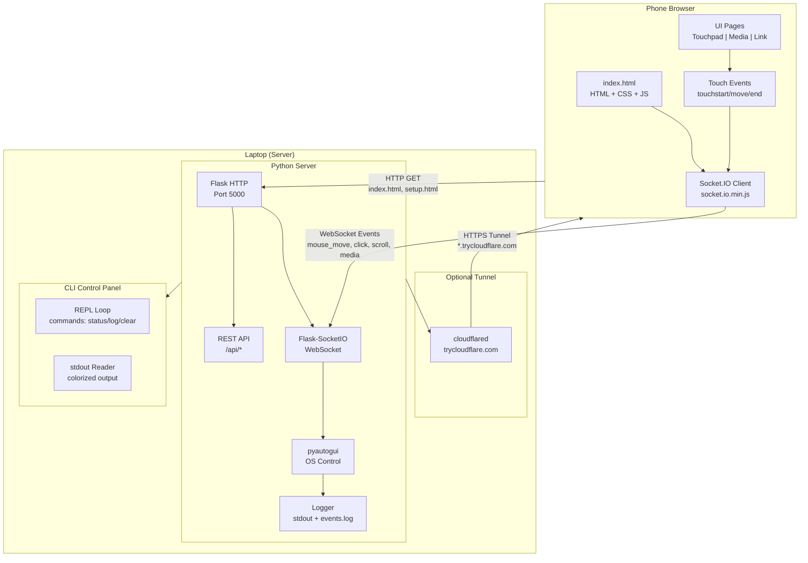

---

## Component Breakdown

### 1. Frontend (`frontend/index.html`)

Single HTML file containing all UI markup, inline CSS, and client-side JavaScript. No build step, no external runtime dependencies except the local Socket.IO library.

#### Pages

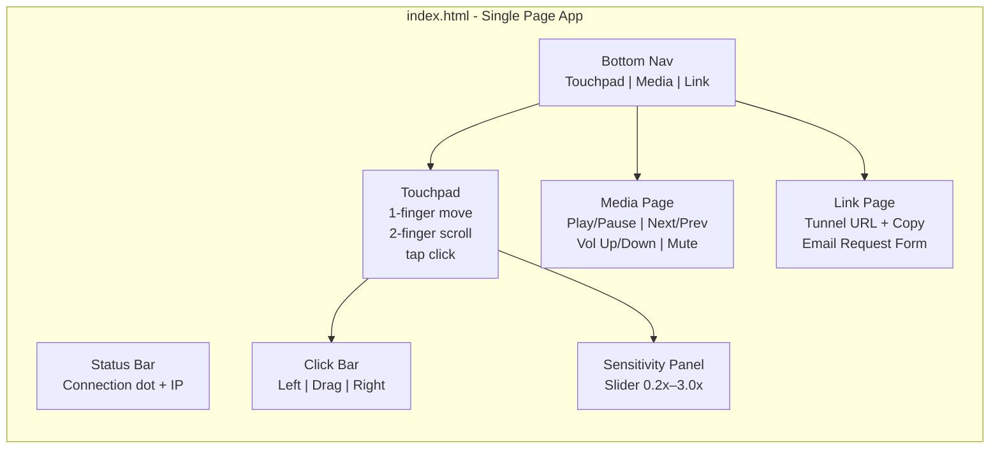

#### Key Design Decisions

| Decision | Rationale |
|----------|-----------|
| **No build step** | Served as-is. No npm, webpack, vite on the laptop |
| **Local socket.io (49 KB)** | Eliminates 3-minute CDN load on phone hotspot |
| **Touch Events API** | Broader mobile compatibility than Pointer Events |
| **WebSocket-first transport** | `['websocket', 'polling']` — instant connect, polling fallback |
| **Script at bottom of `<body>`** | Page renders before 49 KB library downloads |
| **touch-action: manipulation** | Prevents double-tap zoom on mobile |
| **appearance: none on slider** | Firefox compatibility for sensitivity slider |
| **Haptic feedback** | `navigator.vibrate(10)` on clicks (not on iOS) |

### 2. Server (`src/server.py`)

Python application built on Flask + Flask-SocketIO with eventlet async mode. Serves frontend, manages WebSocket connections, and executes OS control via pyautogui.

#### Internal Architecture

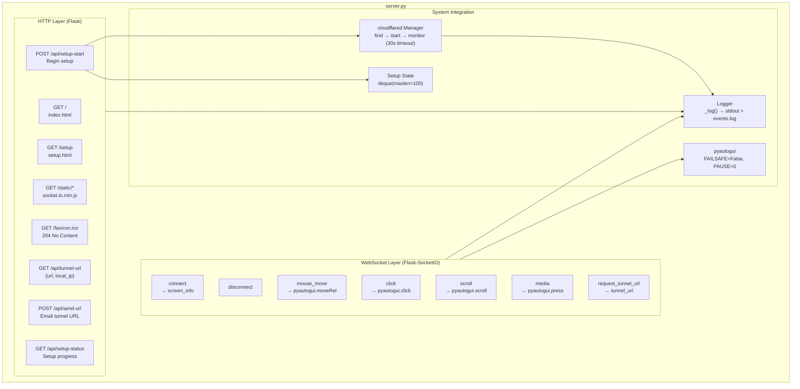

#### WebSocket Event Handlers

| Event | Handler | Action |
|-------|---------|--------|
| `connect` | `handle_connect` | Send screen dimensions, local IP, tunnel URL |
| `disconnect` | `handle_disconnect` | Log disconnection |
| `mouse_move` | `handle_move` | `pyautogui.moveRel(dx, dy)` |
| `click` | `handle_click` | `pyautogui.click(button)` |
| `scroll` | `handle_scroll` | `pyautogui.scroll(clicks)` — converts px to notches |
| `media` | `handle_media` | `pyautogui.press(playpause/nexttrack/etc.)` |
| `request_tunnel_url` | `handle_request_tunnel_url` | Emit current tunnel URL |

#### Design Decisions

| Decision | Rationale |
|----------|-----------|
| **eventlet.monkey_patch()** | Enables native WebSocket; without it Flask-SocketIO falls to HTTP-long-polling |
| **static_folder=None** | Bypasses Flask 3.0's built-in handler which intercepts `/static/` before our route |
| **Cache-Control: no-cache** on HTML | Prevents cached stale frontend |
| **Cache-Control: max-age=86400** on static | socket.io.min.js cached 24h on phone |
| **pyautogui.FAILSAFE = False** | Prevents corner-movement crash |
| **pyautogui.PAUSE = 0** | Removes 100ms built-in delay between calls |
| **cloudflared via subprocess.Popen** | Non-blocking tunnel management; 30s timeout with regex URL detection |

### 3. CLI Control Panel (`src/cli.py`)

Interactive REPL that launches `server.py` as a subprocess, captures stdout in real-time, and provides filtered colored display.

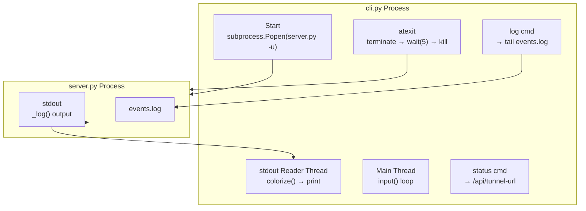

#### Commands

| Command | Description |
|---------|-------------|
| `status` or `s` | Show server status, local IP, tunnel URL |
| `log` or `l` | Show last 20 lines from `events.log` |
| `la` | Show ALL lines from `events.log` |
| `clear` or `cls` | Clear terminal screen |
| `help` or `h` | Show command reference |
| `q` or `exit` | Stop server and quit |

#### Design Decisions

| Decision | Rationale |
|----------|-----------|
| **Subprocess (not threading)** | Flask-SocketIO has known threading issues; separate process avoids GIL |
| **`-u` flag** | Unbuffered Python output ensures real-time log capture |
| **`atexit` cleanup** | Ensures server process is killed even if CLI crashes |
| **`TimeoutExpired → .kill()`** | Fallback if graceful terminate fails |
| **Filtered display** | Hides INFO (mouse moves, scrolls) from live terminal; shows only OK/WARN/ERROR |
| **Colorama** | Cross-platform colored terminal output |

### 4. Email Service (`src/email_service.py`)

Standalone module for sending email via SMTP. Imported by `server.py`, also runnable from CLI.

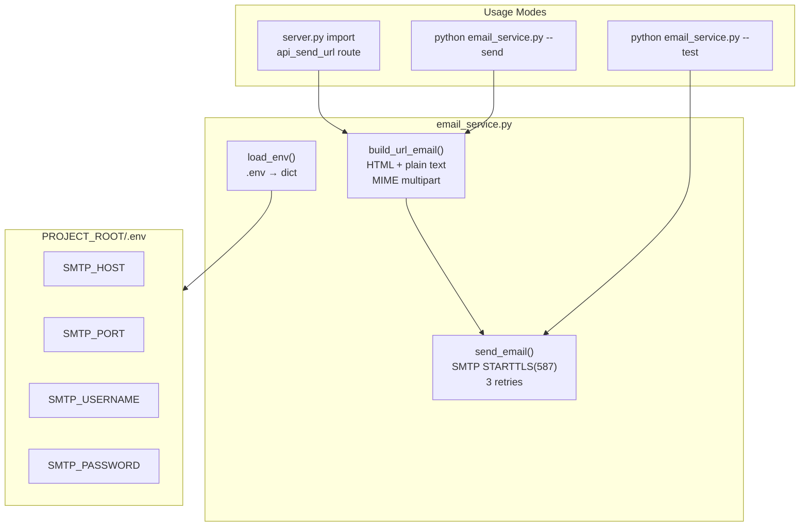

#### Design Decisions

| Decision | Rationale |
|----------|-----------|
| **Plain-text MIME alternative** | Ensures deliverability to SMS gateways that strip HTML |
| **Importable by server.py** | `api_send_url` calls `send_email()` directly with tunnel URL |
| **Standalone CLI** | Test SMTP config without starting full server |
| **Standard library only** | `smtplib` + `ssl` — zero external dependencies |
| **3 retries with exponential backoff** | Resilient to transient SMTP failures |

### 5. Cloudflare Tunnel (cloudflared)

External binary creating a secure HTTPS tunnel from Cloudflare's edge to `localhost:5000`.

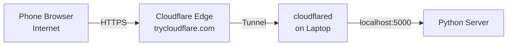

Provides:
- Public HTTPS URL on any network
- No port forwarding, no static IP, no DNS config
- DDoS protection and edge caching

**Limitations:**
- URL changes on every restart (free tier)
- Idle timeout after several hours
- Adds 50–200 ms latency vs local access

---

## Data Flow

### Connection Sequence

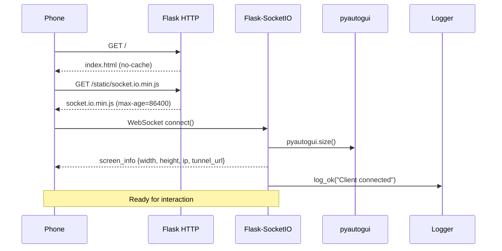

### Mouse Move Flow

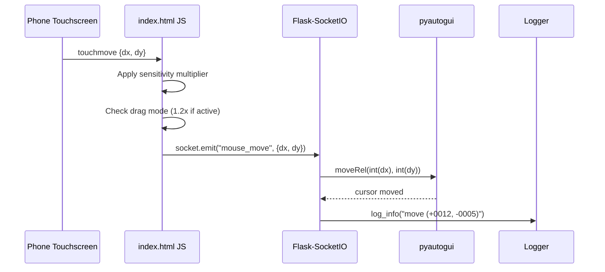

### Click Flow

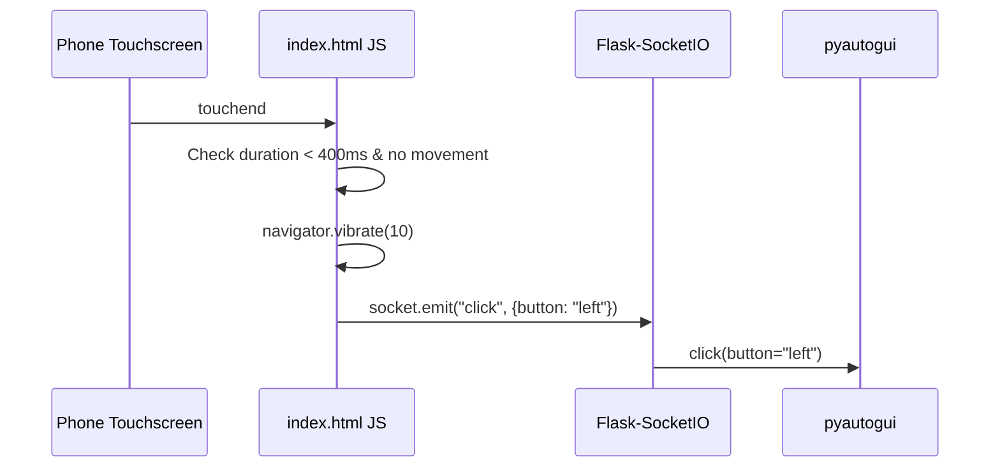

### Two-Finger Scroll Flow

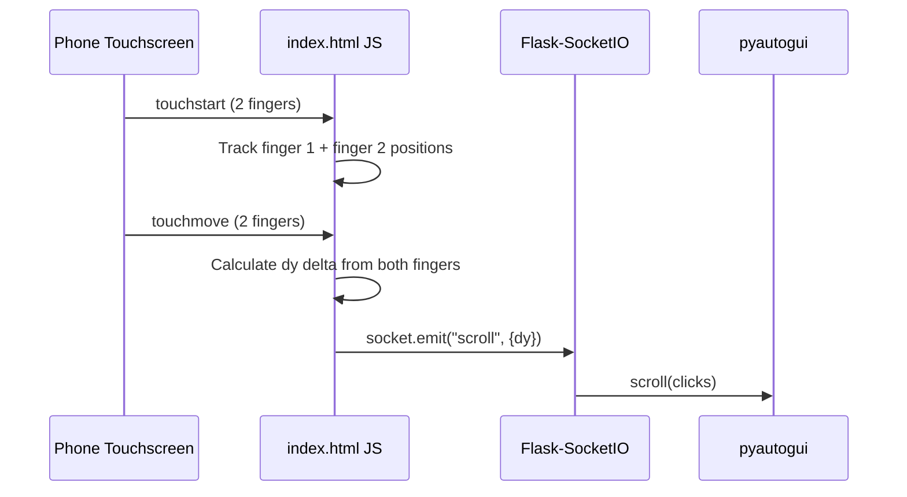

### Setup Wizard Flow

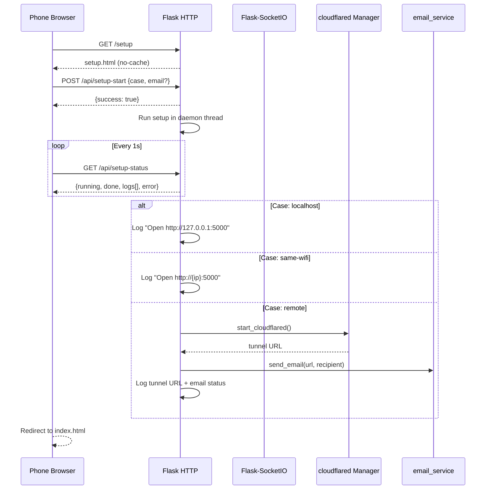

---

## Logging Architecture

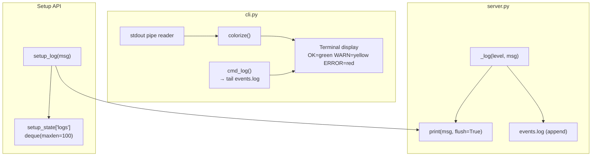

---

## Security Model

Remote Mouse has **no authentication**. Security relies on:

1. **Network segmentation** — accessible to anyone on the local network (binds `0.0.0.0:5000`)
2. **URL randomness** — Cloudflare tunnel URLs have ~64-bit entropy
3. **URL volatility** — tunnel URL invalid when cloudflared stops
4. **Trust model** — designed for personal use on trusted networks

For additional security, consider:
- Running behind a reverse proxy with basic auth
- Firewall rules restricting access to specific IPs
- Binding to a specific interface instead of `0.0.0.0`

---

## Threading Model

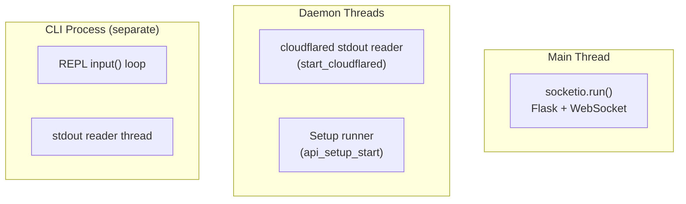

- **server.py** runs in its own process
- **cli.py** runs as a separate process, connected via pipe to server's stdout
- Setup runs in a daemon thread so the API response returns immediately
- cloudflared stdout reader runs in a daemon thread for non-blocking URL detection
