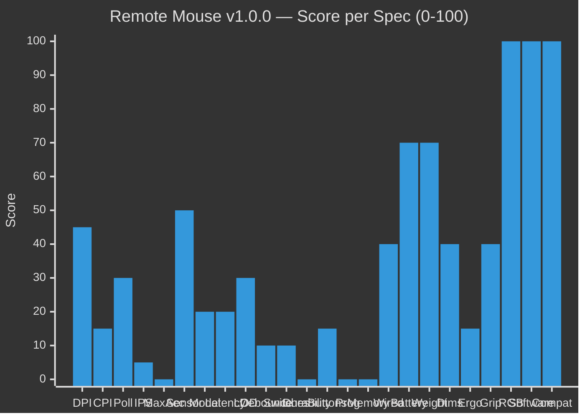
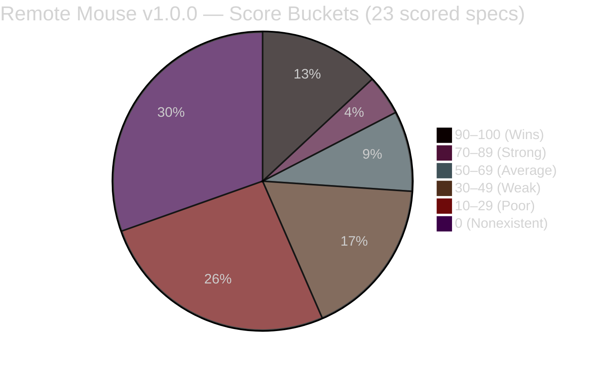

# Remote Mouse vs. Wired Mouse — Spec Comparison

**Current version:** v1.0.0 (DPI presets)  
**Baseline:** v5.0.1 (scored 34/100)  
**Last updated:** 2026-06-26

Each spec scored 0–100 relative to a typical wired mouse.

---

## Score Overview

---

## Comparison Table

| # | Spec | Wired Mouse (score) | v1.0.0 (score) | Gap | Key Difference |
|---|------|-------------------:|----------------:|----:|----------------|
| 1 | DPI | 100 | 45 | 55 | Hardware presets vs. slider + 4 buttons |
| 2 | CPI | 100 | 15 | 85 | Can read system CPI but doesn't display it |
| 3 | Polling Rate | 100 | 30 | 70 | 125–1000 Hz fixed vs. 30–120 Hz uncontrolled |
| 4 | IPS | 100 | 5 | 95 | Hardware cap vs. no cap or acceleration |
| 5 | Max Acceleration | 100 | 0 | 100 | 20–50G vs. no acceleration features |
| 6 | Sensor Type | 100 | 50 | 50 | Optical/laser vs. phone touchscreen (different tech) |
| 7 | Sensor Model | 100 | 20 | 80 | Identifiable vs. can detect but doesn't use |
| 8 | Click Latency | 100 | 20 | 80 | 1–5 ms vs. 10–100 ms |
| 9 | LOD | 100 | 30 | 70 | 1–3 mm adjustable vs. binary on/off |
| 10 | Debounce Time | 100 | 10 | 90 | Hardware circuit vs. not implemented |
| 11 | Switch Type | 100 | 10 | 90 | Tactile+audible vs. silent tap |
| 12 | Click Durability | 100 | 0 | 100 | Rated lifespan vs. not tracked |
| 13 | Number of Buttons | 100 | 15 | 85 | 3–12 vs. 2 |
| 14 | Programmable Buttons | 100 | 0 | 100 | Remapping+macros vs. fixed |
| 15 | Onboard Memory | 100 | 0 | 100 | Profiles on device vs. session-only |
| 16 | Wired Connectivity | 100 | 40 | 60 | USB zero-config vs. WiFi+URL+setup |
| 17 | Bluetooth | — | — | — | N/A — not supported |
| 18 | 2.4 GHz Wireless | — | — | — | N/A — not supported |
| 19 | Battery Life | 100 | 70 | 30 | USB-powered vs. phone+battery |
| 20 | Charging Port | — | — | — | N/A |
| 21 | Fast Charging | — | — | — | N/A |
| 22 | Weight | 100 | 70 | 30 | 50–150 g physical vs. zero (weightless) |
| 23 | Dimensions | 100 | 40 | 60 | Fixed hand-sized vs. phone-dependent |
| 24 | Ergonomics | 100 | 15 | 85 | Contoured vs. flat rectangle |
| 25 | Grip Style | 100 | 40 | 60 | Palm/claw/fingertip vs. touch-based |
| 26 | PTFE Feet | — | — | — | N/A — phone on desk |
| 27 | Build Material | — | — | — | N/A — phone-dependent |
| 28 | RGB Lighting | 60 | 100 | –40 | Aesthetic LEDs vs. none (win) |
| 29 | Software/Drivers | 40 | 100 | –60 | 500 MB bloatware vs. 66 KB browser |
| 30 | Compatibility | 80 | 100 | –20 | USB HID only vs. any browser device |

---

## Score Distribution

---

## Overall Score

| Metric | Wired Mouse | Remote Mouse v1.0.0 |
|--------|:-----------:|:-------------------:|
| Scored specs | 23 of 30 | 23 of 30 |
| Average score | **95/100** | **35/100** |
| Raw aggregate | 2180 / 2300 | 805 / 2300 |

---

## Category Breakdown

| Group | Wired | v1.0.0 | Anchor Spec |
|-------|:----:|:------:|-------------|
| v1 — Motion & Tracking | 100 | 19 | Max Accel (0), IPS (5) |
| v2 — Sensing & Clicks | 100 | 26 | Debounce (10), Sensor Model (20) |
| v3 — Switches & Buttons | 100 | 5 | Durability/Programmable/Memory (0) |
| v4 — Connectivity | 100 | 55 | Wired simplicity vs. remote setup |
| v5 — Physical | 100 | 33 | Ergonomics (15) |
| v6 — Extras | 60 | 100 | v1.0.0 wins all three |

## Interpretation

**35/100** means Remote Mouse v1.0.0 is not a wired mouse replacement. It excels at:

- **Zero friction** — no install, no drivers, any device
- **Mobility** — control from anywhere in the room (or world with tunnel)

It fails at the fundamental tactile experience:

- 5 specs score 0 (acceleration, durability, programmability, onboard memory)
- 6 specs score ≤15 (CPI display, IPS, buttons, debounce, switch type, ergonomics)
- Only 3 specs beat a wired mouse (RGB avoidance, no bloatware, broader compatibility)

The 120-version plan targets closing the gap from 35 → ~95 by turning every ❌ into a fully emulated equivalent.
