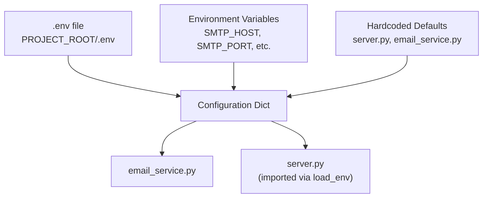
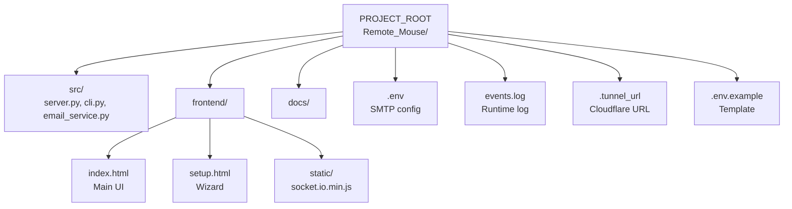
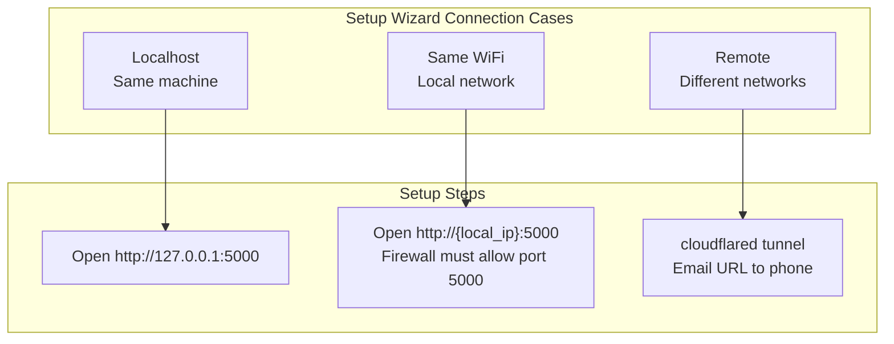

# Configuration Reference

**Version:** v1.0.0  
**Last updated:** 2026-06-26

This document describes every configuration option in Remote Mouse — environment variables, server settings, frontend tunables, file paths, and customization points.

---

## Configuration Loading Order



Values are resolved in order: `.env` file → environment variables → hardcoded defaults.

---

## Environment Variables (.env)

Create by copying `.env.example` at project root:

```bash
cp .env.example .env
```

### SMTP Settings

| Variable | Required | Default | Description |
|----------|----------|---------|-------------|
| `SMTP_HOST` | Yes | — | SMTP server hostname (e.g., `smtp.gmail.com`) |
| `SMTP_PORT` | No | `587` | SMTP port (`587` STARTTLS, `465` SSL) |
| `SMTP_USERNAME` | Yes | — | SMTP auth username (usually your email) |
| `SMTP_PASSWORD` | Yes | — | SMTP password or App Password |
| `SMTP_FROM_EMAIL` | No | same as `SMTP_USERNAME` | From: address in sent emails |
| `SMTP_TO_EMAIL` | Yes* | — | Default recipient for CLI `--test` mode |

\* `SMTP_TO_EMAIL` required for `--test`; when server sends via `/api/send-url`, recipient comes from POST body.

### Provider Examples

```ini
# Gmail (requires App Password with 2FA enabled)
SMTP_HOST=smtp.gmail.com
SMTP_PORT=587
SMTP_USERNAME=your.name@gmail.com
SMTP_PASSWORD=xxxx xxxx xxxx xxxx
SMTP_FROM_EMAIL=your.name@gmail.com
SMTP_TO_EMAIL=5551234567@vtext.com

# Outlook
SMTP_HOST=smtp-mail.outlook.com
SMTP_PORT=587
SMTP_USERNAME=your.name@outlook.com
SMTP_PASSWORD=your-password

# Yahoo Mail (requires App Password)
SMTP_HOST=smtp.mail.yahoo.com
SMTP_PORT=587
SMTP_USERNAME=your.name@yahoo.com
SMTP_PASSWORD=your-app-password
```

---

## Server Configuration (`src/server.py`)

All server settings are defined directly in `server.py`. No external config file.

### Port and Bind

```python
socketio.run(app, host='0.0.0.0', port=5000, debug=False)
```

| Parameter | Current Value | Description |
|-----------|--------------|-------------|
| `host` | `'0.0.0.0'` | Listen on all interfaces (accessible from LAN). Change to `'127.0.0.1'` for local-only |
| `port` | `5000` | TCP port. Change if port is in use |
| `debug` | `False` | Flask debug mode. Enable for development with auto-reload |

**If you change the port**, update:
1. Startup scripts (`scripts/start.ps1`, `scripts/start.sh`)
2. Windows Firewall rule
3. CLI setup URL: `SETUP_URL = 'http://localhost:5000/setup'` in `cli.py`

### Secret Key

```python
app.config['SECRET_KEY'] = os.urandom(24).hex()
```

Randomly generated on each server start. Used internally by Flask-SocketIO for session signing. Not security-critical since there is no authentication.

### pyautogui Tuning

```python
pyautogui.FAILSAFE = False
pyautogui.PAUSE = 0
```

| Setting | Default | Current | Effect |
|---------|---------|---------|--------|
| `FAILSAFE` | `True` | `False` | When True, mouse in corner raises exception. Disabled to prevent crashes |
| `PAUSE` | `0.1` | `0` | Built-in 100ms delay between calls. Set to 0 for zero latency |

### Socket.IO Options

```python
socketio = SocketIO(app, async_mode='eventlet', cors_allowed_origins="*",
                    ping_interval=5, ping_timeout=3)
```

| Option | Value | Description |
|--------|-------|-------------|
| `async_mode` | `'eventlet'` | WebSocket-native async. Must match `eventlet.monkey_patch()` at line 1 |
| `cors_allowed_origins` | `"*"` | Allow connections from any origin (needed for tunnel access) |
| `ping_interval` | `5` | Ping every 5 seconds to keep connection alive |
| `ping_timeout` | `3` | Wait 3 seconds for ping response before disconnecting |

### Cache Control

```python
# index.html, setup.html — never cache
resp.headers['Cache-Control'] = 'no-cache, must-revalidate'

# static/* (socket.io.min.js) — cache 24h
resp.headers['Cache-Control'] = 'public, max-age=86400'
```

| Route | Cache Policy | Reason |
|-------|-------------|--------|
| `/` (index.html) | `no-cache` | Always serve latest frontend |
| `/setup` (setup.html) | `no-cache` | Always serve latest setup wizard |
| `/static/*` | `max-age=86400` | socket.io.min.js (49 KB) — cache on phone for 24h |

---

## File Paths

All paths derive from `PROJECT_ROOT`:

```python
PROJECT_ROOT = os.path.dirname(os.path.dirname(os.path.abspath(__file__)))
# Resolves to: E:\GitHub Projects\Remote_Mouse\

FRONTEND_DIR = os.path.join(PROJECT_ROOT, 'frontend')
# Resolves to: .../Remote_Mouse/frontend/

STATIC_DIR = os.path.join(FRONTEND_DIR, 'static')
# Resolves to: .../Remote_Mouse/frontend/static/
```

### File Reference



| Path | Type | Purpose |
|------|------|---------|
| `PROJECT_ROOT/.env` | Config | SMTP credentials (gitignored) |
| `PROJECT_ROOT/.env.example` | Template | Copy to `.env` and fill in |
| `PROJECT_ROOT/events.log` | Runtime | All server events with timestamps (gitignored) |
| `PROJECT_ROOT/.tunnel_url` | Runtime | Current cloudflared URL (gitignored) |
| `PROJECT_ROOT/src/server.py` | Source | Flask + WebSocket + pyautogui |
| `PROJECT_ROOT/src/cli.py` | Source | REPL control panel |
| `PROJECT_ROOT/src/email_service.py` | Source | SMTP email sender |
| `PROJECT_ROOT/frontend/index.html` | Frontend | Main mouse control page |
| `PROJECT_ROOT/frontend/setup.html` | Frontend | Setup wizard |
| `PROJECT_ROOT/frontend/static/socket.io.min.js` | Asset | Socket.IO client v4.7.5 (49 KB) |

---

## Frontend Tunables (`frontend/index.html`)

### Socket.IO Connection

| Option | Current Value | Description |
|--------|---------------|-------------|
| `transports` | `['websocket', 'polling']` | WebSocket first, HTTP fallback |
| `reconnection` | `true` | Auto-reconnect on disconnect |
| `reconnectionAttempts` | `Infinity` | Never stop reconnecting |
| `reconnectionDelay` | `1000` | Initial delay before first retry (ms) |
| `reconnectionDelayMax` | `5000` | Max delay between retries (ms) |

### Sensitivity Slider

```html
<input type="range" id="sens-slider" min="0.2" max="3.0" step="0.1" value="1.0">
```

| Attribute | Value | Description |
|-----------|-------|-------------|
| `min` | `0.2` | Slowest cursor speed |
| `max` | `3.0` | Fastest cursor speed |
| `step` | `0.1` | Granularity of adjustment |
| `value` | `1.0` | Default (no multiplier) |

### Tap Threshold

```javascript
if (Date.now() - touchStartTime < 400) { /* tap detected */ }
```

| Constant | Location | Effect |
|----------|----------|--------|
| `400` | touchpad touchend handler | Max ms for a touch to count as a tap |

Lower (e.g., `200`): only very quick touches click. Higher (e.g., `600`): slow touches also click.

### Movement Dead Zone

```javascript
if (Math.abs(dx) > 1 || Math.abs(dy) > 1) { /* send move event */ }
```

| Value | Effect |
|-------|--------|
| `1` px | Ignore sub-1px jitter. Increase to 3–5 for noisier screens |

### Drag Mode Multiplier

```javascript
// Drag mode applies 1.2x extra multiplier
socket.emit('mouse_move', { dx: dx * sensitivity * 1.2, dy: dy * sensitivity * 1.2 });
```

| Value | Location | Effect |
|-------|----------|--------|
| `1.2` | touchmove handler when dragMode=true | Makes dragging slightly faster for cross-screen selections |

### Two-Finger Scroll Sensitivity

The scroll delta calculation in `server.py`:

```python
clicks = max(1, abs(int(dy / 20)))
```

| Value | Effect |
|-------|--------|
| `20` | Pixels per scroll notch. Lower = more sensitive (fewer pixels per notch) |

---

## Network Configuration

### Connection Modes



### Firewall Rule (Windows)

```powershell
# Verify rule exists
netsh advfirewall firewall show rule name="Remote Mouse 5000"

# Add rule (if missing)
netsh advfirewall firewall add rule name="Remote Mouse 5000" dir=in action=allow protocol=TCP localport=5000

# Delete and recreate with new port
netsh advfirewall firewall delete rule name="Remote Mouse 5000"
netsh advfirewall firewall add rule name="Remote Mouse 5000" dir=in action=allow protocol=TCP localport=8080
```

### Static IP (Optional)

Set a static IP to avoid URL changes on every boot:

**Windows:** Settings > Network & Internet > WiFi > Hardware properties > Edit IP assignment > Manual > On
- IP: Outside DHCP range (e.g., `10.0.0.100`)
- Subnet: `255.255.255.0`
- Gateway: Router IP
- DNS: `8.8.8.8` / `1.1.1.1`

---

## CLI Configuration (`src/cli.py`)

| Setting | Value | Description |
|---------|-------|-------------|
| `SETUP_URL` | `'http://localhost:5000/setup'` | Auto-opened in browser on CLI start |
| `EVENT_LOG_FILE` | `ProjectRoot/events.log` | Path to log file for `log` command |
| `TUNNEL_URL_FILE` | `ProjectRoot/.tunnel_url` | Path to tunnel URL for `status` command |
| Color coding | Green=OK, Yellow=WARN, Red=ERROR | Applied by `colorize()` based on prefix |

---

## Startup Scripts

### Windows (`scripts/start.ps1`)

```powershell
$ProjectRoot = Split-Path -Parent $PSScriptRoot
# All other paths derive from $ProjectRoot
```

### Linux/macOS (`scripts/start.sh`)

```bash
PROJECT_ROOT=$(dirname "$(dirname "$0")")
cd "$PROJECT_ROOT" || exit 1
```

---

## Version-Specific Config

### v1.0.0 — DPI Presets (Current)

| Feature | Config Point | Default | Location |
|---------|-------------|---------|----------|
| DPI preset buttons | 400, 800, 1600, 3200 | Added to click bar | `frontend/index.html` |
| DPI label | Shows "400 DPI" etc. next to preset | In settings panel | `frontend/index.html` |
| Sensitivity–DPI mapping | `base_dpi = 800` | Server-side conversion | `src/server.py` |

---

## Events Log

Auto-created at `PROJECT_ROOT/events.log`. All server events with timestamps:

```
[19:30:22] OK Server starting on port 5000...
[19:30:22] INFO Local: http://10.0.0.5:5000
[19:31:05] OK Client connected
[19:31:12] INFO move   (+0045, -0023)
[19:31:14] OK click  left
[19:31:18] INFO scroll (+00120)
```

**Note:** Grows without rotation. Clear periodically or add log rotation for long sessions.
