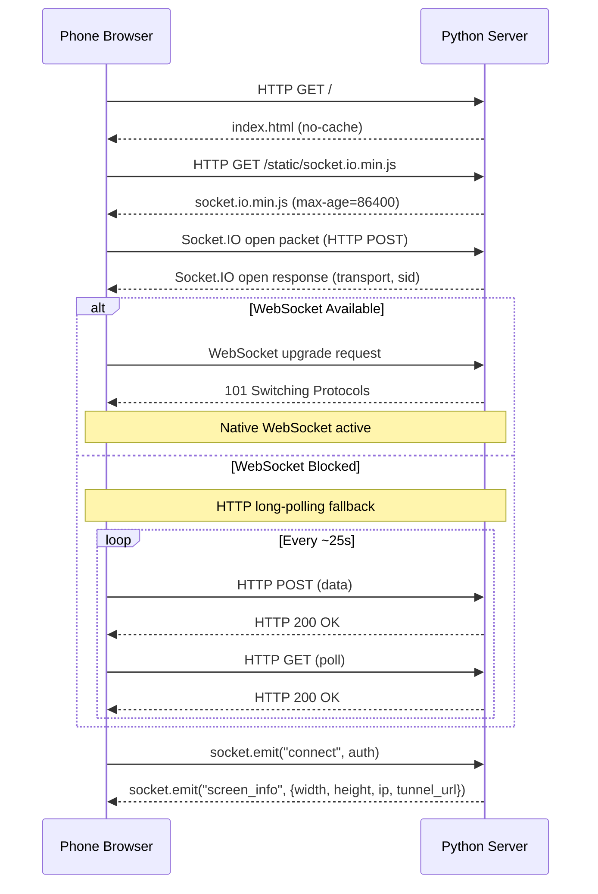
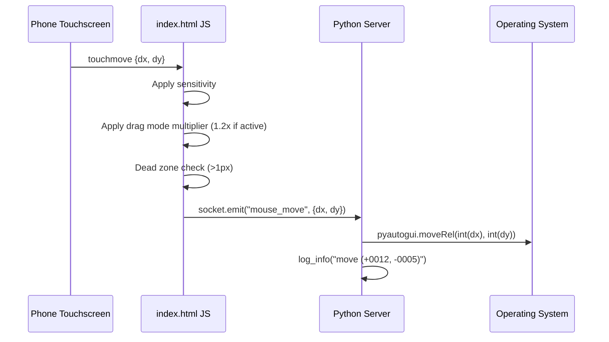
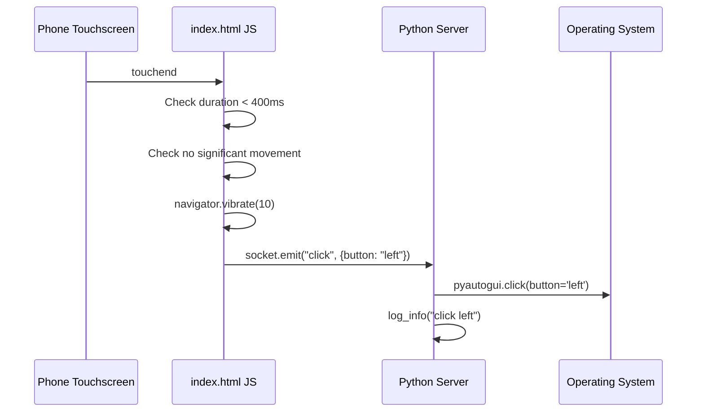
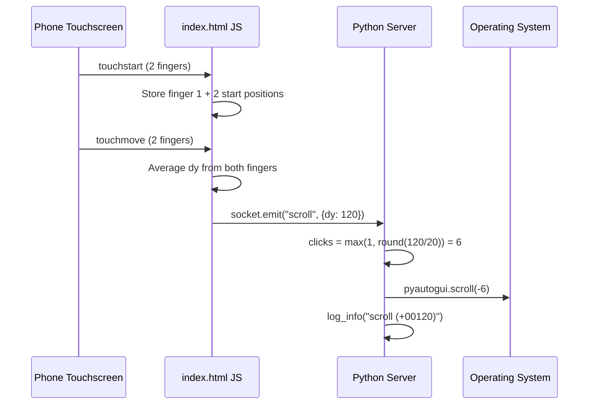
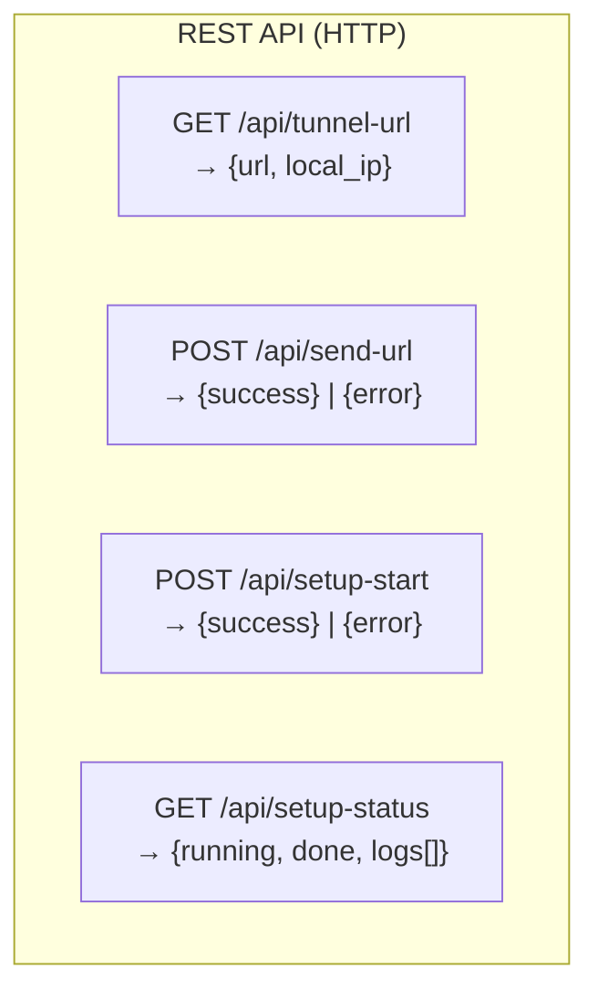
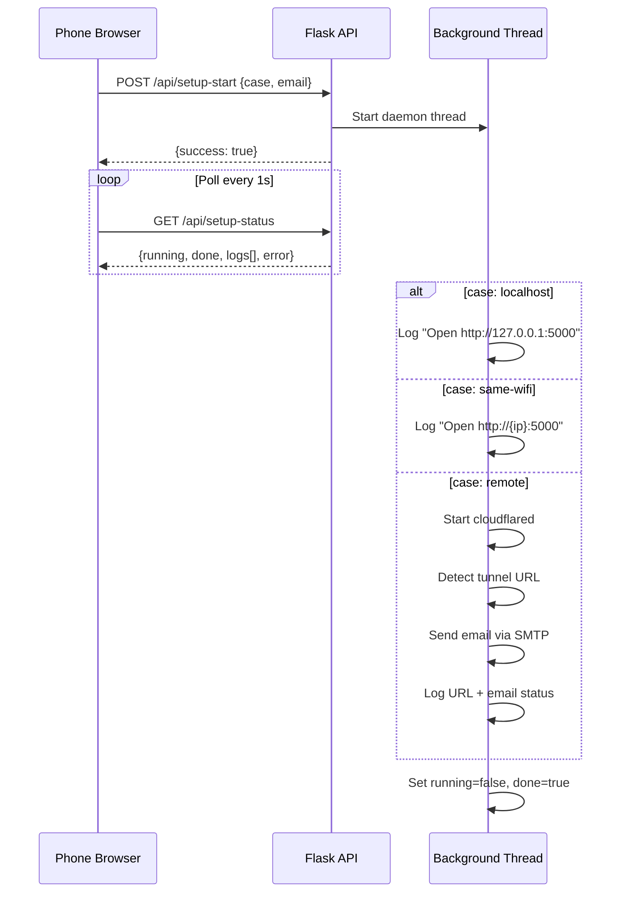
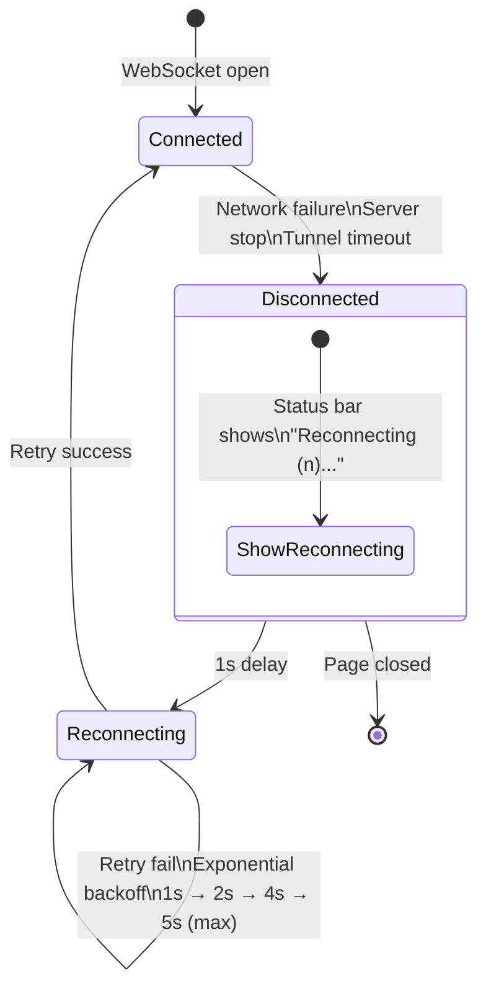

# WebSocket Protocol

**Version:** v1.0.0  
**Last updated:** 2026-06-26

This document describes the WebSocket protocol between the phone browser and the Python server. All events use Socket.IO, which provides WebSocket with automatic HTTP long-polling fallback, reconnection, and event routing.

---

## Transport

| Property | Value |
|----------|-------|
| **Primary** | WebSocket |
| **Fallback** | HTTP long-polling (Socket.IO auto-negotiates) |
| **Library** | Socket.IO v4 (client: 4.7.5, server: Flask-SocketIO 5.x) |
| **Connection URL** | Same as page URL (`http://laptop:5000` or `https://tunnel.trycloudflare.com`) |
| **Client transports** | `['websocket', 'polling']` |
| **Ping interval** | 5 seconds |
| **Ping timeout** | 3 seconds |

### Handshake



### Client Connection Options

```javascript
const socket = io({
  transports: ['websocket', 'polling'],
  reconnection: true,
  reconnectionAttempts: Infinity,
  reconnectionDelay: 1000,
  reconnectionDelayMax: 5000,
});
```

---

## Event Reference

### Server-to-Client Events

#### `screen_info`

Sent automatically when a client connects. Contains laptop screen dimensions and connection URLs.

```json
{
  "width": 1920,
  "height": 1080,
  "ip": "10.0.0.5",
  "tunnel_url": "https://abcdefgh123456.trycloudflare.com"
}
```

| Field | Type | Description |
|-------|------|-------------|
| `width` | int | Screen width in pixels |
| `height` | int | Screen height in pixels |
| `ip` | string | Local IP address of the laptop |
| `tunnel_url` | string | Cloudflare tunnel URL (empty string if no tunnel) |

#### `tunnel_url`

Sent in response to `request_tunnel_url`. Provides the current tunnel URL.

```json
{
  "url": "https://abcdefgh123456.trycloudflare.com"
}
```

| Field | Type | Description |
|-------|------|-------------|
| `url` | string | Current tunnel URL (empty if no active tunnel) |

---

### Client-to-Server Events

#### `mouse_move`

Sent when the user drags a finger on the touchpad. The most frequent event.



**Payload:**

```json
{
  "dx": 45,
  "dy": -23
}
```

| Field | Type | Range | Description |
|-------|------|-------|-------------|
| `dx` | int | -500 to +500 | Delta X (positive = right, negative = left) |
| `dy` | int | -500 to +500 | Delta Y (positive = down, negative = up) |

**Server handler:**

```python
@socketio.on('mouse_move')
def handle_move(data):
    dx = data.get('dx', 0)
    dy = data.get('dy', 0)
    if dx != 0 or dy != 0:
        pyautogui.moveRel(int(dx), int(dy), _pause=False)
```

**Notes:**
- Delta is pre-scaled by client-side sensitivity (0.2x–3.0x) and drag mode multiplier (1.2x)
- Dead zone of 1px prevents micro-jitter from being sent
- Server casts to `int()` for pixel-perfect movement
- `_pause=False` skips pyautogui's 100ms delay

---

#### `click`

Sent on touchpad tap or click bar button press.



**Payload:**

```json
{
  "button": "left"
}
```

```json
{
  "button": "right"
}
```

| Field | Type | Values | Description |
|-------|------|--------|-------------|
| `button` | string | `"left"` or `"right"` | Which mouse button to click |

**Server handler:**

```python
@socketio.on('click')
def handle_click(data):
    button = data.get('button', 'left')
    pyautogui.click(button=button, _pause=False)
```

**Tap detection logic (client-side):**

```javascript
// In touchend handler:
if (e.changedTouches.length === 1 && !touchMoved && Date.now() - touchStartTime < 400) {
    socket.emit('click', { button: 'left' });
    navigator.vibrate(10);
}
```

Three conditions must ALL be true:
1. Exactly 1 finger lifted
2. No significant movement occurred during the touch
3. Touch duration under 400ms

---

#### `scroll`

Sent on two-finger vertical drag.



**Payload:**

```json
{
  "dy": 120
}
```

| Field | Type | Description |
|-------|------|-------------|
| `dy` | int | Scroll delta in pixels (positive = scroll down, negative = scroll up) |

**Server handler:**

```python
@socketio.on('scroll')
def handle_scroll(data):
    dy = data.get('dy', 0)
    if dy != 0:
        clicks = max(1, abs(int(dy / 20)))
        pyautogui.scroll(-clicks if dy > 0 else clicks, _pause=False)
```

**Mapping:**
- Pixel delta → clicks (notches): divide by 20
- Positive dy (finger moves up) → scroll content down (negative pyautogui value)
- Minimum 1 click always sent

---

#### `media`

Sent on media control button press. Triggers system-wide media keys.

**Payload:**

```json
{
  "action": "play_pause"
}
```

| Field | Type | Allowed Values | Description |
|-------|------|----------------|-------------|
| `action` | string | `play_pause`, `next`, `prev`, `vol_up`, `vol_down`, `mute` | Which media action |

**Action-to-key mapping:**

| Frontend button | `action` value | pyautogui key | OS effect |
|-----------------|----------------|---------------|-----------|
| Play/Pause (big center) | `play_pause` | `playpause` | Toggle playback |
| Next (skip forward) | `next` | `nexttrack` | Next track |
| Prev (skip back) | `prev` | `prevtrack` | Previous track |
| Volume + | `vol_up` | `volumeup` | Increase volume (2% on Windows) |
| Volume - | `vol_down` | `volumedown` | Decrease volume (2% on Windows) |
| Mute | `mute` | `volumemute` | Toggle mute |

**Server handler:**

```python
@socketio.on('media')
def handle_media(data):
    action = data.get('action', '')
    key_map = {
        'play_pause': 'playpause',
        'next': 'nexttrack',
        'prev': 'prevtrack',
        'vol_up': 'volumeup',
        'vol_down': 'volumedown',
        'mute': 'volumemute',
    }
    key = key_map.get(action)
    if key:
        pyautogui.press(key, _pause=False)
```

**Notes:**
- System-wide keys — work with any active media app (Spotify, VLC, YouTube)
- pyautogui sends a single key press (not held)
- Volume change amount depends on OS (Windows ~2%, macOS ~1 notch)

---

#### `request_tunnel_url`

Sent by the client to request the current tunnel URL. No payload.

```json
{}
```

**Server response:** Emits `tunnel_url` event with the current URL.

**Frontend usage:**

```javascript
socket.emit('request_tunnel_url');
// Server responds with: socket.emit('tunnel_url', { url: 'https://...' })
```

Sent automatically on connection to populate the Link page, and when the user taps "Refresh" on the Link page.

---

## REST API Endpoints



### GET /api/tunnel-url

Returns current tunnel URL and local IP.

```json
{
  "url": "https://abcdefgh123456.trycloudflare.com",
  "local_ip": "10.0.0.5"
}
```

**Status codes:** `200 OK`

**Frontend usage (fallback when WebSocket is disconnected):**

```javascript
fetch('/api/tunnel-url')
  .then(r => r.json())
  .then(data => {
    if (data.url) updateTunnelUrl(data.url);
  });
```

---

### POST /api/send-url

Sends tunnel URL to a specified email via SMTP.

**Request:**

```json
{
  "email": "user@example.com"
}
```

**Success `200`:**

```json
{
  "success": true,
  "message": "Tunnel URL sent to user@example.com"
}
```

**Error `400`:**

```json
{ "error": "Invalid email address" }
{ "error": "No tunnel URL available" }
```

**Error `500`:**

```json
{ "error": "Failed to send email: connection refused" }
```

---

### POST /api/setup-start

Starts the setup wizard workflow in a background thread.

**Request:**

```json
{
  "case": "remote",
  "email": "user@example.com"
}
```

| Field | Required | Values | Description |
|-------|----------|--------|-------------|
| `case` | Yes | `same-wifi`, `remote`, `localhost` | Connection type |
| `email` | For `remote` | Valid email | Recipient for tunnel URL |

**Response `200`:**

```json
{ "success": true }
```

**Error `400`:**

```json
{ "error": "Invalid case. Choose same-wifi, remote, or localhost" }
{ "error": "Email required for remote access" }
```

**Setup workflow:**



---

### GET /api/setup-status

Returns current setup state for polling.

```json
{
  "running": false,
  "done": true,
  "case": "remote",
  "email": true,
  "error": null,
  "tunnel_url": "https://abcdefgh123456.trycloudflare.com",
  "local_ip": "10.0.0.5",
  "logs": [
    "[19:30:22] OK Case: Remote",
    "[19:30:22] INFO Starting cloudflared tunnel...",
    "[19:30:25] OK Tunnel URL: https://..."
  ]
}
```

| Field | Type | Description |
|-------|------|-------------|
| `running` | bool | Setup in progress |
| `done` | bool | Setup completed |
| `case` | string | Selected connection case |
| `email` | bool | Email was provided |
| `error` | string | Error message (null if no error) |
| `tunnel_url` | string | Current tunnel URL |
| `local_ip` | string | Laptop's local IP |
| `logs` | string[] | Recent log entries (max 100) |

---

## Reconnection Behavior



**Client-side reconnection config:**
- `reconnectionAttempts: Infinity` — never gives up
- `reconnectionDelay: 1000` — 1 second initial delay
- `reconnectionDelayMax: 5000` — max 5 second delay

**Status bar indicators:**
| State | Dot Color | Text |
|-------|-----------|------|
| Connected | Green | "Connected" |
| Disconnected | Gray | "Disconnected" |
| Reconnecting | Yellow | "Reconnecting (3)..." |

---

## Error Handling (Server-Side)

All events are guarded against missing or malformed data using `.get()` with defaults:

```python
dx = data.get('dx', 0)
dy = data.get('dy', 0)
button = data.get('button', 'left')
action = data.get('action', '')
```

Each handler checks for meaningful values before acting (e.g., `if dx != 0 or dy != 0`). Invalid or empty events are silently ignored.

---

## Extending the Protocol

To add a new event:

1. **Client side (`index.html`):** Call `socket.emit('event_name', payload)` where needed
2. **Server side (`server.py`):** Add `@socketio.on('event_name')` handler
3. **This doc:** Add the event reference

**Example — screenshot trigger:**

```python
@socketio.on('screenshot')
def handle_screenshot():
    import pyautogui
    from datetime import datetime
    img = pyautogui.screenshot()
    img.save(f'screenshot_{datetime.now():%Y%m%d_%H%M%S}.png')
    log_ok(f"screenshot saved")
```

Payload can be any JSON-serializable object. Server handler can call any pyautogui function, execute shell commands, or perform any action.
