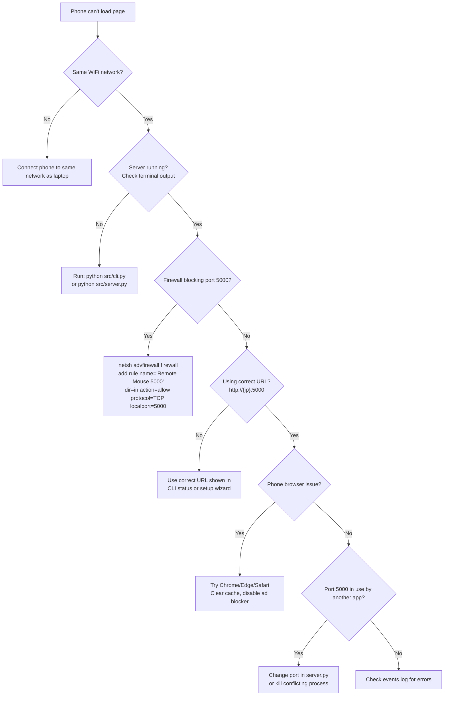
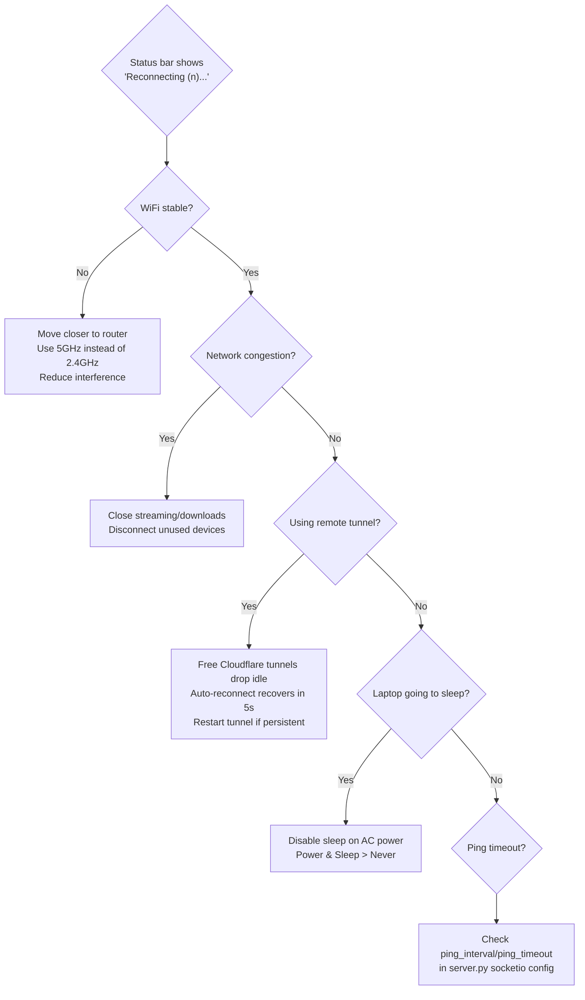
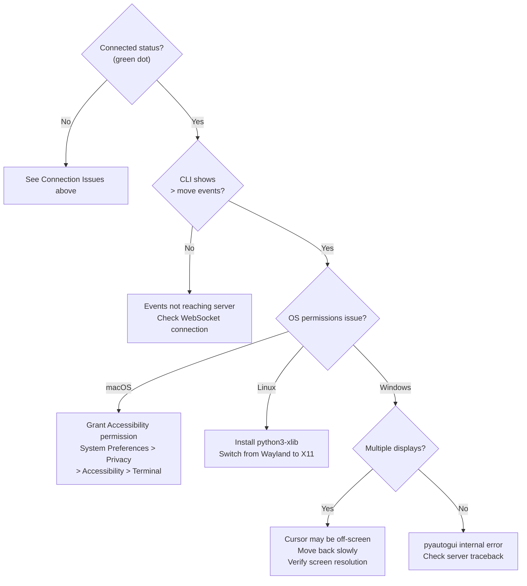
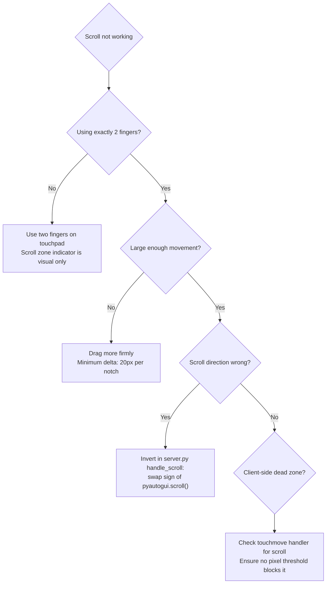
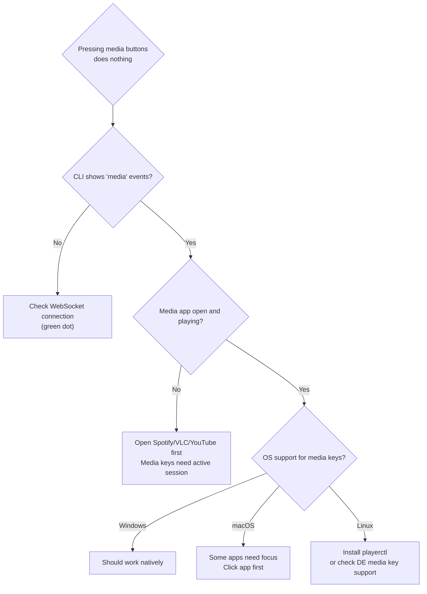
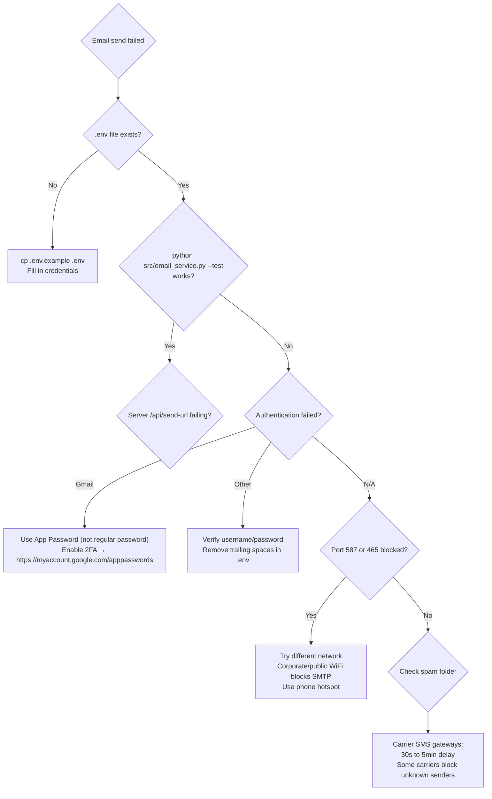
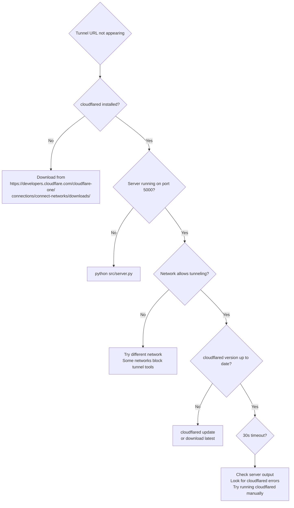
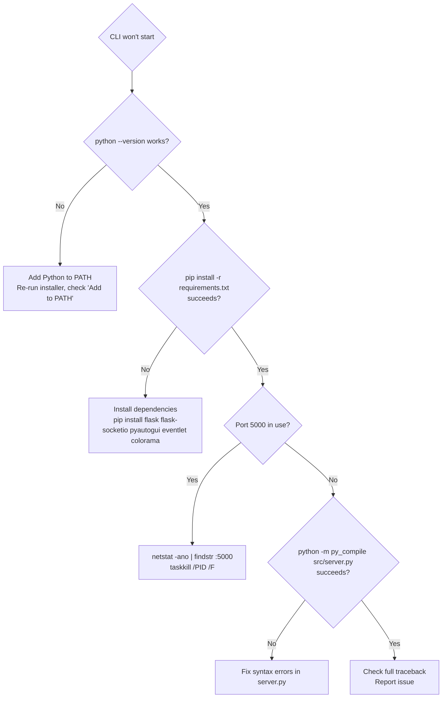

# Troubleshooting

**Version:** v1.0.0  
**Last updated:** 2026-06-26

This document covers common issues, their causes, and how to fix them. If a problem is not listed here, check the server logs (CLI output or `events.log`) for error messages.

---

## Quick Reference

| Problem | Quick Fix |
|---------|-----------|
| Page won't load on phone | Check WiFi / same network / firewall |
| WebSocket won't connect | Check server is running / correct URL |
| Mouse moves but lags | Reduce sensitivity / check network latency |
| Clicks not working | Check server logs / pyautogui permissions |
| Email not sending | Run `python src/email_service.py --test` |
| Tunnel URL not appearing | Check cloudflared installed and started |
| CLI shows "Server stopped" | Port in use / check `server.log` |
| Two-finger scroll not working | Use 2 fingers, check scroll zone |
| DPI presets not responding | Check index.html v1.0.0 preset buttons |

---

## Connection Issues

### Decision Tree: Phone Cannot Load the Page



### Detailed Solutions

#### Different WiFi Networks

**Symptom:** Browser shows "Site cannot be reached" or timeout.

**Fix:**
- Ensure phone and laptop are on the **same** network
- Check laptop's IP: `ipconfig` (Windows) or `ip addr` (Linux/macOS)
- Use `http://<ip>:5000` (not `https://`)
- For remote access, use the Cloudflare tunnel URL

#### Firewall Blocking (Windows)

**Check:**
```powershell
netsh advfirewall firewall show rule name="Remote Mouse 5000"
```

**Add if missing:**
```powershell
netsh advfirewall firewall add rule name="Remote Mouse 5000" dir=in action=allow protocol=TCP localport=5000
```

#### Server Not Running

**Check:**
- Terminal should show: `OK Remote Mouse v1.0.0 starting on port 5000...`
- Look for Python traceback errors
- Verify with: `python -m py_compile src/server.py`

#### Wrong Port

If you changed the port in `server.py`:
```python
socketio.run(app, host='0.0.0.0', port=5000, ...)
```
Use `http://<ip>:<new-port>` instead of `:5000`.

#### Phone Browser Issues

| Action | Why |
|--------|-----|
| Use Chrome, Edge, or Safari (latest) | Best touch + WebSocket support |
| Clear browser cache | Stale JS may have incompatible socket.io version |
| Disable ad blocker | Some block WebSocket connections |
| Disable VPN | VPN routes traffic away from LAN |

---

## WebSocket Issues

### Decision Tree: WebSocket Disconnects Constantly



### Detailed Solutions

#### Unstable WiFi
- Move closer to router
- Switch to 5GHz (less interference than 2.4GHz)
- Remove sources of interference (microwaves, cordless phones)

#### Network Congestion
- Close bandwidth-heavy apps (streaming, video calls, downloads)
- Disconnect other devices from the network temporarily

#### Cloudflare Tunnel Timeout
- Free Cloudflare tunnels may drop idle connections after ~2 hours
- Auto-reconnect recovers within 5 seconds
- To force reconnect: restart cloudflared or server

#### Laptop Goes to Sleep
**Windows:** Settings > System > Power & sleep > Never
**macOS:** System Preferences > Energy Saver > Never
**Linux:** `systemctl mask sleep.target`

---

## Mouse Control Issues

### Decision Tree: Cursor Does Not Move



### Cursor Moves in Wrong Direction

**Symptom:** Dragging up moves cursor down (or right/left inverted).

**Fix:** In `frontend/index.html`, negate dx or dy in the touchmove handler:

```javascript
// Invert axes as needed
socket.emit('mouse_move', {
  dx: -dx * sensitivity,  // Invert horizontal
  dy: dy * sensitivity     // Normal vertical
});
```

### Sensitivity Too High or Low

| Issue | Fix |
|-------|-----|
| Too fast | Set sensitivity to 0.5x or 0.2x |
| Too slow | Set sensitivity to 2.0x or 3.0x |
| Changes not applied | Slider adjusts in real-time. Check `sens-slider` value |

Adjust via Settings panel (gear icon) → Sensitivity slider.

### Two-Finger Scroll Not Working



**Note:** In v5.0.0, two-finger scroll was silently broken due to `prev1.y` instead of `prev1.lastY`. Fixed in v5.0.1. If you're on an older version, update your code.

### Drag Mode Issues

| Symptom | Cause | Fix |
|---------|-------|-----|
| Drag doesn't hold button | Drag Mode not toggled on | Tap drag button (center) until green |
| Drag moves without clicking | Drag Mode is on, tap still works | Tap = click, drag = hold+move |
| Drag speed too fast | 1.2x multiplier applies | Edit multiplier in `index.html` |

---

## Media Control Issues

### Decision Tree: Media Buttons Do Nothing



### Volume Changes Too Large/Small

Each `press('volumeup')` sends one key press. Volume change per press:
- Windows: ~2%
- macOS: ~1 notch
- Linux: varies by DE

**To send multiple presses per button press,** modify `handle_media` in `src/server.py`:

```python
key = key_map.get(action)
if key:
    count = 3 if action in ('vol_up', 'vol_down') else 1
    for _ in range(count):
        pyautogui.press(key, _pause=False)
```

---

## Email Issues

### Decision Tree: Email Not Sending



### Detailed Solutions

#### Missing .env File

```bash
cp .env.example .env
```

Edit `.env` with your SMTP credentials. The file must be at **project root** (`PROJECT_ROOT/.env`), not in `src/` or `frontend/`.

#### Gmail App Password Required

1. Enable 2-Step Verification at https://myaccount.google.com/security
2. Generate App Password at https://myaccount.google.com/apppasswords
3. Use the 16-character password (no spaces) in `.env`
4. Test: `python src/email_service.py --test`

#### Port Blocked

Corporate networks, public WiFi, and some mobile hotspots block SMTP ports (587, 465). Workaround: use a different network.

#### Testing Configuration

```bash
# Test with default recipient (SMTP_TO_EMAIL in .env)
python src/email_service.py --test

# Send a specific URL
python src/email_service.py --send https://mytunnel.trycloudflare.com
```

---

## Cloudflare Tunnel Issues

### Decision Tree: Tunnel Fails to Start



### Detailed Solutions

#### cloudflared Not Installed

Download from: https://developers.cloudflare.com/cloudflare-one/connections/connect-networks/downloads/

Verify: `cloudflared --version`

#### Port 5000 Not Accessible

```bash
# Test server is running
curl http://localhost:5000
# Should return HTML content
```

#### cloudflared Not Found by Server

The server searches for cloudflared in:
1. System PATH (`cloudflared` or `cloudflared.exe`)
2. `~/.cloudflared/cloudflared.exe`
3. `C:\Program Files\cloudflared\cloudflared.exe`
4. `C:\tools\cloudflared\cloudflared.exe`
5. `/usr/local/bin/cloudflared`
6. `/usr/bin/cloudflared`

If installed elsewhere, add its directory to PATH or symlink it into one of these locations.

#### Tunnel URL Changes Every Session

This is expected for free Cloudflare tunnels. The URL changes:
- Every time cloudflared restarts
- After idle timeout (~2 hours)

The frontend auto-refreshes via `/api/tunnel-url` polling and `request_tunnel_url` WebSocket event.

---

## CLI Issues

### Decision Tree: CLI Won't Start or Crashes



### Detailed Solutions

#### "Python not found"

Add Python to PATH:
- **Windows:** Re-run Python installer, check "Add Python to PATH"
- **macOS/Linux:** Python is usually pre-installed. Try `python3` instead of `python`

#### "Server stopped" Immediately

**Port 5000 already in use:**
```powershell
# Find process using port 5000
netstat -ano | findstr :5000

# Kill it
taskkill /PID <pid> /F
```

**Missing dependencies:**
```bash
pip install -r requirements.txt
```

**Syntax error:**
```bash
python -m py_compile src/server.py
```

#### CLI Output Garbled or Missing Colors

```bash
pip install colorama
```

Colorama is optional on Windows 10+ terminal but required for colored output on older Windows and Linux/macOS.

---

## Performance Issues

### High Latency

**Symptom:** Noticeable delay between touch and cursor movement.

| Cause | Latency | Fix |
|-------|---------|-----|
| Different networks | ∞ | Move to same WiFi |
| 2.4GHz WiFi | 10–30ms extra | Switch to 5GHz |
| Network congestion | 50–200ms extra | Close streaming/downloads |
| Cloudflare tunnel | 50–200ms extra | Use local access when possible |
| High sensitivity | Perceived delay | Lower sensitivity (0.5x–1.0x) |

### Cursor Jitter

**Symptom:** Cursor vibrates when finger is still.

**Fixes (in order of effectiveness):**

1. **Increase dead zone in `index.html`:**
   ```javascript
   // Change from > 1 to > 3
   if (Math.abs(dx) > 3 || Math.abs(dy) > 3) {
   ```

2. **Lower sensitivity:** Reduces amplification of micro-movements

3. **Clean phone screen:** Oil, moisture, or screen protector can cause erratic touch readings

---

## Platform-Specific Issues

### macOS: pyautogui Not Working

**Step-by-step fix:**
1. System Settings > Privacy & Security > Accessibility
2. Click lock icon and enter password
3. Click + and add your terminal app (Terminal.app or iTerm2)
4. Also add `Python.app` if visible
5. Restart the server
6. Test again

### Linux: Wayland vs X11

pyautogui requires X11. If using Wayland (default on Ubuntu 21.04+, Fedora 34+):

**Option 1:** Switch to X11 on login screen (gear icon before entering password)

**Option 2:** Use xdotool as alternative in `server.py`:
```python
import subprocess
subprocess.run(['xdotool', 'mousemove_relative', '--', str(dx), str(dy)])
```

**Option 3:** Install `python3-xlib` for partial Wayland support.

### Windows: Antivirus Blocking

Add exceptions for:
- `python.exe` (or `python3.exe`)
- Port 5000 (TCP inbound/outbound)

Common antivirus software that may interfere: Norton, McAfee, Avast, Bitdefender.

### Phone Browser Compatibility

| Browser | WebSocket | Haptic | Clipboard | Status |
|---------|-----------|--------|-----------|--------|
| Chrome (Android) | ✅ | ✅ | ✅ | Best experience |
| Edge (Android) | ✅ | ✅ | ✅ | Same engine as Chrome |
| Samsung Internet | ✅ | ✅ | ✅ | Minor CSS differences |
| Safari (iOS) | ✅ | ❌ | ⚠️ HTTPS only | No vibration API on iOS |
| Firefox (Android) | ✅ | ✅ | ✅ | Slightly different touch behavior |

**iOS limitations:**
- `navigator.vibrate()` not supported (all iOS browsers use WebKit, no Vibration API)
- Clipboard API requires HTTPS (local HTTP may not work)

---

## Error Messages Reference

| Error Message | Meaning | Fix |
|---------------|---------|-----|
| `[Errno 10048] Address already in use` | Port 5000 already used | Kill process or change port |
| `pyautogui.PyAutoGUIException` | pyautogui operation failed | Grant macOS permissions / check OS |
| `smtplib.SMTPAuthenticationError` | SMTP login failed | Check username and password |
| `smtplib.SMTPServerDisconnected` | SMTP server closed connection | Check SMTP host and port |
| `socket.gaierror` | DNS resolution failed | Check network connectivity |
| `OSError: [WinError 10061]` | Connection refused | Server not running on that port |
| `FileNotFoundError: cloudflared` | cloudflared not in PATH | Install and add to PATH |
| `TimeoutExpired` | cloudflared took >30s | Check network / try manually |
| `ModuleNotFoundError: eventlet` | Missing dependency | `pip install eventlet` |

---

## Log File Analysis

Check `PROJECT_ROOT/events.log` for patterns:

```
# Normal operation
[19:30:22] OK Remote Mouse v1.0.0 starting on port 5000...
[19:31:05] OK Client connected
[19:31:12] INFO move   (+0045, -0023)

# Common errors
[19:32:00] ERROR Failed to send email: SMTPAuthenticationError
[19:33:00] ERROR cloudflared timed out (30s)
[19:34:00] WARN Client disconnected (likely network issue)
```

---

## Version-Specific Issues

### v1.0.0 — DPI Presets

| Issue | Cause | Fix |
|-------|-------|-----|
| DPI buttons don't respond | JS event not bound | Check `index.html` for `click` handlers on preset buttons |
| DPI setting not saved | Session-only storage | Profile persistence not yet implemented (planned for v1.0.4) |
| Effective DPI shows wrong value | Base DPI calculation mismatch | Check `base_dpi` constant in `src/server.py` |

### v5.0.1 — Two-Finger Scroll Fix

If updating from v5.0.0: two-finger scroll was broken due to `prev1.y` instead of `prev1.lastY`. All touch objects were also simplified (removed orphan `startX`/`startY`/`startTime`). Ensure you have the latest version of `frontend/index.html`.
