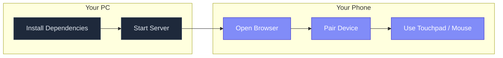
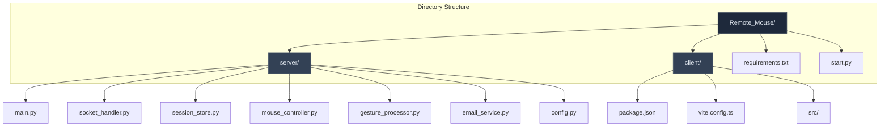
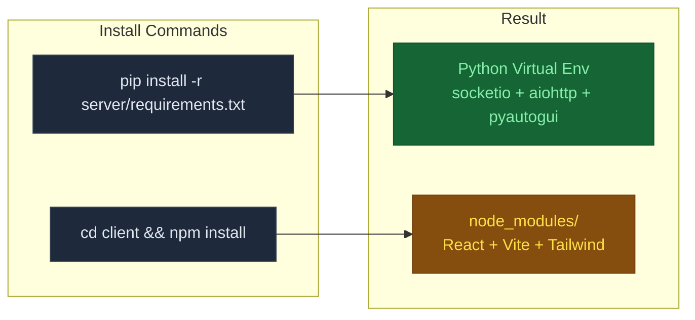
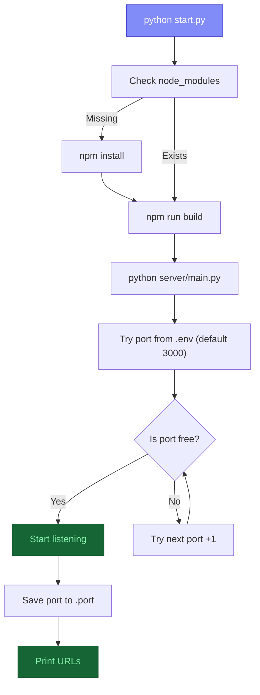
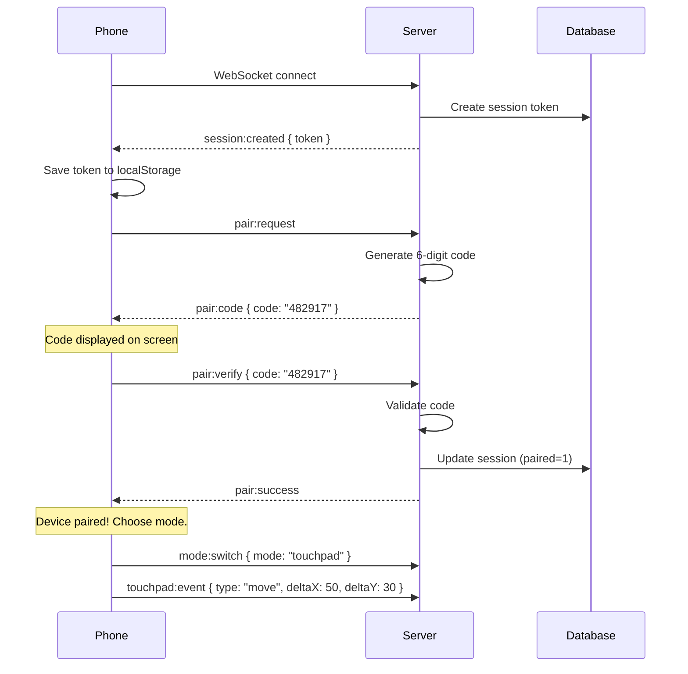
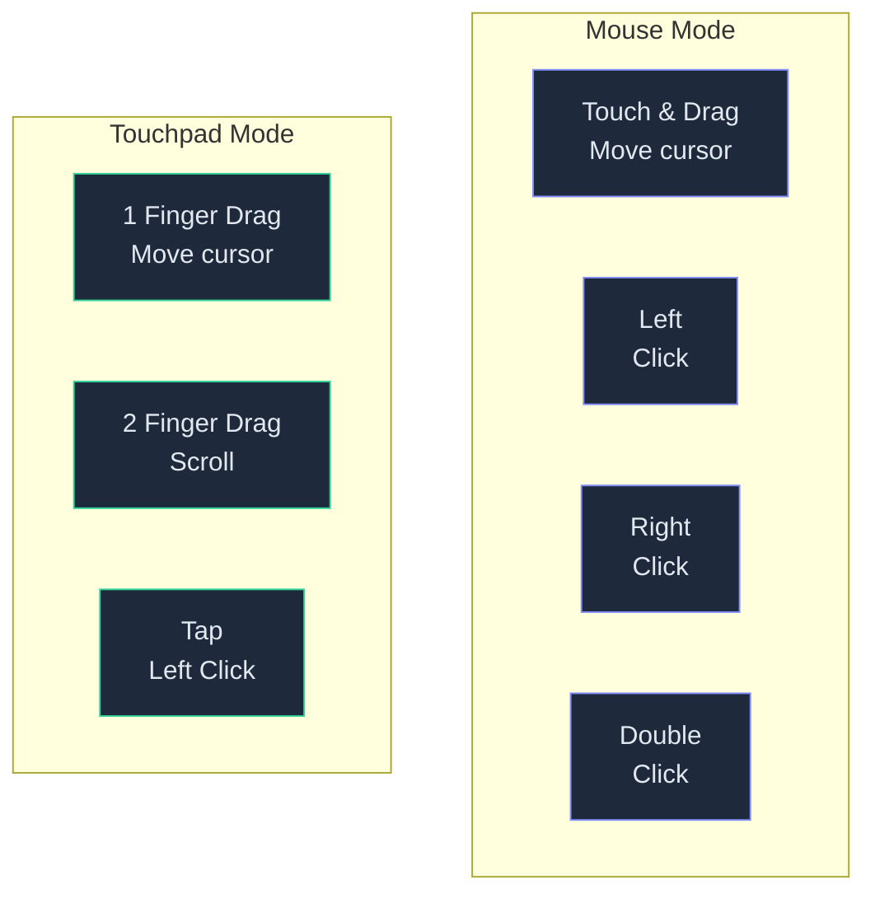
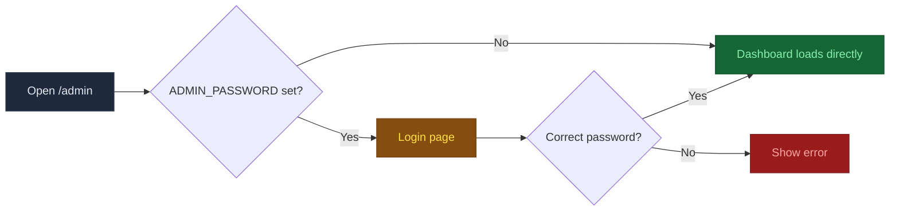
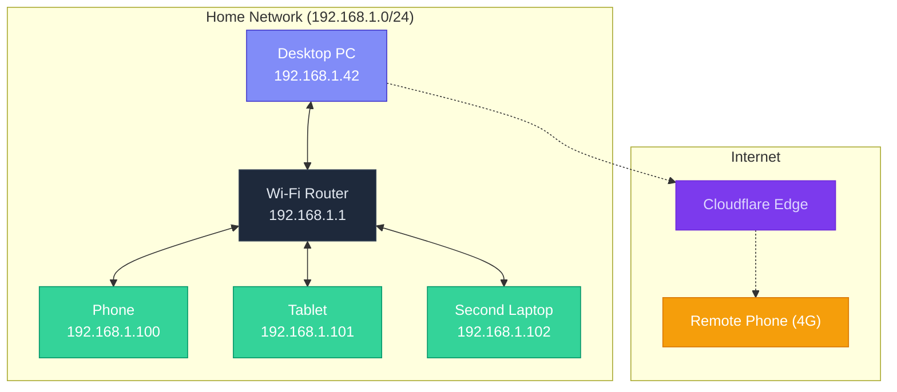

# Getting Started with TouchMorph

This guide walks through the complete setup process — from cloning the repository to controlling your desktop from your phone.

---

## Overview



---

## Step 1: Prerequisites

### On your PC (the machine you want to control)

| Software | Version | Check Command |
|----------|---------|---------------|
| **Python** | 3.10 or later | `python --version` |
| **Node.js** | 18 or later | `node --version` |
| **pip** | (comes with Python) | `pip --version` |
| **npm** | (comes with Node.js) | `npm --version` |

### On your phone (the controller)

- Any modern web browser:
  - **Chrome** (Android)
  - **Safari** (iOS 15+)
  - **Firefox** (Android)
  - **Edge** (Android)

No app installation is required on the phone. Everything runs in the browser.

### Network

- Both devices must be on **the same local network** (Wi-Fi or wired).
- Alternatively, use a **Cloudflare Tunnel** for access over the internet (see [Deployment Guide](04-Deployment.md)).
- No port forwarding or static IP is required for basic LAN use.

---

## Step 2: Clone the Repository

```bash
git clone https://github.com/yourusername/Remote_Mouse.git
cd Remote_Mouse
```



---

## Step 3: Install Dependencies

### Python Backend

```bash
pip install -r server/requirements.txt
```

This installs:

| Package | Version | Purpose |
|---------|---------|---------|
| `python-socketio[asyncio-client]` | 5.12.1 | WebSocket server for real-time communication |
| `aiohttp` | 3.11+ | Async HTTP server for API endpoints and admin dashboard |
| `pyautogui` | 0.9.54 | Cross-platform desktop mouse control |
| `python-dotenv` | 1.0.1 | Load `.env` configuration file |

### JavaScript Frontend

```bash
cd client
npm install
cd ..
```

This installs:

| Package | Version | Purpose |
|---------|---------|---------|
| `react` | 18.3.1 | UI framework |
| `react-dom` | 18.3.1 | React DOM renderer |
| `socket.io-client` | 4.7.4 | WebSocket client for browser |
| `clsx` | 2.1.0 | Conditional CSS class utility |
| `vite` | 5.2+ | Dev server and build tool |
| `tailwindcss` | 3.4+ | Utility-first CSS framework |
| `typescript` | 5.4+ | Type safety |



---

## Step 4: Configure Environment (Optional)

```bash
cp .env.example .env
```

Edit `.env` with a text editor:

```env
TOUCHMORPH_HOST=0.0.0.0
TOUCHMORPH_PORT=3000
```

You can leave these at defaults for most setups. See the [Deployment Guide](04-Deployment.md) for advanced configuration options like:
- Custom port binding
- Admin dashboard password
- SMTP email for tunnel URL delivery

---

## Step 5: Start the Server

### Method A: One-Command Launcher (Recommended)

```bash
python start.py
```

This command:
1. Checks that client dependencies are installed
2. Builds the React app for production
3. Starts the Python server with port auto-detection

```
[TouchMorph] Starting TouchMorph ...
[TouchMorph] Installing client dependencies ...
[TouchMorph] Building client app ...
✓ built in 750ms
[TouchMorph] Attempting port 3000 ...
[TouchMorph] Server running on 0.0.0.0:3000
[TouchMorph] Dashboard: http://localhost:3000/admin
[TouchMorph] Connect from another device: http://192.168.1.42:3000
```

### Method B: Manual (for Development)

Open two terminals:

**Terminal 1 — Python Server:**
```bash
cd server
python main.py
```

**Terminal 2 — Vite Dev Server (for hot reload):**
```bash
cd client
npm run dev
```

The Vite dev server runs on port **5173** and proxies WebSocket traffic to the Python server on port **3000**.

### Port Auto-Fallback

If port 3000 is already in use, the server automatically tries 3001, 3002, etc., up to 3009:

```
[TouchMorph] Port 3000 in use, trying 3001 ...
[TouchMorph] Server running on 0.0.0.0:3001
```

The chosen port is saved to `.port` so the Vite dev server and tunnel scripts can read it.



---

## Step 6: Connect from Your Phone

1. **Look at the terminal** — find the line that says:
   ```
   [TouchMorph] Connect from another device: http://192.168.1.42:3000
   ```

2. **Open that URL** in your phone's browser (Chrome, Safari, etc.)

3. **You will see** the TouchMorph pairing screen.

### First-Time Pairing Flow



### Pairing Steps in Detail

1. The phone connects automatically and receives a session token.
2. Tap the **Generate Code** button on your phone.
3. A 6-digit code appears on the phone screen.
4. The code is also logged in the server terminal.
5. On the phone, enter the same 6-digit code in the input field and press Enter.
6. If the code matches, the device is paired and the main interface loads.

---

## Step 7: Using TouchMorph

### Mouse Mode

The mouse mode provides a virtual touch area and three click buttons:

- **Pointer Area** — Drag your finger to move the cursor. The absolute position on screen maps to your phone's touch coordinates.
- **Left Click** — Tap the Left button.
- **Right Click** — Tap the Right button (opens context menus).
- **Double Click** — Tap the Double button (opens files/applications).

### Touchpad Mode

The touchpad mode gives a more laptop-like experience:

- **1 Finger Move** — Drag with one finger to move the cursor (relative movement, like a laptop touchpad).
- **2 Finger Scroll** — Use two fingers to scroll vertically/horizontally.
- **Tap to Click** — Tap anywhere on the touchpad area to left-click.



---

## Step 8: Admin Dashboard

Open `http://<your-pc-ip>:3000/admin` in your PC's browser (or any browser on the network).

The dashboard shows:

- **Connected Devices** — List of all devices with their session tokens, IP addresses, pairing status, current mode, and last active time.
- **Kick Button** — Force-disconnect a device.
- **Event Log** — Real-time log of all WebSocket events.
- **Auto-Refresh** — The dashboard refreshes every 3 seconds.

If `ADMIN_PASSWORD` is set in `.env`, you must log in first:



---

## Step 9: Stopping the Server

Press **Ctrl+C** in the terminal where the server is running:

```
^C[TouchMorph] Shutting down ...
```

The server stops gracefully, closing all WebSocket connections.

---

## What's Next?

- **Remote access over the internet** — See [Deployment Guide](04-Deployment.md) for Cloudflare Tunnel setup.
- **Customizing the port** — Set `TOUCHMORPH_PORT` in `.env` to a different value.
- **Securing the admin dashboard** — Set `ADMIN_PASSWORD` in `.env`.
- **Adding a QR code** — The architecture supports QR-based discovery for easier phone connection.
- **Keyboard support** — The WebSocket protocol is extensible for keyboard events.

---

## Troubleshooting

| Problem | Solution |
|---------|----------|
| `Port 3000 in use` | Server auto-falls back to 3001+. Or kill the old process: `kill $(lsof -ti:3000)` |
| Phone can't connect | Ensure both devices are on the same network. Check firewall settings. |
| `pyautogui` clicks not working on macOS | Grant Accessibility permissions in System Settings > Privacy & Security > Accessibility |
| Client app not found | Run `python start.py` instead of `python server/main.py` to auto-build the client |
| `npm install` fails | Ensure Node.js 18+ is installed. Delete `node_modules` and try again. |

For more detailed troubleshooting, see the [Troubleshooting Guide](06-Troubleshooting.md).

---

## Platform-Specific Setup Notes

### Windows

```powershell
# Check Python installation
python --version
# If not installed, download from python.org

# Check Node.js installation
node --version
# If not installed, download from nodejs.org

# Install Python dependencies
pip install -r server\requirements.txt

# Install client dependencies and start
cd client
npm install
npm run build
cd ..
python server\main.py
```

**Firewall:** Windows Defender may block the server. Allow inbound connections on port 3000:
```powershell
New-NetFirewallRule -DisplayName "TouchMorph" -Direction Inbound -Protocol TCP -LocalPort 3000 -Action Allow
```

### Linux (Ubuntu/Debian)

```bash
# Install Python and Node.js
sudo apt update
sudo apt install -y python3 python3-pip python3-venv nodejs npm

# Clone and setup
git clone https://github.com/yourusername/Remote_Mouse.git
cd Remote_Mouse

# Create virtual environment (recommended)
python3 -m venv venv
source venv/bin/activate

# Install dependencies
pip install -r server/requirements.txt
cd client && npm install && cd ..

# Build and start
python start.py
```

**System dependencies for pyautogui:**
```bash
# On Linux, pyautogui needs X11 libraries
sudo apt install -y python3-tk python3-dev scrot
```

**DISPLAY variable:** If running from SSH or a service, ensure `DISPLAY` is set:
```bash
export DISPLAY=:0
python start.py
```

### macOS

```bash
# Install Homebrew (if not installed)
/bin/bash -c "$(curl -fsSL https://raw.githubusercontent.com/Homebrew/install/HEAD/install.sh)"

# Install Python and Node.js
brew install python@3.12 node

# Clone and setup
git clone https://github.com/yourusername/Remote_Mouse.git
cd Remote_Mouse
pip3 install -r server/requirements.txt
cd client && npm install && cd ..
python start.py
```

**Accessibility permissions:**
On first run, macOS may block pyautogui. Go to:
- **System Settings > Privacy & Security > Accessibility**
- Add your terminal application (Terminal, iTerm2, VS Code)
- Check the box next to it
- Restart the server

---

## Installing as a Service

### Windows (Task Scheduler)

Create a scheduled task to start TouchMorph automatically on login:

```powershell
$action = New-ScheduledTaskAction -Execute "python" `
  -Argument "server\main.py" `
  -WorkingDirectory "C:\Users\YourName\Remote_Mouse"

$trigger = New-ScheduledTaskTrigger -AtLogOn
$principal = New-ScheduledTaskPrincipal -UserId "YourName" -LogonType Interactive

Register-ScheduledTask -TaskName "TouchMorph" `
  -Action $action `
  -Trigger $trigger `
  -Principal $principal `
  -Force

Write-Host "TouchMorph scheduled task created. Runs on login."
```

### Linux (systemd)

Create a systemd service file:

```bash
sudo tee /etc/systemd/system/touchmorph.service << 'EOF'
[Unit]
Description=TouchMorph Remote Mouse
After=network.target

[Service]
Type=simple
User=$USER
WorkingDirectory=$HOME/Remote_Mouse/server
ExecStart=$HOME/Remote_Mouse/venv/bin/python main.py
Restart=on-failure
RestartSec=5
Environment=DISPLAY=:0

[Install]
WantedBy=multi-user.target
EOF

sudo systemctl daemon-reload
sudo systemctl enable touchmorph
sudo systemctl start touchmorph
```

---

## Verifying the Installation

After completing the setup, run these checks to verify everything works:

```bash
# 1. Server is running
curl http://localhost:3000/health
# Expected: {"status": "ok"}

# 2. Client is served
curl -s http://localhost:3000/ | head -5
# Expected: <!doctype html> ... <title>TouchMorph</title>

# 3. Admin dashboard
curl -s http://localhost:3000/admin | head -5
# Expected: <!DOCTYPE html> ... TouchMorph Dashboard

# 4. No errors in server log
# Terminal should show clean startup without tracebacks
```

---

## Network Diagram



---

## First-Time User Walkthrough

This section describes exactly what you will see on each screen the first time you connect.

### Screen 1: Connecting

When you first open the URL, you'll see a dark screen with "Connecting..." centered. This lasts 1-3 seconds while the WebSocket connection is established.

### Screen 2: Pairing

After connecting, you'll see the pairing screen:

1. **"Pair Your Device"** heading
2. **"Generate Code"** button — tap this
3. A **6-digit code** appears in large text
4. An **input field** appears below the code
5. Enter the same code that appears on screen (wait, the code IS on the phone's screen — this is for the laptop to enter it)

**Important:** The pairing flow works as follows:
- The phone taps "Generate Code"
- The phone displays a 6-digit code
- The person on the laptop sees the code in the laptop's terminal (logged as: `Pairing code generated for <sid>: 482917`)
- The person enters that code on the PHONE (in the input field)
- If the code matches, the phone transitions to the control screen

### Screen 3: Control

Once paired, you'll see:
- **Top bar:** "TouchMorph" title on the left, "mouse | touchpad" toggle in the center, a green dot on the right (connection indicator)
- **Main area:** Either the mouse mode interface or the touchpad mode interface depending on your selection

### Working with Mouse Mode

- The large dotted-border area is your touch surface
- **Drag anywhere** on this area to move the cursor
- The cursor position on your PC screen maps to your phone's touch position
- Three buttons at the bottom: Left, Right, Double
- The area tracks pointer events — you need to touch AND drag

### Working with Touchpad Mode

- The large gradient area is your touchpad
- **One finger:** Drag to move cursor (relative movement)
- **Two fingers:** Drag to scroll
- **Tap:** Left-click
- The touchpad surface changes color when it detects two fingers

---

## Environmental Considerations

### Battery Life

| Factor | Impact | Mitigation |
|--------|--------|-----------|
| Screen on (Wake Lock) | High | Phone screen stays on during use |
| WebSocket connection | Low | Minimal data (~100 bytes per event) |
| Heartbeat ping | Negligible | Single packet every 25 seconds |
| Touch events | Low | Only sent on actual touch input |

**Expected battery drain:** ~5-10% per hour of active use on a modern phone.

### Network Bandwidth

- Each touch event: ~80-120 bytes (WebSocket frame overhead included)
- At 60 events/second (rapid dragging): ~6 KB/s
- At typical usage: ~1-2 KB/s
- **Monthly estimate:** ~100-500 MB for heavy daily use

### Security on Public Networks

On public Wi-Fi (coffee shops, airports), the connection is unencrypted in LAN mode. Either:
1. Use a **Cloudflare Tunnel** for TLS encryption
2. Use a **VPN** between the phone and PC
3. Use a **mobile hotspot** from your phone to create a private network

---

## Getting Started with the Admin Dashboard

The admin dashboard provides a web-based interface for monitoring connected devices. Here's how to use it:

### Accessing the Dashboard

1. Open `http://localhost:3000/admin` on your PC (or `http://192.168.1.42:3000/admin` from another device)
2. If you set `ADMIN_PASSWORD` in `.env`, you'll see a login page
3. If no password is set, the dashboard loads directly

### Dashboard Layout

```
┌─────────────────────────────────────────────────┐
│  TouchMorph Dashboard                            │
│                                                  │
│  Devices: 3  ·  Refresh  ·  Logout               │
├─────────────────────────────────────────────────┤
│  Token      │ IP      │ Status │ Mode │ Time │   │
│  ─────────────────────────────────────────────── │
│  a1b2c3d4… │ 10.0.0.5│ Paired │ mouse│ 2:30PM│ K │
│  e5f6a7b8… │ 10.0.0.6│ Pending│ mouse│ 2:25PM│ K │
│  c9d0e1f2… │ 10.0.0.7│ Paired │ tpad │ 2:20PM│ K │
├─────────────────────────────────────────────────┤
│  Event Log                                       │
│  ┌─────────────────────────────────────────────┐ │
│  │ [2:30PM] a1b2c3d4... touchpad:move         │ │
│  │ [2:30PM] a1b2c3d4... touchpad:move         │ │
│  │ [2:29PM] e5f6a7b8... connect               │ │
│  │ [2:29PM] e5f6a7b8... paired                │ │
│  │ [2:28PM] c9d0e1f2... reconnect             │ │
│  └─────────────────────────────────────────────┘ │
└─────────────────────────────────────────────────┘
```

### Dashboard Features

| Feature | Description |
|---------|-------------|
| **Device count** | Shows total number of known sessions |
| **Refresh** | Manually reloads device list and logs |
| **Logout** | Ends admin session (only visible if auth enabled) |
| **Device table** | Lists all sessions with token, IP, status, mode, and last active time |
| **Status badges** | Green = Paired, Yellow = Pending (not yet paired) |
| **Kick button** | Force-disconnects a device — it must re-pair on next connect |
| **Event log** | Shows last 50 events with timestamps and truncated tokens |

### Admin Session Lifecycle

```mermaid
stateDiagram-v2
    [*] --> LoggedOut
    LoggedOut --> LoggedIn: POST password
    LoggedIn --> LoggedOut: Logout / Cookie expires
    LoggedIn --> LoggedIn: Refresh dashboard
    LoggedOut --> LoggedOut: Wrong password

    state LoggedIn {
        [*] --> ViewingDashboard
        ViewingDashboard --> KickingDevice: Click Kick
        KickingDevice --> ViewingDashboard: Device kicked
        ViewingDashboard --> ViewingDashboard: Auto-refresh 3s
    end
```

---

## First-Time User FAQ

### Why do I need to enter a code on the same device that generated it?

The pairing flow works across TWO devices:
- **Device A (the phone you want to use as remote):** Taps "Generate Code" → code appears
- **Device B (another device, or the server terminal):** Shows the same code

Then you enter the code on **Device A**.

If you only have one phone: the code appears on the phone AND is logged in the server terminal. Enter the code from the terminal into the phone input.

### Why does the cursor jump to random places on first use?

In mouse mode, the touch coordinates map directly to screen coordinates. If the phone's screen is 1080×2340 pixels and the desktop is 1920×1080, the mapping is 1:1 (not scaled). This means touching the center of the phone (540, 1170) maps to (540, 1170) on the desktop, which may be off-center.

**Tip:** Use **touchpad mode** for more natural cursor control. Touchpad mode uses relative movement (delta from last position) instead of absolute positioning.

### Can I control the mouse from multiple phones at the same time?

Yes. Multiple phones can connect and pair simultaneously. However, only the **most recently active** phone controls the cursor. If Phone A moves the mouse, then Phone B moves the mouse, Phone B takes over. The cursor follows the last device that sent an event.

### What happens if I leave the page open and walk away?

The **Wake Lock API** keeps the phone screen on (on Chrome/Safari). The **heartbeat ping** keeps the WebSocket connection alive. When you return, the touchpad still works. After about 10 minutes of inactivity on iOS, the browser may suspend the tab — reloading the page restores the session from localStorage.

### Can I use TouchMorph on my smart TV's browser?

Most smart TV browsers support WebSocket. However, touch events may not work correctly on all TV browsers (some emulate mouse events only). Chrome on Android TV works. Safari on Apple TV may have limitations.

### Does it work with a stylus?

Yes. A stylus generates the same pointer/touch events as a finger. The stylus may provide more precision for mouse mode.

---

## Common First-Time Mistakes

| Mistake | Symptom | Fix |
|---------|---------|-----|
| Opening `localhost:3000` on phone | Phone tries to connect to itself | Use the PC's LAN IP address |
| Typing the wrong IP | "Cannot connect" / timeout | Double-check the IP in terminal |
| Phone on mobile data | Can't reach PC on LAN | Connect phone to same WiFi |
| Firewall blocking port | Connection refused | Add firewall rule for port 3000 |
| Server not built | Blank page or 404 | Run `python start.py` |
| Wrong port (3000 open but moved to 3001) | Connection refused | Check the `.port` file or terminal output |
| Two devices generating codes | Codes don't match | Each device has its OWN code. Enter the code from YOUR screen. |
| Background tab suspended | Connection lost | Reload page — session auto-restores |

---

## Platform-Specific Tips

### iPhone / iPad

- **Safari** supports Wake Lock on iOS 16+. On iOS 15, the screen may lock.
- **Chrome on iOS** uses WebKit (same engine as Safari). Same Wake Lock support.
- To prevent screen lock on iOS 15: Settings > Display & Brightness > Auto-Lock > 5 minutes.
- iOS may prompt "TouchMorph wants to control your PC" — tap Allow.

### Android

- **Chrome** fully supports Wake Lock, WebSocket, and Touch Events.
- Enable **Developer Options** > **Stay awake** (while charging) for testing.
- Some Android OEMs have aggressive battery optimization that may kill the browser. Add Chrome to the "never sleep" list in battery settings.

### Windows Tablet

- Open TouchMorph in a browser on the tablet to control your main PC.
- Touch events work in Edge and Chrome on Windows tablets.
- Two-finger scroll works on touchscreen Windows devices.

---

## Testing Your Setup

After completing the setup, run this comprehensive test:

```bash
#!/usr/bin/env bash
# test-setup.sh — Verify TouchMorph installation

echo "=== TouchMorph Setup Test ==="
echo ""

# 1. Check Python
echo -n "Python: "
python --version 2>&1 || echo "NOT FOUND (install Python 3.10+)"

# 2. Check Python packages
echo -n "pyautogui: "
python -c "import pyautogui; print('OK')" 2>&1 || echo "MISSING (pip install pyautogui)"
echo -n "aiohttp: "
python -c "import aiohttp; print('OK')" 2>&1 || echo "MISSING (pip install aiohttp)"
echo -n "socketio: "
python -c "import socketio; print('OK')" 2>&1 || echo "MISSING (pip install python-socketio)"

# 3. Check Node.js
echo -n "Node.js: "
node --version 2>&1 || echo "NOT FOUND (install Node.js 18+)"

# 4. Check client build
echo -n "Client build: "
if [ -d "client/dist" ]; then
    echo "OK (client/dist exists)"
else
    echo "NOT BUILT (run: cd client && npm run build)"
fi

# 5. Check .env
echo -n ".env file: "
if [ -f ".env" ]; then echo "OK"; else echo "NOT FOUND (optional — cp .env.example .env)"; fi

# 6. Check server
echo -n "Server running: "
if curl -s http://localhost:3000/health > /dev/null 2>&1; then
    echo "OK (port 3000)"
else
    echo "NOT RUNNING (run: python start.py)"
fi

# 7. Check database
echo -n "Database: "
if [ -f "server/touchmorph.db" ]; then
    RECORDS=$(sqlite3 server/touchmorph.db "SELECT count(*) FROM sessions;" 2>/dev/null)
    echo "OK ($RECORDS sessions)"
else
    echo "EMPTY (auto-created on first server start)"
fi

echo ""
echo "=== Test Complete ==="
```

---

## Getting Help

If you encounter issues not covered in this guide:

1. **Read the Troubleshooting Guide:** See [06-Troubleshooting.md](06-Troubleshooting.md)
2. **Check the server terminal:** Error messages are printed to the console
3. **Check the admin dashboard:** `/admin` shows device status and event logs
4. **Generate a support bundle:** See the Troubleshooting Guide for instructions

### Quick Links

| Resource | Location |
|----------|----------|
| Getting Started | This guide |
| Architecture | [wiki/02-Architecture.md](02-Architecture.md) |
| API Reference | [wiki/03-API-Reference.md](03-API-Reference.md) |
| Deployment | [wiki/04-Deployment.md](04-Deployment.md) |
| Development | [wiki/05-Development.md](05-Development.md) |
| Troubleshooting | [wiki/06-Troubleshooting.md](06-Troubleshooting.md) |
