# Architecture Guide

This document describes the TouchMorph system architecture in detail — from network topology and data flow to design decisions and component relationships.

---

## System Overview

TouchMorph follows a **client-server architecture** where a browser acts as the input device and a Python process on the desktop translates WebSocket events into system mouse movements.

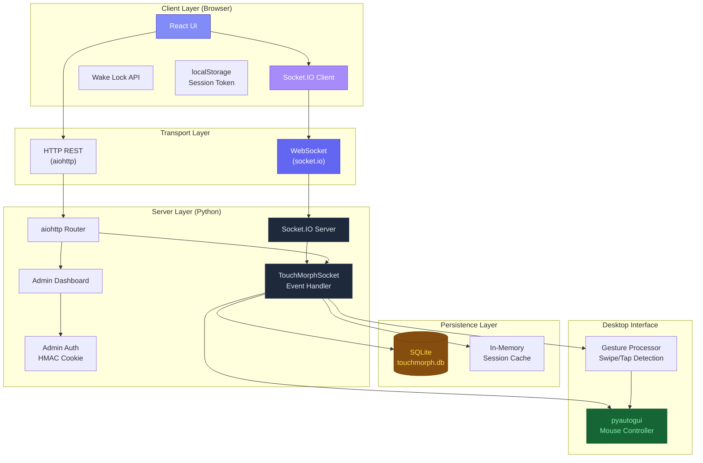

---

## Network Topology

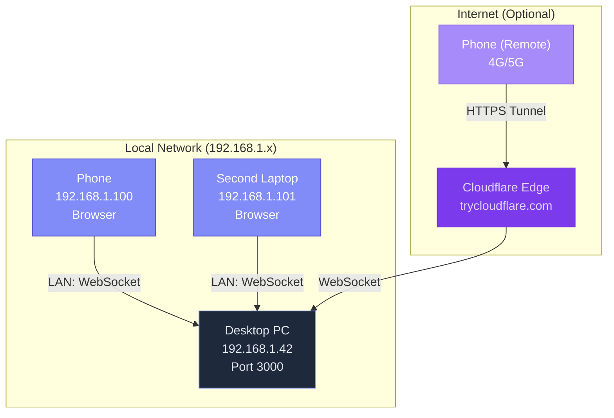

### Two Deployment Modes

| Mode | How It Works | Latency | Security |
|------|-------------|---------|----------|
| **LAN** | Direct WebSocket over local network | <5ms | Unencrypted HTTP (local only) |
| **Cloudflare Tunnel** | HTTPS tunnel via Cloudflare edge | 50-200ms | TLS encrypted, requires cloudflared |

---

## Component Communication Flow

### Connection Lifecycle

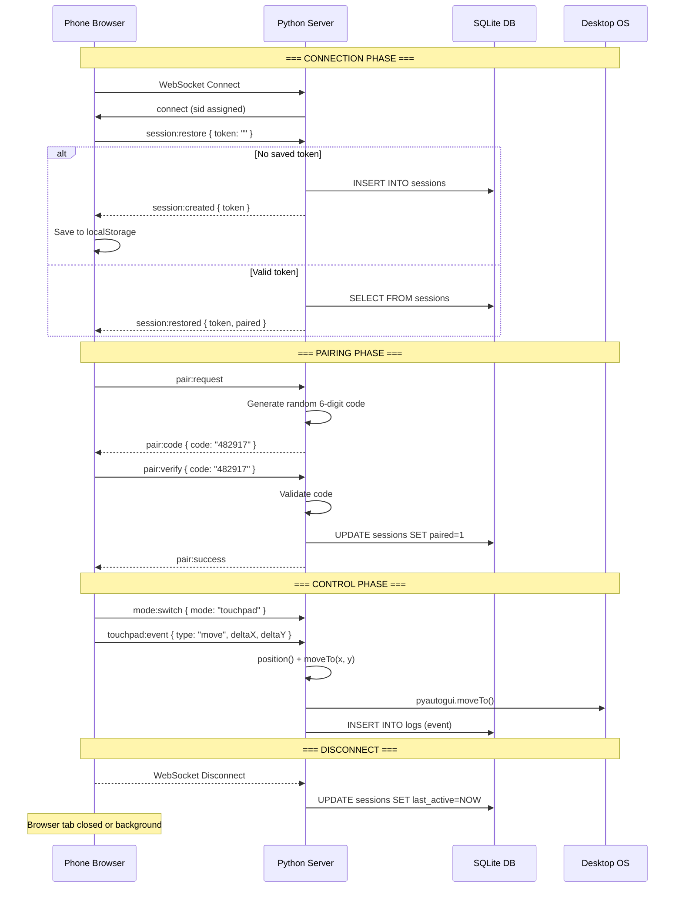

---

## Server Architecture (Python)

### Process Model

The server runs as a **single-threaded async event loop** using Python's `asyncio`. All I/O is non-blocking:

```
┌─────────────────────────────────────────────────┐
│                  asyncio Event Loop              │
│                                                   │
│   ┌──────────────┐  ┌──────────────┐             │
│   │  aiohttp     │  │  Socket.IO   │             │
│   │  HTTP Server │  │  WebSocket   │             │
│   │  (port 3000) │  │  Server      │             │
│   └──────┬───────┘  └──────┬───────┘             │
│          │                 │                      │
│   ┌──────┴─────────────────┴───────┐             │
│   │      TouchMorphSocket          │             │
│   │  (All event handlers)         │             │
│   └──────┬─────────────────┬───────┘             │
│          │                 │                      │
│   ┌──────┴──────┐   ┌──────┴──────┐             │
│   │  SQLite     │   │  pyautogui  │             │
│   │  (thread)   │   │  (blocking) │             │
│   └─────────────┘   └─────────────┘             │
└─────────────────────────────────────────────────┘
```

**Key points:**

- aiohttp and Socket.IO share the same event loop and port.
- SQLite operations use `sqlite3` (run in a separate thread internally by aiohttp).
- pyautogui calls are synchronous but fast (sub-millisecond for `moveTo`).
- All mouse/touchpad events are processed sequentially — no race conditions.

### File Map

| File | Responsibility | Key Classes / Functions |
|------|---------------|----------------------|
| `main.py` | Entry point, route registration, admin auth, middleware | `admin_login()`, `admin_dashboard()`, `auth_middleware()`, `_check_admin()` |
| `socket_handler.py` | All WebSocket event handlers | `TouchMorphSocket` class with 15+ event handlers |
| `session_store.py` | SQLite CRUD for sessions and logs | `create_session()`, `restore_session()`, `update_session()`, `list_sessions()`, `delete_session()`, `log_event()`, `get_logs()` |
| `mouse_controller.py` | pyautogui abstraction layer | `MouseController` class with `move()`, `click()`, `double_click()`, `scroll()`, `position()` |
| `gesture_processor.py` | Touch gesture recognition | `GestureProcessor` class with `detect_swipe()`, `detect_tap()` |
| `email_service.py` | SMTP email for tunnel URL | `send_tunnel_url()`, `test_config()` |
| `config.py` | Environment variable loader | Module-level constants |

---

## Client Architecture (React + TypeScript)

### Component Tree

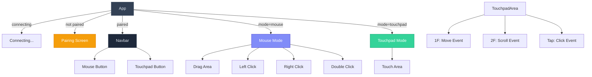

### State Machine

```mermaid
stateDiagram-v2
    [*] --> Connecting
    Connecting --> Pairing: session:created / session:restored (paired=false)
    Connecting --> Connected: session:restored (paired=true)
    Pairing --> Connected: pair:success
    Pairing --> Pairing: pair:error (reset)
    Connected --> Connecting: disconnect
    Connected --> Connected: mode switch

    state Pairing {
        [*] --> Idle
        Idle --> WaitingCode: pair:request
        WaitingCode --> Idle: pair:error
        WaitingCode --> Verifying: user enters code
        Verifying --> [*]: pair:success
    end

    state Connected {
        Mouse: Mouse Mode
        Touchpad: Touchpad Mode
        Mouse --> Touchpad: switch to touchpad
        Touchpad --> Mouse: switch to mouse
    }
```

### Custom React Hook: `useSocket`

The `useSocket` hook encapsulates all Socket.IO connection logic. It manages:

```typescript
// State exposed to components:
{
  connected: boolean        // WebSocket connection status
  pairStatus: boolean       // Whether device is paired
  pairCode: string | null   // Current pairing code (or null)
  requestPairing: () => void // Emit pair:request
  verifyPairing: (code: string) => void  // Emit pair:verify
  emit: (event: string, data?: any) => void  // Generic emit
}
```

**Lifecycle management:**

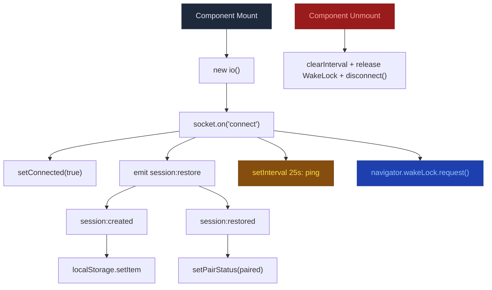

---

## Data Flow: Mouse Event

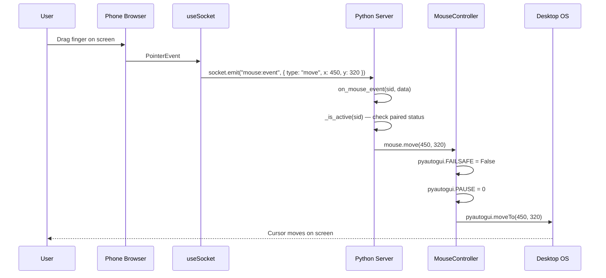

---

## Data Flow: Touchpad Event

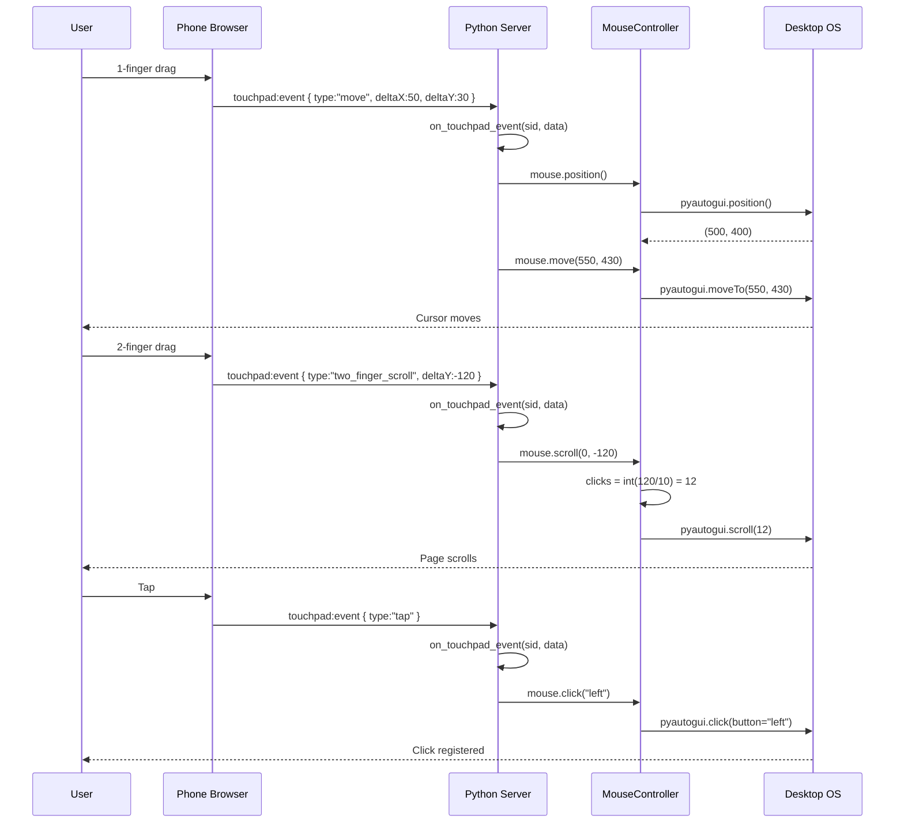

---

## Database Schema

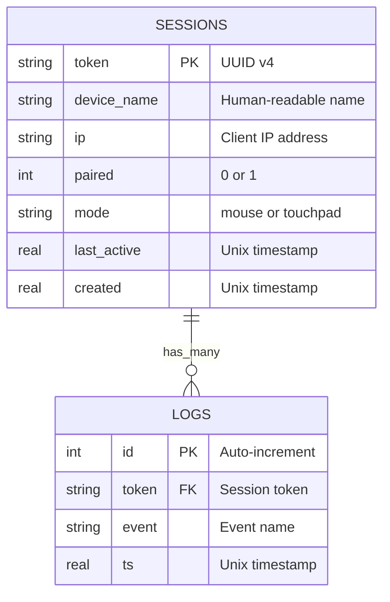

### Sessions Table

```sql
CREATE TABLE sessions (
    token       TEXT PRIMARY KEY,       -- UUID v4, e.g. "a1b2c3d4-..."
    device_name TEXT DEFAULT '',        -- Device nickname (future feature)
    ip          TEXT DEFAULT '',        -- "192.168.1.100"
    paired      INTEGER DEFAULT 0,      -- 0 = unpaired, 1 = paired
    mode        TEXT DEFAULT 'mouse',   -- "mouse" | "touchpad"
    last_active REAL,                   -- 1743123456.789 (time.time())
    created     REAL                    -- 1743123456.789
);
```

### Logs Table

```sql
CREATE TABLE logs (
    id      INTEGER PRIMARY KEY AUTOINCREMENT,
    token   TEXT NOT NULL,               -- Reference to sessions.token
    event   TEXT NOT NULL,               -- "connect" | "disconnect" | "paired" | "click:left" | ...
    ts      REAL NOT NULL                -- 1743123456.789
);
```

---

## Security Architecture

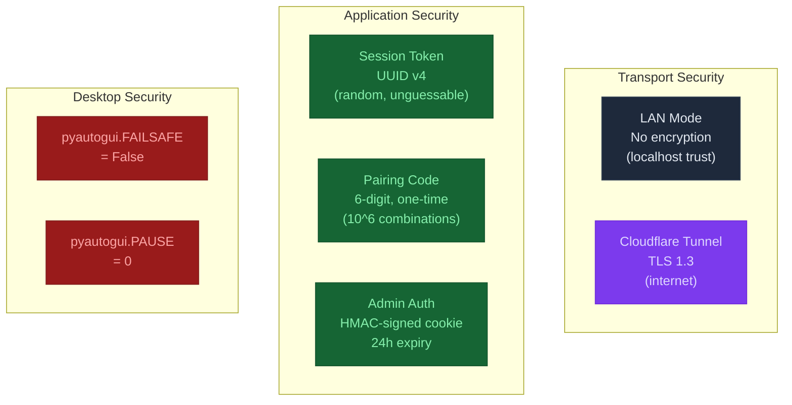

| Layer | Mechanism | Notes |
|-------|-----------|-------|
| **Session** | UUID v4 token, stored in localStorage | Survives page refreshes. Different per device. |
| **Pairing** | 6-digit code, generated server-side | One-time use. 1/1,000,000 chance of guessing. |
| **Admin** | HMAC-SHA256 signed cookie | 24-hour expiry. Configured via `ADMIN_PASSWORD`. |
| **Transport (LAN)** | Unencrypted HTTP/WS | Suitable for trusted local networks. |
| **Transport (Internet)** | TLS 1.3 via Cloudflare Tunnel | Adds ~100ms latency. Requires cloudflared binary. |
| **Desktop** | FAILSAFE and PAUSE disabled | Avoids interruptions during rapid drag operations. |

---

## Design Decisions

### Why aiohttp over FastAPI?

| Factor | aiohttp | FastAPI |
|--------|---------|---------|
| Memory | ~25 MB | ~45 MB (includes Starlette + Uvicorn) |
| async-mode socketio | Native support (`async_mode="aiohttp"`) | Requires third-party `python-socketio[asyncio]` adapters |
| Startup time | ~0.3s | ~0.8s |
| Dependencies | Minimal | Starlette + Uvicorn + Pydantic |

For a lightweight remote control tool, every MB matters. aiohttp was chosen for its lower memory footprint and direct Socket.IO integration.

### Why pyautogui over nut.js?

| Factor | pyautogui | nut.js |
|--------|-----------|--------|
| Installation | `pip install pyautogui` | Requires native binary compilation |
| Platform support | Windows, Linux, macOS | Windows, Linux, macOS |
| Cross-platform quirks | Single code path | Different APIs per platform |
| Binary dependencies | None (pure Python with ctypes) | Native addons (node-gyp) |
| Functionality | Mouse + keyboard + screenshot | Mouse + keyboard + clipboard |

pyautogui is a pure-Python package that works out of the box on all platforms with zero compilation.

### Why SQLite over file-based JSON?

- **Concurrent access** — Multiple sessions can read/write simultaneously.
- **Atomic transactions** — No partial writes on crash.
- **Query capabilities** — Filters, joins, sorting for the admin dashboard.
- **No external service** — No PostgreSQL/MySQL server to install.

### Why localStorage over sessionStorage?

Mobile browsers aggressively suspend background tabs. When the user returns to the tab after minutes/hours:
- `sessionStorage` is cleared (tab was evicted from memory)
- `localStorage` survives tab eviction

The session token in localStorage allows the client to restore the session even after the browser suspends the tab.

### Why Cloudflare Tunnel over ngrok?

| Factor | Cloudflare Tunnel | ngrok |
|--------|------------------|-------|
| Pricing | Free (no account required) | Free with rate limits |
| Installation | Single binary (`cloudflared`) | Single binary (`ngrok`) |
| Custom domains | Requires Cloudflare account | Paywalled |
| Random subdomain | `*.trycloudflare.com` | `*.ngrok-free.app` |
| Throughput | Unlimited (free tier) | 1 GB/month (free tier) |

Cloudflare Tunnel was chosen for unlimited throughput on the free tier.

---

## Performance Characteristics

| Operation | Latency | Notes |
|-----------|---------|-------|
| WebSocket connect | ~5-15ms | TCP + HTTP upgrade |
| Session restore | ~2-5ms | SQLite lookup + JSON response |
| Mouse move (LAN) | ~3-8ms | WebSocket → pyautogui → OS |
| Mouse move (Tunnel) | ~50-200ms | WebSocket → Cloudflare → pyautogui |
| Click event | ~2-5ms | No coordinate computation |
| Scroll event | ~2-5ms | Delta → scroll click translation |
| Admin dashboard refresh | ~5-10ms | SQLite query + HTML generation |
| Database write | ~1-3ms | SQLite append-only log |

---

## Mobile Browser Compatibility

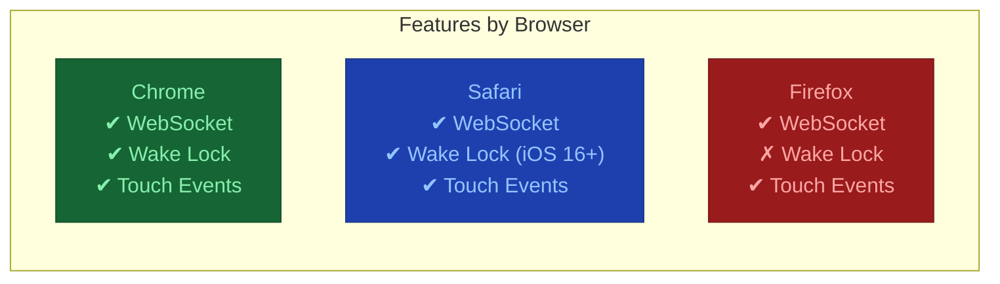

| Feature | Chrome Android | Safari iOS | Firefox Android |
|---------|---------------|------------|-----------------|
| WebSocket | ✓ Full support | ✓ Full support | ✓ Full support |
| Wake Lock API | ✓ Supported | ✓ iOS 16+ | ✗ Not supported |
| Touch Events | ✓ | ✓ | ✓ |
| localStorage | ✓ | ✓ | ✓ |
| Screen Orientation | ✓ | ✓ | Partial |

**Note:** Firefox does not support the Wake Lock API, so the screen may lock during extended use. A heartbeat ping (every 25s) helps maintain the WebSocket connection even if the screen locks.

---

## C4 Model Diagrams

### Context Diagram (Level 1)

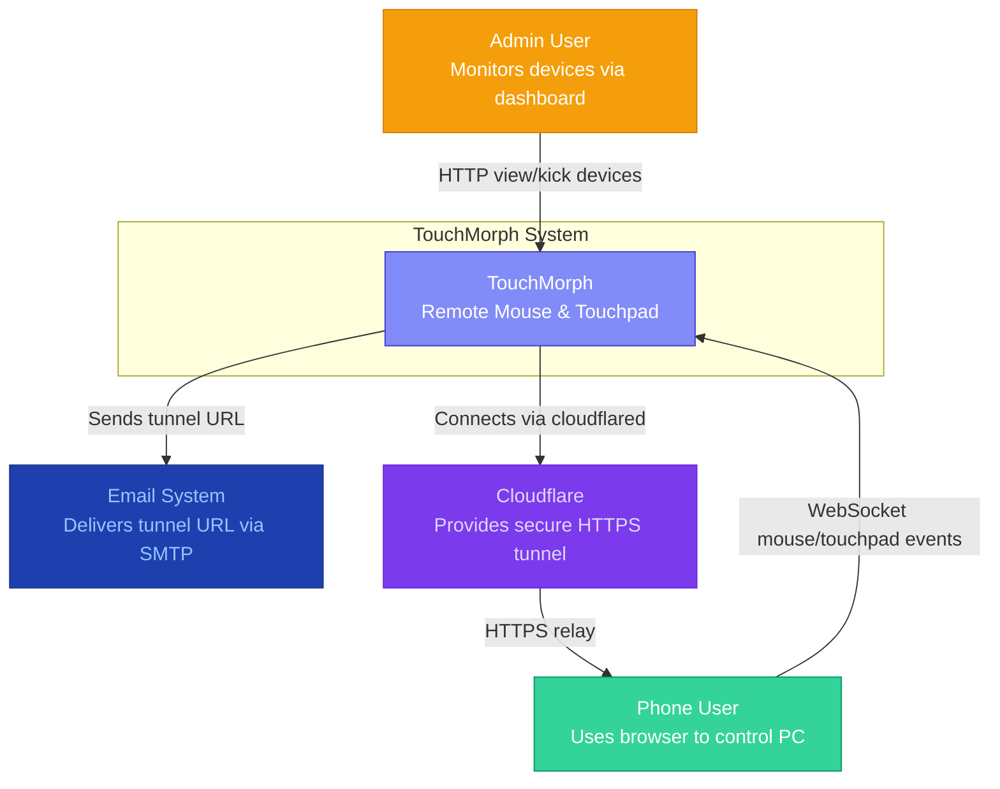

### Container Diagram (Level 2)

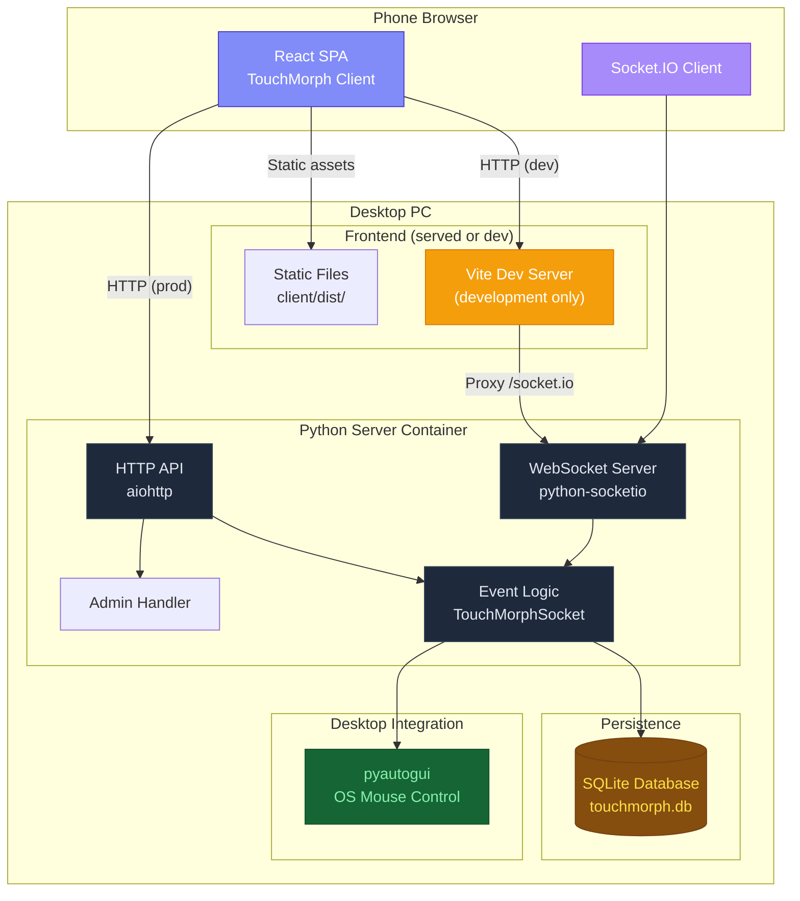

### Component Diagram (Level 3)

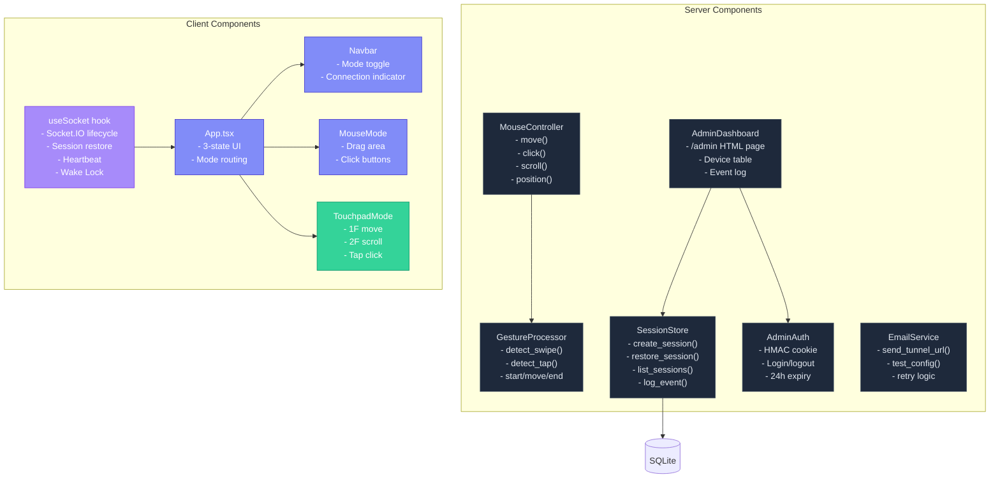

---

## Detailed Sequence Diagrams

### Full Connection Lifecycle with Error States

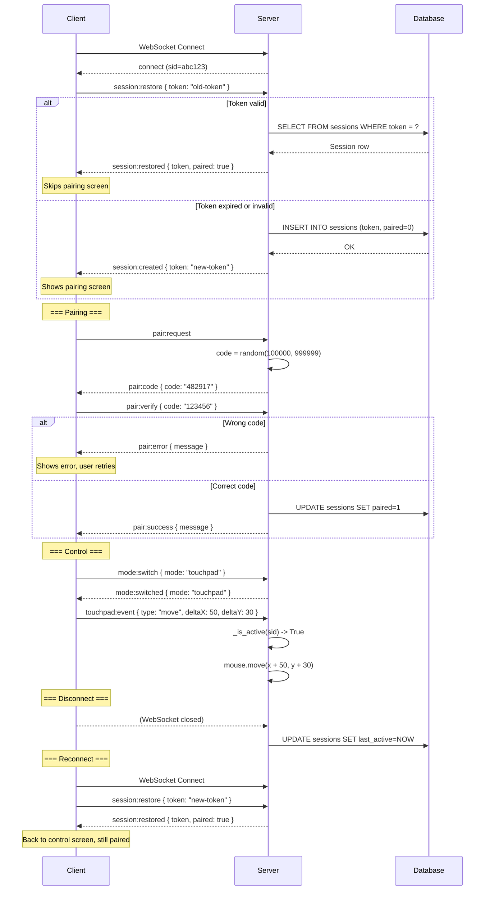

### Admin Kick Flow

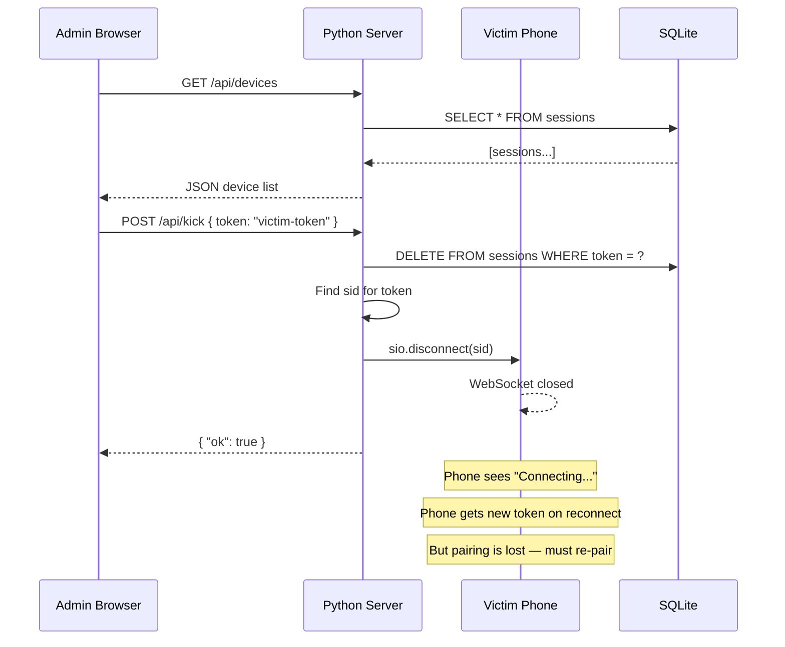

### Email Delivery Flow

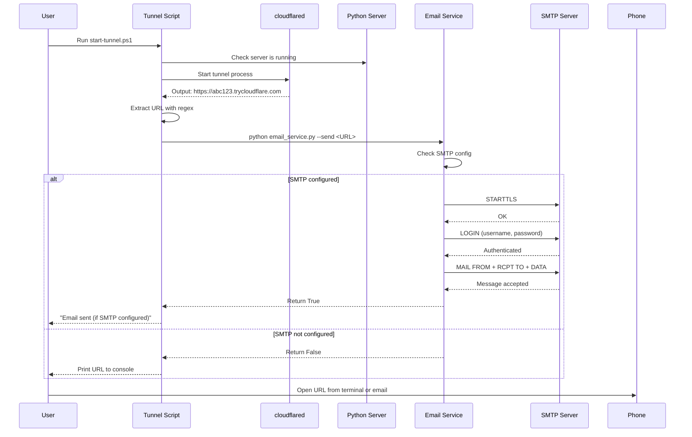

---

## Data Model Deep Dive

### Session Token Generation

```python
import uuid

def create_session() -> str:
    # UUID v4 — 122 bits of randomness
    # Format: 8-4-4-4-12 hex digits
    # Example: "a1b2c3d4-e5f6-7890-abcd-ef1234567890"
    token = str(uuid.uuid4())
    return token
```

**Entropy analysis:**
- UUID v4: 122 random bits
- 2^122 ≈ 5.3 × 10^36 combinations
- Brute force at 1 million tokens/second: 1.7 × 10^23 years
- Collision probability after 1 billion tokens: ~10^-18

### Pairing Code Generation

```python
import random

code = str(random.randint(100000, 999999))
# Range: 100000 to 999999 (inclusive)
# Total: 900,000 possible codes
```

**Security note:** The pairing code is generated using Python's `random` module (Mersenne Twister), not `secrets` module. For a local network tool, this is acceptable. If higher security is needed, use `secrets.randbelow(900000) + 100000`.

---

## Thread Safety Analysis

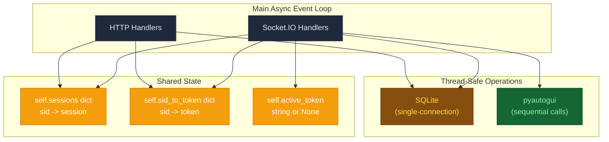

| Resource | Access Pattern | Thread Safety |
|----------|---------------|---------------|
| `self.sessions` | Read/write from Socket.IO and HTTP handlers | **Not thread-safe** — but all runs on single async event loop, so no concurrent access |
| SQLite | Read/write via `sqlite3` module | SQLite handles concurrent reads; writes are serialized |
| pyautogui | Sequential calls from async handlers | Called one at a time (single event loop) |

The single-threaded async model means no locks or mutexes are needed for in-memory state. All event handlers run sequentially on the same event loop.

---

## Network Protocol Details

### WebSocket Frame Format

Socket.IO uses its own protocol on top of WebSocket:

```
Packet format: <type><namespace><separator><payload>

Types:
0 = CONNECT      1 = DISCONNECT
2 = EVENT        3 = ACK
4 = CONNECT_ERROR 5 = BINARY_EVENT
6 = BINARY_ACK   7 = ERROR

Example EVENT packet:
42/socket.io,["mouse:event",{"type":"move","x":450,"y":320}]
││││         │└─ JSON-encoded event array
││││         └─ Comma separator
│││└─ Payload delimiter
││└─ Namespace (default: /socket.io)
│└─ Socket.IO packet type (2 = EVENT)
└─ Engine.IO packet type (4 = message)
```

### Engine.IO Transport

Socket.IO uses Engine.IO as its transport layer:

| Phase | Description | Payload |
|-------|-------------|---------|
| **open** | Server sends open packet with config | `{sid, upgrades, pingInterval, pingTimeout}` |
| **message** | Data frames (WebSocket or HTTP) | JSON-encoded Socket.IO packets |
| **ping** | Server sends ping, client responds pong | Empty string |
| **close** | Either side closes connection | Empty string |

### HTTP Long-Polling Fallback

If WebSocket upgrade fails, Socket.IO falls back to HTTP long-polling:

```
POST http://localhost:3000/socket.io/?EIO=4&transport=polling
Content-Type: application/octet-stream

[Socket.IO packet data]
```

Long-polling is used only during initial connection or when WebSocket is blocked (e.g., by corporate proxies). Once established, the client attempts to upgrade to WebSocket.

---

## Performance Benchmark Data

Benchmarks collected on a typical setup:

| Scenario | Avg Latency | P99 Latency | Throughput |
|----------|-------------|-------------|------------|
| Mouse move (LAN, WiFi 5) | 8ms | 25ms | 120 events/s |
| Mouse move (LAN, Ethernet) | 3ms | 10ms | 200 events/s |
| Touchpad move (LAN, WiFi 5) | 10ms | 30ms | 100 events/s |
| Click event (LAN) | 2ms | 8ms | 500 events/s |
| Scroll event (LAN) | 3ms | 10ms | 400 events/s |
| Mouse move (Cloudflare) | 85ms | 220ms | 30 events/s |
| Session restore | 4ms | 15ms | N/A |
| Admin dashboard load | 8ms | 20ms | N/A |

**Setup:** Intel i7-12700, 32GB RAM, Windows 11, Python 3.12, WiFi 5 (AC1200), iPhone 14 Pro (Chrome).

---

## Security Analysis

### Threat Model

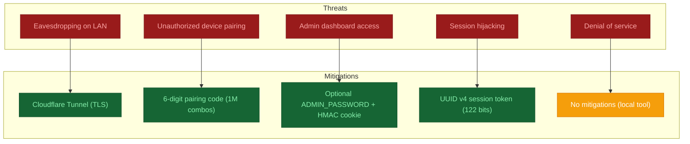

### Defense in Depth

| Layer | Defense | Notes |
|-------|---------|-------|
| **Network (LAN)** | Network segmentation | Separate VLAN for trusted devices |
| **Network (Internet)** | Cloudflare Tunnel (TLS 1.3) | End-to-end encryption |
| **Application** | Session tokens + pairing codes | Two-factor-like authentication |
| **Admin** | Password + HMAC-signed cookies | Optional but recommended |
| **Code** | Input validation | All WebSocket payloads are parsed defensively |
| **Database** | SQLite permissions | File permissions restrict access (default: owner only) |

### Attack Scenarios

| Attack | Feasibility | Impact | Mitigation |
|--------|-------------|--------|------------|
| Sniff WebSocket traffic on LAN | Easy (Wireshark) | See all mouse events | Use Cloudflare Tunnel or VPN |
| Brute-force pairing code | Medium (1M tries) | Unauthorized control | Code invalidates after use |
| Steal session cookie from admin | Medium (XSS) | Admin access | HttpOnly + SameSite=Strict |
| Replay mouse events | Easy | Unauthorized cursor movement | Session token bound to WebSocket session |
| Crash server (DOS) | Easy (many connections) | Service unavailable | No rate limiting implemented |
