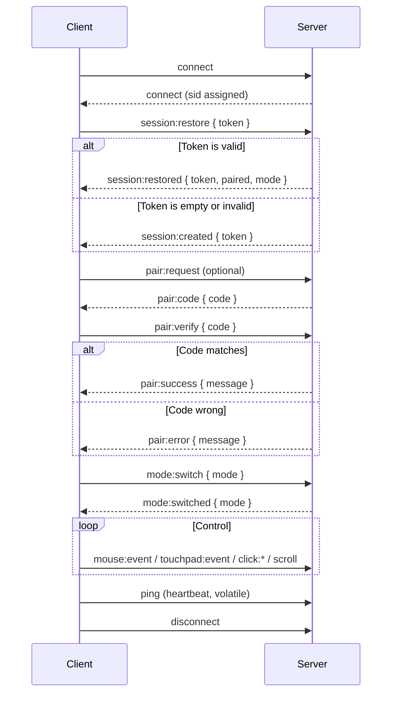
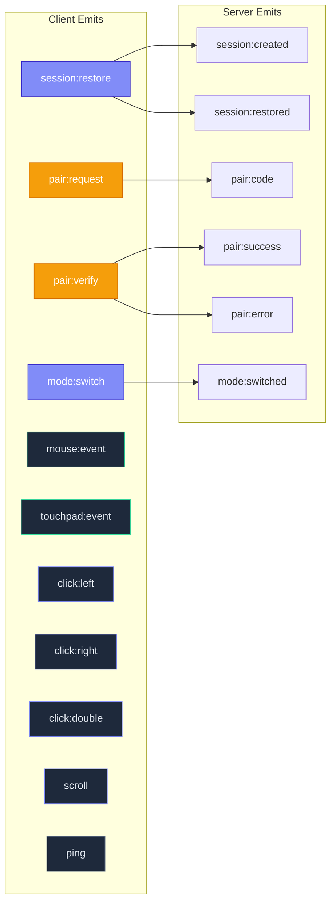
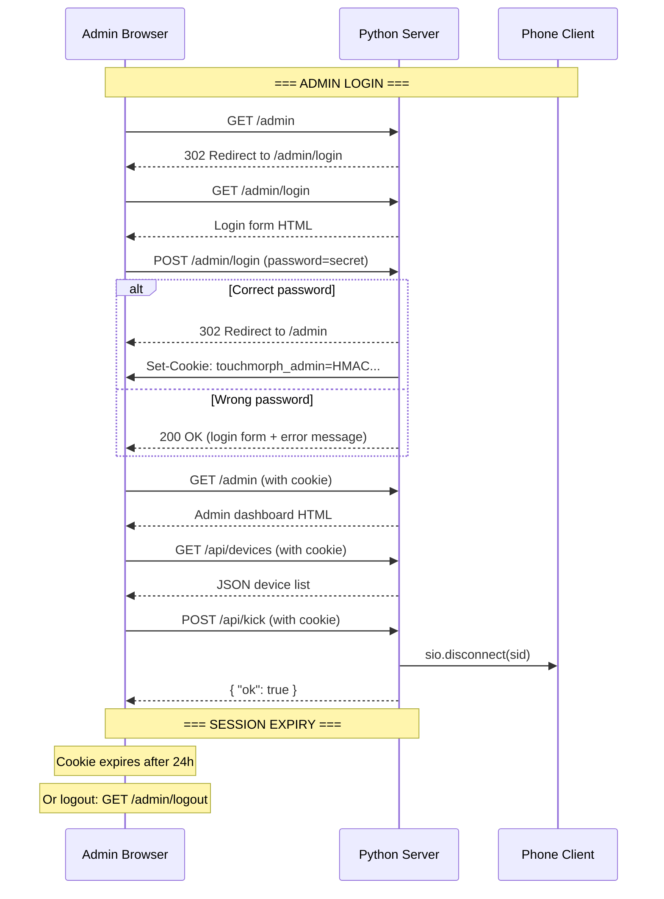
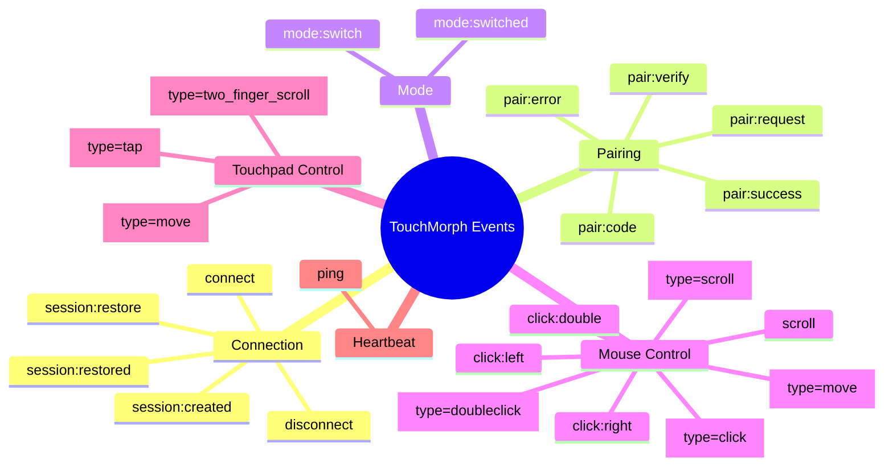
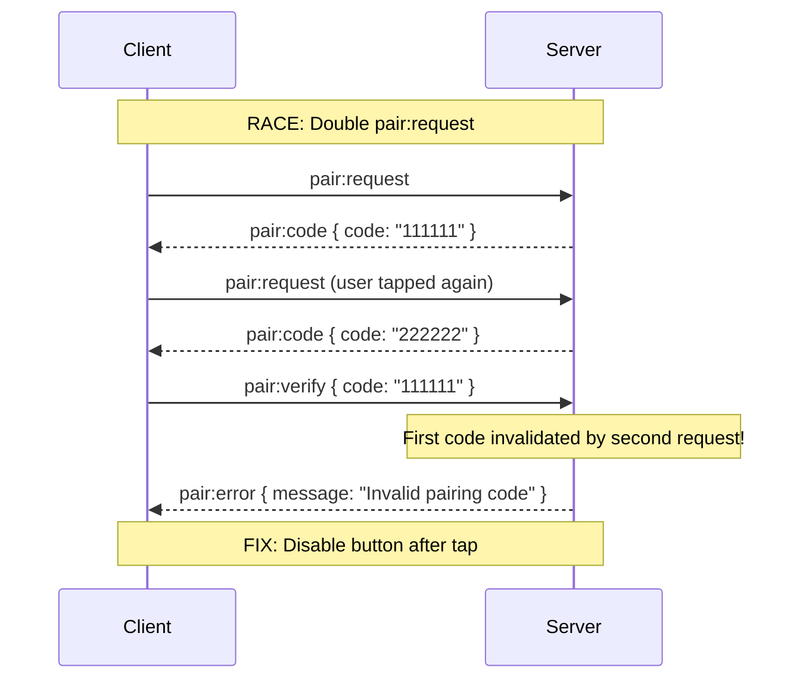
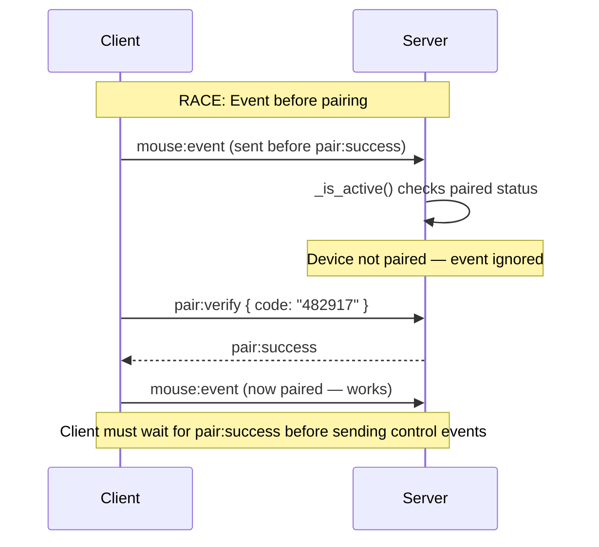

# API Reference

Complete documentation of all WebSocket events, HTTP endpoints, and data structures used by TouchMorph.

---

## WebSocket Events

The client-server communication uses **Socket.IO** with WebSocket transport (with long-polling fallback). All events are JSON-encoded.

### Connection Flow



---

### Client → Server Events

#### `session:restore`

Restore a previous session or create a new one. Sent immediately on WebSocket connect.

**Payload:**

```json
{
  "token": "a1b2c3d4-e5f6-7890-abcd-ef1234567890"
}
```

| Field | Type | Required | Description |
|-------|------|----------|-------------|
| `token` | string | No | Previously saved session token. Empty string or omitted to create new session. |

**Server responses:** `session:created` or `session:restored`

---

#### `pair:request`

Request a new 6-digit pairing code.

**Payload:** None

**Server response:** `pair:code`

---

#### `pair:verify`

Submit a pairing code to establish the device as the active controller.

**Payload:**

```json
{
  "code": "482917"
}
```

| Field | Type | Required | Description |
|-------|------|----------|-------------|
| `code` | string | Yes | The 6-digit code displayed on the device that called `pair:request`. |

**Server responses:** `pair:success` or `pair:error`

---

#### `mode:switch`

Switch between mouse and touchpad mode.

**Payload:**

```json
{
  "mode": "touchpad"
}
```

| Field | Type | Required | Description |
|-------|------|----------|-------------|
| `mode` | string | Yes | Either `"mouse"` or `"touchpad"`. |

**Server response:** `mode:switched`

---

#### `mouse:event`

Send a mouse-related event (move, click, double-click, scroll).

**Payload — Move:**

```json
{
  "type": "move",
  "x": 450,
  "y": 320
}
```

| Field | Type | Required | Description |
|-------|------|----------|-------------|
| `type` | string | Yes | `"move"`, `"click"`, `"doubleclick"`, or `"scroll"` |
| `x` | number | For move | Absolute X coordinate from phone touch position |
| `y` | number | For move | Absolute Y coordinate from phone touch position |
| `button` | string | For click | `"left"` or `"right"` |
| `deltaX` | number | For scroll | Horizontal scroll delta (used for touchpad-style scroll) |
| `deltaY` | number | For scroll | Vertical scroll delta (used for touchpad-style scroll) |

**Payload — Click:**

```json
{
  "type": "click",
  "button": "right"
}
```

**Payload — Scroll:**

```json
{
  "type": "scroll",
  "deltaY": -120,
  "deltaX": 0
}
```

---

#### `touchpad:event`

Send a touchpad event (relative move, two-finger scroll, tap).

**Payload — Move (1 finger):**

```json
{
  "type": "move",
  "deltaX": 50,
  "deltaY": 30,
  "fingerCount": 1
}
```

| Field | Type | Required | Description |
|-------|------|----------|-------------|
| `type` | string | Yes | `"move"`, `"tap"`, or `"two_finger_scroll"` |
| `deltaX` | number | For move/scroll | Horizontal delta from last position |
| `deltaY` | number | For move/scroll | Vertical delta from last position |
| `fingerCount` | number | No | Number of fingers detected (1 or 2) |

**Payload — Two-Finger Scroll:**

```json
{
  "type": "two_finger_scroll",
  "deltaX": 0,
  "deltaY": -120,
  "fingerCount": 2
}
```

**Payload — Tap:**

```json
{
  "type": "tap"
}
```

---

#### `click:left`

Trigger a left mouse button click.

**Payload:** None

---

#### `click:right`

Trigger a right mouse button click.

**Payload:** None

---

#### `click:double`

Trigger a double-click (left button).

**Payload:** None

---

#### `scroll`

Trigger a scroll event.

**Payload:**

```json
{
  "deltaY": -120,
  "deltaX": 0
}
```

| Field | Type | Required | Description |
|-------|------|----------|-------------|
| `deltaY` | number | No | Vertical scroll delta. Negative = scroll down. |
| `deltaX` | number | No | Horizontal scroll delta. |

---

#### `ping`

Heartbeat ping to keep the connection alive. Sent as a **volatile** event every 25 seconds — if the connection is congested, the ping is dropped rather than queued.

**Payload:** None (no acknowledgment expected)

---

### Server → Client Events

#### `session:created`

Sent when a new session is created (no valid token provided on connect).

```json
{
  "token": "a1b2c3d4-e5f6-7890-abcd-ef1234567890"
}
```

| Field | Type | Description |
|-------|------|-------------|
| `token` | string | The new session UUID. Must be saved to localStorage. |

---

#### `session:restored`

Sent when an existing session is successfully restored.

```json
{
  "token": "a1b2c3d4-e5f6-7890-abcd-ef1234567890",
  "paired": true,
  "mode": "touchpad"
}
```

| Field | Type | Description |
|-------|------|-------------|
| `token` | string | The session UUID (may be refreshed by server) |
| `paired` | boolean | Whether the device was already paired |
| `mode` | string | Last used mode: `"mouse"` or `"touchpad"` |

---

#### `pair:code`

Sent in response to `pair:request`. Contains the 6-digit pairing code.

```json
{
  "code": "482917"
}
```

| Field | Type | Description |
|-------|------|-------------|
| `code` | string | 6-digit numeric code. Display this to the user. |

---

#### `pair:success`

Sent when `pair:verify` receives a matching code.

```json
{
  "message": "Device paired successfully"
}
```

The client should enable the main control interface upon receiving this event.

---

#### `pair:error`

Sent when `pair:verify` receives a non-matching code.

```json
{
  "message": "Invalid pairing code"
}
```

The client should clear the code input and allow the user to retry.

---

#### `mode:switched`

Confirms the mode switch requested via `mode:switch`.

```json
{
  "mode": "touchpad"
}
```

| Field | Type | Description |
|-------|------|-------------|
| `mode` | string | The confirmed mode: `"mouse"` or `"touchpad"` |

---

### Event Summary



---

## HTTP API Endpoints

### `GET /health`

Health check endpoint. Returns server status.

**Response 200:**

```json
{
  "status": "ok"
}
```

---

### `GET /admin`

The TouchMorph admin dashboard. Returns an HTML page with device monitoring and event logs.

**Authentication:** Required if `ADMIN_PASSWORD` is set.

**Response 200:** HTML page (see [Admin Dashboard](#admin-dashboard) section)

---

### `GET /admin/login`

Login page for admin authentication. Only accessible when `ADMIN_PASSWORD` is set.

- **GET:** Returns the login form HTML.
- **POST:** Submits password for authentication.

**POST body:** `application/x-www-form-urlencoded`

| Field | Type | Required |
|-------|------|----------|
| `password` | string | Yes |

**POST response 302:** Redirects to `/admin` on success, returns login form with error on failure.

**Cookie set on success:**

| Cookie | Value | Max Age | Flags |
|--------|-------|---------|-------|
| `touchmorph_admin` | HMAC-signed session token | 24 hours | `HttpOnly`, `SameSite=Strict` |

---

### `GET /admin/logout`

Clears the admin session cookie and redirects to the login page.

**Response 302:** Redirects to `/admin/login`

---

### `GET /api/devices`

Returns a JSON list of all known devices/sessions.

**Authentication:** Required if `ADMIN_PASSWORD` is set.

**Response 200:**

```json
[
  {
    "token": "a1b2c3d4-e5f6-7890-abcd-ef1234567890",
    "device_name": "",
    "ip": "192.168.1.100",
    "paired": true,
    "mode": "touchpad",
    "last_active": 1743123456.789
  },
  {
    "token": "b2c3d4e5-f6a7-8901-bcde-f12345678901",
    "device_name": "",
    "ip": "192.168.1.101",
    "paired": false,
    "mode": "mouse",
    "last_active": 1743123450.123
  }
]
```

| Field | Type | Description |
|-------|------|-------------|
| `token` | string | Session UUID (truncated in dashboard UI) |
| `device_name` | string | Device nickname (currently unused) |
| `ip` | string | Client IP address (from `x-forwarded-for` or socket remote address) |
| `paired` | boolean | Whether device completed pairing |
| `mode` | string | Current mode: `"mouse"` or `"touchpad"` |
| `last_active` | number | Unix timestamp of last activity |

---

### `POST /api/kick`

Force-disconnects a device by session token.

**Authentication:** Required if `ADMIN_PASSWORD` is set.

**Request body:**

```json
{
  "token": "a1b2c3d4-e5f6-7890-abcd-ef1234567890"
}
```

| Field | Type | Required |
|-------|------|----------|
| `token` | string | Yes — the session token to disconnect |

**Response 200:**

```json
{
  "ok": true
}
```

**Side effects:**
1. Session deleted from SQLite database.
2. Corresponding WebSocket connection terminated via `sio.disconnect(sid)`.
3. In-memory session state cleaned up.
4. Event logged: `"kicked"`.

---

### `GET /api/logs`

Returns recent event log entries.

**Authentication:** Required if `ADMIN_PASSWORD` is set.

**Query parameters:**

| Parameter | Type | Default | Description |
|-----------|------|---------|-------------|
| `limit` | number | 50 | Maximum number of log entries |

**Response 200:**

```json
[
  {
    "id": 1,
    "token": "a1b2c3d4-...",
    "event": "connect",
    "ts": 1743123400.0
  },
  {
    "id": 2,
    "token": "a1b2c3d4-...",
    "event": "paired",
    "ts": 1743123410.0
  },
  {
    "id": 3,
    "token": "a1b2c3d4-...",
    "event": "touchpad:move",
    "ts": 1743123420.0
  }
]
```

| Field | Type | Description |
|-------|------|-------------|
| `id` | number | Auto-incrementing log ID |
| `token` | string | Session token (truncated in dashboard UI) |
| `event` | string | Event name (see [Event Log Reference](#event-log-reference)) |
| `ts` | number | Unix timestamp |

---

### `GET /` (Root)

Serves the TouchMorph client application.

**Behavior:**

- If `client/dist/` exists (client has been built): **200** — serves the React application (`index.html` + static assets from `/assets/`).
- If `client/dist/` does not exist: **200** — serves a setup instruction page telling the user to run `python start.py`.

---

## Event Log Reference

The server logs all significant events to the SQLite `logs` table. These are the possible `event` values:

| Event | When It Occurs |
|-------|---------------|
| `connect` | New session created (first WebSocket connect) |
| `reconnect` | Existing session restored (subsequent connects) |
| `disconnect` | WebSocket disconnected |
| `paired` | Device successfully completed pairing |
| `kicked` | Device was kicked from admin dashboard |
| `mode:mouse` | Mode switched to mouse |
| `mode:touchpad` | Mode switched to touchpad |
| `click:left` | Left click performed |
| `click:right` | Right click performed |
| `double_click` | Double-click performed |
| `scroll` | Scroll event processed |
| `mouse:move` | Mouse move event |
| `mouse:click` | Mouse mode click |
| `mouse:doubleclick` | Mouse mode double-click |
| `mouse:scroll` | Mouse mode scroll |
| `touchpad:move` | Touchpad 1-finger move |
| `touchpad:tap` | Touchpad tap (click) |
| `touchpad:two_finger_scroll` | Touchpad 2-finger scroll |

---

## Authentication Flow



### HMAC Cookie Structure

```
touchmorph_admin = "<random_hex>:<unix_timestamp>:<signature>"
```

| Component | Format | Purpose |
|-----------|--------|---------|
| `random_hex` | 32 hex chars (16 bytes) | Uniqueness — prevents replay of same cookie |
| `unix_timestamp` | Decimal number | Expiry check (24h from creation) |
| `signature` | First 16 chars of HMAC-SHA256 | Integrity — prevents tampering |

**Signature calculation (Python):**

```python
import hmac, hashlib

raw = f"{random_hex}:{timestamp}"
sig = hmac.new(secret.encode(), raw.encode(), hashlib.sha256).hexdigest()[:16]
cookie = f"{raw}:{sig}"
```

---

## Socket.IO Transport Details

### Client Connection

```typescript
// Default connection (same origin)
const socket = io({
  transports: ['websocket', 'polling'],
  reconnection: true,
  reconnectionAttempts: Infinity,
  reconnectionDelay: 1000,
  reconnectionDelayMax: 5000,
});
```

| Option | Value | Description |
|--------|-------|-------------|
| `transports` | `['websocket', 'polling']` | Prefer WebSocket, fall back to HTTP long-polling |
| `reconnection` | `true` | Auto-reconnect on disconnect |
| `reconnectionAttempts` | `Infinity` | Never stop trying to reconnect |
| `reconnectionDelay` | `1000` | Start with 1s delay |
| `reconnectionDelayMax` | `5000` | Max 5s between attempts |

### Vite Dev Proxy Configuration

```typescript
// vite.config.ts
server: {
  proxy: {
    '/socket.io': {
      target: 'http://localhost:3000',  // Python server
      ws: true,                          // WebSocket support
    },
  },
}
```

During development, the Vite dev server (port 5173) proxies all `/socket.io` traffic to the Python server (port 3000 or fallback from `.port` file).

---

## Error Responses

All errors follow HTTP standard codes:

| Status Code | Meaning | Common Causes |
|-------------|---------|---------------|
| 200 | Success | Request processed |
| 302 | Redirect | Not authenticated, redirecting to login |
| 400 | Bad Request | Missing required fields in request body |
| 403 | Forbidden | Directory listing denied (assets) |
| 404 | Not Found | Unknown route |
| 500 | Internal Error | Server-side exception (logged to console) |

WebSocket errors are communicated via dedicated events (`pair:error`) rather than HTTP status codes.

---

## Complete Event Reference Table



### Event Summary Table

| Direction | Event | Payload | Response | Notes |
|-----------|-------|---------|----------|-------|
| C→S | `session:restore` | `{ token? }` | `session:created` or `session:restored` | Sent on every connect |
| S→C | `session:created` | `{ token }` | — | New session |
| S→C | `session:restored` | `{ token, paired, mode }` | — | Existing session |
| C→S | `pair:request` | — | `pair:code` | Generates new code |
| S→C | `pair:code` | `{ code }` | — | 6-digit code |
| C→S | `pair:verify` | `{ code }` | `pair:success` or `pair:error` | Validates code |
| S→C | `pair:success` | `{ message }` | — | Pairing OK |
| S→C | `pair:error` | `{ message }` | — | Wrong code |
| C→S | `mode:switch` | `{ mode }` | `mode:switched` | mouse/touchpad |
| S→C | `mode:switched` | `{ mode }` | — | Confirms switch |
| C→S | `mouse:event` | `{ type, x?, y?, ... }` | — | Various mouse actions |
| C→S | `touchpad:event` | `{ type, deltaX?, deltaY? }` | — | Touchpad actions |
| C→S | `click:left` | — | — | Left mouse click |
| C→S | `click:right` | — | — | Right mouse click |
| C→S | `click:double` | — | — | Double click |
| C→S | `scroll` | `{ deltaX?, deltaY? }` | — | Scroll event |
| C→S | `ping` | — | — | Heartbeat (volatile) |

---

## HTTP Endpoint Reference Table

| Method | Path | Auth Required | Content-Type | Response |
|--------|------|---------------|--------------|----------|
| GET | `/` | No | text/html | React app or setup page |
| GET | `/health` | No | application/json | `{"status":"ok"}` |
| GET | `/admin` | If ADMIN_PASSWORD set | text/html | Admin dashboard HTML |
| GET | `/admin/login` | No | text/html | Login form HTML |
| POST | `/admin/login` | No | form-urlencoded | 302 or login form |
| GET | `/admin/logout` | If ADMIN_PASSWORD set | — | 302 to /admin/login |
| GET | `/api/devices` | If ADMIN_PASSWORD set | application/json | Device list JSON |
| POST | `/api/kick` | If ADMIN_PASSWORD set | application/json | `{"ok":true}` |
| GET | `/api/logs` | If ADMIN_PASSWORD set | application/json | Log entries JSON |
| GET | `/assets/*` | No | varies | Static client assets |

---

## Payload Schema Definitions

### session:restore

```json
{
  "token": "string (optional) — previously saved UUID session token"
}
```

### session:created (Response)

```json
{
  "token": "string — new UUID v4 session token, e.g., 'a1b2c3d4-e5f6-7890-abcd-ef1234567890'"
}
```

### session:restored (Response)

```json
{
  "token": "string — session token (may differ from requested if server rotated it)",
  "paired": "boolean — whether device was previously paired",
  "mode": "string — 'mouse' or 'touchpad'"
}
```

### pair:request

No payload. The server generates a new 6-digit code and invalidates any previous code.

### pair:code (Response)

```json
{
  "code": "string — 6-digit numeric code, e.g., '482917'"
}
```

### pair:verify

```json
{
  "code": "string (required) — the 6-digit code displayed after pair:request"
}
```

### pair:success (Response)

```json
{
  "message": "string — 'Device paired successfully'"
}
```

### pair:error (Response)

```json
{
  "message": "string — 'Invalid pairing code'"
}
```

### mode:switch

```json
{
  "mode": "string (required) — 'mouse' or 'touchpad'"
}
```

### mode:switched (Response)

```json
{
  "mode": "string — 'mouse' or 'touchpad'"
}
```

### mouse:event — Move

```json
{
  "type": "'move'",
  "x": "number — absolute X coordinate (0 to screen width)",
  "y": "number — absolute Y coordinate (0 to screen height)"
}
```

### mouse:event — Click

```json
{
  "type": "'click'",
  "button": "'left' | 'right'"
}
```

### mouse:event — Double Click

```json
{
  "type": "'doubleclick'"
}
```

### mouse:event — Scroll

```json
{
  "type": "'scroll'",
  "deltaX": "number — horizontal scroll delta",
  "deltaY": "number — vertical scroll delta"
}
```

### touchpad:event — Move

```json
{
  "type": "'move'",
  "deltaX": "number — horizontal delta from last position",
  "deltaY": "number — vertical delta from last position",
  "fingerCount": "number (optional) — 1 or 2"
}
```

### touchpad:event — Tap

```json
{
  "type": "'tap'"
}
```

### touchpad:event — Two-Finger Scroll

```json
{
  "type": "'two_finger_scroll'",
  "deltaX": "number — horizontal scroll delta",
  "deltaY": "number — vertical scroll delta",
  "fingerCount": "number — 2"
}
```

### click:left / click:right / click:double

No payload.

### scroll

```json
{
  "deltaX": "number (optional) — horizontal scroll delta, default 0",
  "deltaY": "number (optional) — vertical scroll delta, default 0"
}
```

### ping

No payload. Sent as volatile event (not queued if connection congested).

---

## Custom Client Examples

### Python Client

You can write a custom Python client to control TouchMorph:

```python
import socketio

sio = socketio.Client()

@sio.event
def connect():
    print("Connected!")
    sio.emit("pair:verify", {"code": "482917"})

@sio.on("pair:success")
def on_pair(data):
    print("Paired!")
    sio.emit("mouse:event", {"type": "move", "x": 500, "y": 300})
    sio.emit("click:left")

@sio.on("pair:error")
def on_error(data):
    print(f"Pairing failed: {data['message']}")

sio.connect("http://localhost:3000")
sio.wait()
```

### JavaScript Client (Node.js)

```javascript
const { io } = require("socket.io-client");

const socket = io("http://localhost:3000");

socket.on("connect", () => {
  console.log("Connected:", socket.id);

  socket.emit("session:restore", { token: "" });
});

socket.on("session:created", (data) => {
  console.log("New session:", data.token);
  // Save token for later use
});

socket.on("session:restored", (data) => {
  console.log("Restored session, paired:", data.paired);
});

socket.on("pair:code", (data) => {
  console.log("Pairing code:", data.code);
});

// Move mouse and click
function moveMouse(x, y) {
  socket.emit("mouse:event", { type: "move", x, y });
}

function clickLeft() {
  socket.emit("click:left");
}

function clickRight() {
  socket.emit("click:right");
}

// Use
moveMouse(500, 300);
setTimeout(() => clickLeft(), 100);
```

### curl Examples

```bash
# Health check
curl http://localhost:3000/health

# Admin dashboard
curl http://localhost:3000/admin

# Device list (no auth)
curl http://localhost:3000/api/devices

# Admin login
curl -X POST http://localhost:3000/admin/login \
  -d "password=mysecret" \
  -c cookies.txt \
  -L

# Device list (with auth)
curl http://localhost:3000/api/devices -b cookies.txt

# Kick a device
curl -X POST http://localhost:3000/api/kick \
  -H "Content-Type: application/json" \
  -b cookies.txt \
  -d '{"token": "a1b2c3d4-..."}'

# Event logs
curl http://localhost:3000/api/logs -b cookies.txt

# Test email config (no auth needed)
python server/email_service.py --test
```

---

## Socket.IO Configuration Reference

### Server Configuration (`server/main.py`)

```python
sio = socketio.AsyncServer(
    async_mode="aiohttp",
    cors_allowed_origins="*",          # Allow all origins
    cors_credentials=True,             # Allow cookies in CORS
    ping_interval=25,                  # Server ping interval (seconds)
    ping_timeout=60,                   # Timeout before disconnect
    max_http_buffer_size=1000000,      # Max HTTP poll buffer
)
```

### Client Configuration (`client/src/hooks/useSocket.ts`)

```typescript
const socket = io({
  transports: ['websocket', 'polling'],   // Prefer WebSocket
  reconnection: true,                       // Auto-reconnect
  reconnectionAttempts: Infinity,           // Never stop
  reconnectionDelay: 1000,                  // Start with 1s
  reconnectionDelayMax: 5000,               // Max 5s between retries
  timeout: 20000,                           // Connection timeout
  autoConnect: true,                        // Connect on construction
});
```

### Socket.IO Configuration Options

| Option | Default | Description |
|--------|---------|-------------|
| `transports` | `["polling", "websocket"]` | Transport order (prefer WebSocket) |
| `reconnection` | `true` | Auto-reconnect on disconnect |
| `reconnectionAttempts` | `Infinity` | Max reconnect attempts |
| `reconnectionDelay` | `1000` | Initial reconnect delay (ms) |
| `reconnectionDelayMax` | `5000` | Max reconnect delay (ms) |
| `randomizationFactor` | `0.5` | Randomize delay to prevent thundering herd |
| `timeout` | `20000` | Connection timeout (ms) |
| `autoConnect` | `true` | Connect automatically on construction |
| `withCredentials` | `false` | Send cookies in CORS requests |
| `forceNew` | `false` | Force new connection (skip pool) |

---

## Event Timing and Ordering

### Expected Timing

| Phase | Typical Duration | Notes |
|-------|-----------------|-------|
| TCP connect | 1-5ms | Local network |
| WebSocket upgrade | 5-15ms | Single round-trip |
| session:restore → response | 2-5ms | SQLite lookup |
| pair:request → pair:code | <1ms | In-memory generation |
| pair:verify → pair:success | 2-5ms | SQLite update |
| mouse:event → cursor moves | 3-10ms | WebSocket + pyautogui |

### Race Conditions to Avoid



**Best practice:** Disable the "Generate Code" button after tapping it until a code is received or an error occurs.


