# Deployment Guide

This document covers all deployment scenarios — from local LAN setup to internet-accessible HTTPS tunnels, Docker containers, and system services.

---

## Deployment Overview

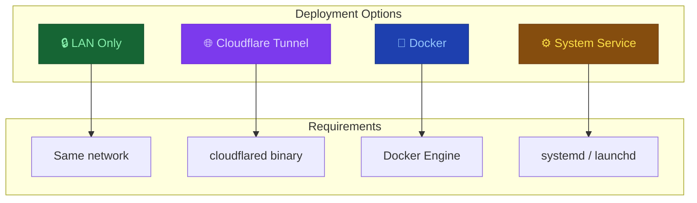

---

## 1. LAN Deployment (Default)

This is the simplest deployment. Both devices must be on the same local network.

### Step 1: Start the Server

```bash
python start.py
```

### Step 2: Find Your LAN IP

The server prints it automatically:

```
[TouchMorph] Connect from another device: http://192.168.1.42:3000
```

If you missed it, find it manually:

**Windows:**
```bash
ipconfig
# Look for "IPv4 Address" under your active network adapter
```

**Linux / macOS:**
```bash
ip addr show | grep inet
# or
ifconfig | grep inet
```

### Step 3: Connect

Open `http://<LAN_IP>:3000` on your phone or any other device on the same network.

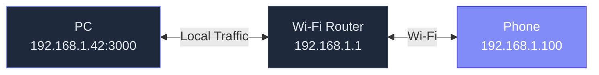

### Firewall Configuration

If the phone cannot connect, check the PC firewall:

**Windows — Allow port 3000:**
```powershell
New-NetFirewallRule -DisplayName "TouchMorph" -Direction Inbound -Protocol TCP -LocalPort 3000 -Action Allow
```

**Linux (ufw):**
```bash
sudo ufw allow 3000/tcp
```

**Linux (firewalld):**
```bash
sudo firewall-cmd --add-port=3000/tcp --permanent
sudo firewall-cmd --reload
```

**macOS:**
- Go to **System Settings > Network > Firewall > Firewall Options**
- Add the Python executable or allow incoming connections on port 3000.

### Customizing the Port

Set a different port in `.env`:

```env
TOUCHMORPH_PORT=8080
```

If the port is in use, the server automatically tries the next available port up to 3009.

---

## 2. Cloudflare Tunnel Deployment

For remote access over the internet (without port forwarding or static IP).

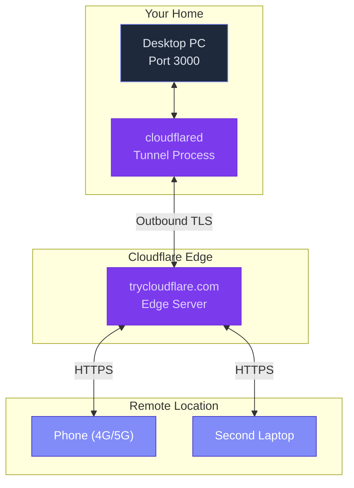

### Prerequisites

1. **cloudflared** installed on your PC:
   - **Windows:** Download from [https://developers.cloudflare.com/cloudflare-one/connections/connect-networks/downloads/](https://developers.cloudflare.com/cloudflare-one/connections/connect-networks/downloads/)
   - **Linux:** `sudo apt install cloudflared` or download the binary
   - **macOS:** `brew install cloudflared`

2. Verify installation:
   ```bash
   cloudflared --version
   ```

### Step 1: Start the Server

```bash
python start.py
```

Wait for the server to be ready (it prints the port it's listening on).

### Step 2: Start the Tunnel

**Windows:**

```powershell
.\scripts\start-tunnel.ps1
```

Or specify a custom port:

```powershell
.\scripts\start-tunnel.ps1 -Port 8080
```

**Linux / macOS:**

```bash
chmod +x scripts/start.sh
./scripts/start.sh
```

### How the Tunnel Script Works

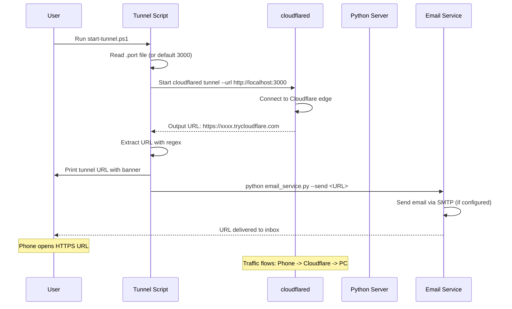

### Step 3: Get the Tunnel URL

The script prints a prominent banner:

```
╔════════════════════════════════════════════════╗
║  SECURE HTTPS TUNNEL ACTIVE                   ║
║                                                ║
║  https://abc123.trycloudflare.com
║                                                ║
╚════════════════════════════════════════════════╝
```

### Step 4: Configure Email Delivery (Optional)

If SMTP is configured in `.env`, the URL is also emailed. Useful when accessing from a phone that can't see the PC terminal.

```env
SMTP_HOST=smtp.gmail.com
SMTP_PORT=587
SMTP_USER=your.email@gmail.com
SMTP_PASS=your-app-password
EMAIL_FROM=your.email@gmail.com
EMAIL_TO=recipient@example.com
```

**Gmail setup:**

1. Go to [https://myaccount.google.com/apppasswords](https://myaccount.google.com/apppasswords)
2. Generate an **App Password** (requires 2-Step Verification enabled)
3. Use that password in `SMTP_PASS`

**Test SMTP without a tunnel:**

```bash
python server/email_service.py --test
```

```
Testing SMTP: your.email@gmail.com @ smtp.gmail.com:587 -> recipient@example.com
OK — test email sent successfully.
```

### Step 5: Connect

Open the HTTPS URL in your phone's browser. The connection is encrypted via Cloudflare's TLS.

### Stopping the Tunnel

Press **Ctrl+C** in the tunnel terminal. The tunnel closes immediately. The Python server can continue running for LAN access.

---

## 3. Docker Deployment

### Dockerfile

Create a `Dockerfile` in the project root:

```dockerfile
FROM node:20-alpine AS client-build
WORKDIR /app/client
COPY client/package*.json ./
RUN npm ci
COPY client/ .
RUN npm run build

FROM python:3.12-slim
WORKDIR /app

# Install cloudflared for tunnel support
RUN apt-get update && apt-get install -y curl && \
    curl -L https://github.com/cloudflare/cloudflared/releases/latest/download/cloudflared-linux-amd64 -o /usr/local/bin/cloudflared && \
    chmod +x /usr/local/bin/cloudflared && \
    apt-get clean

COPY server/requirements.txt .
RUN pip install --no-cache-dir -r requirements.txt

COPY server/ server/
COPY --from=client-build /app/client/dist/ client/dist/

ENV TOUCHMORPH_HOST=0.0.0.0
ENV TOUCHMORPH_PORT=3000

EXPOSE 3000

CMD ["python", "server/main.py"]
```

### Docker Compose

Create `docker-compose.yml`:

```yaml
version: "3.8"
services:
  touchmorph:
    build: .
    container_name: touchmorph
    ports:
      - "3000:3000"
    environment:
      - TOUCHMORPH_HOST=0.0.0.0
      - TOUCHMORPH_PORT=3000
      - ADMIN_PASSWORD=${ADMIN_PASSWORD:-}
      - ADMIN_SECRET=${ADMIN_SECRET:-touchmorph-docker-secret}
    volumes:
      - touchmorph-data:/app/server
    restart: unless-stopped
    network_mode: host  # Required for pyautogui to control desktop

volumes:
  touchmorph-data:
```

**Note:** `network_mode: host` is typically needed for pyautogui to access the host's display server (X11 on Linux, Quartz on macOS). On Windows, Docker Desktop's container networking may require additional configuration.

### Build and Run

```bash
# Build
docker compose build

# Run
docker compose up -d

# View logs
docker compose logs -f

# Stop
docker compose down
```

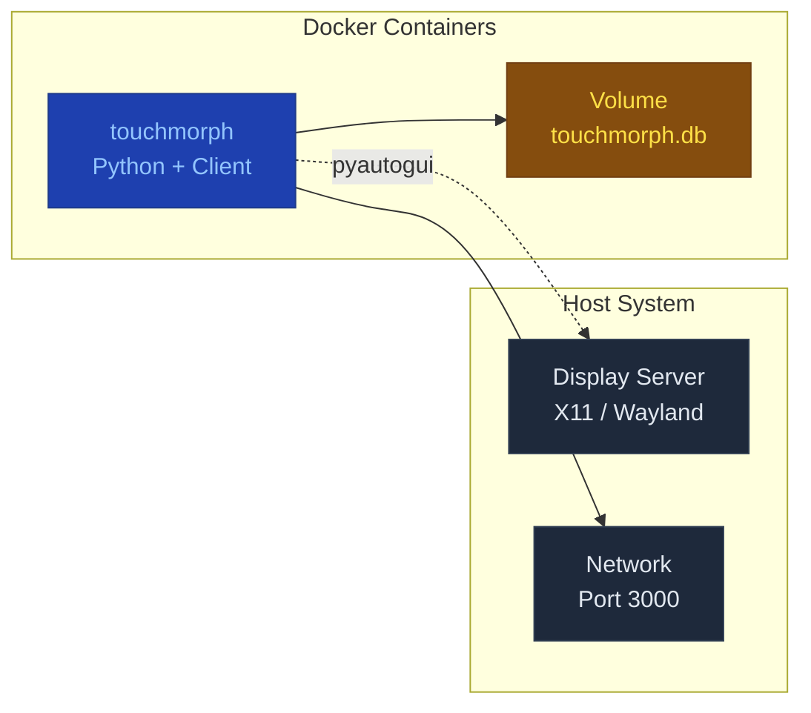

---

## 4. System Service (Auto-Start on Boot)

### Linux (systemd)

Create `/etc/systemd/system/touchmorph.service`:

```ini
[Unit]
Description=TouchMorph Remote Mouse Server
After=network.target

[Service]
Type=simple
User=your-username
WorkingDirectory=/home/your-username/Remote_Mouse/server
ExecStart=/usr/bin/python /home/your-username/Remote_Mouse/server/main.py
Restart=on-failure
RestartSec=5
EnvironmentFile=/home/your-username/Remote_Mouse/.env

[Install]
WantedBy=multi-user.target
```

Enable and start:

```bash
sudo systemctl daemon-reload
sudo systemctl enable touchmorph.service
sudo systemctl start touchmorph.service

# Check status
sudo systemctl status touchmorph.service

# View logs
sudo journalctl -u touchmorph.service -f
```

### macOS (launchd)

Create `~/Library/LaunchAgents/com.touchmorph.server.plist`:

```xml
<?xml version="1.0" encoding="UTF-8"?>
<!DOCTYPE plist PUBLIC "-//Apple//DTD PLIST 1.0//EN"
  "http://www.apple.com/DTDs/PropertyList-1.0.dtd">
<plist version="1.0">
<dict>
    <key>Label</key>
    <string>com.touchmorph.server</string>
    <key>ProgramArguments</key>
    <array>
        <string>/usr/bin/python3</string>
        <string>/Users/your-username/Remote_Mouse/server/main.py</string>
    </array>
    <key>WorkingDirectory</key>
    <string>/Users/your-username/Remote_Mouse/server</string>
    <key>RunAtLoad</key>
    <true/>
    <key>KeepAlive</key>
    <true/>
    <key>StandardOutPath</key>
    <string>/Users/your-username/Library/Logs/touchmorph.log</string>
    <key>StandardErrorPath</key>
    <string>/Users/your-username/Library/Logs/touchmorph-error.log</string>
    <key>EnvironmentVariables</key>
    <dict>
        <key>TOUCHMORPH_HOST</key>
        <string>0.0.0.0</string>
        <key>TOUCHMORPH_PORT</key>
        <string>3000</string>
    </dict>
</dict>
</plist>
```

Load and start:

```bash
launchctl load ~/Library/LaunchAgents/com.touchmorph.server.plist
launchctl start com.touchmorph.server

# Check status
launchctl list | grep touchmorph

# Stop
launchctl stop com.touchmorph.server
launchctl unload ~/Library/LaunchAgents/com.touchmorph.server.plist
```

### Windows (Task Scheduler)

```powershell
# Create a scheduled task to start TouchMorph on login
$action = New-ScheduledTaskAction -Execute "python" -Argument "server\main.py" -WorkingDirectory "C:\Users\YourName\Remote_Mouse"
$trigger = New-ScheduledTaskTrigger -AtLogOn
$principal = New-ScheduledTaskPrincipal -UserId "YourName" -LogonType Interactive
$settings = New-ScheduledTaskSettingsSet -AllowStartIfOnBatteries -DontStopIfGoingOnBatteries

Register-ScheduledTask -TaskName "TouchMorph" -Action $action -Trigger $trigger -Principal $principal -Settings $settings -Force

# Start manually
Start-ScheduledTask -TaskName "TouchMorph"

# Stop
Stop-ScheduledTask -TaskName "TouchMorph"

# Delete
Unregister-ScheduledTask -TaskName "TouchMorph" -Confirm:$false
```

---

## 5. Reverse Proxy Deployment

For production setups, place TouchMorph behind a reverse proxy (nginx, Caddy, or Apache) for better performance and TLS termination.

### nginx Configuration

```nginx
server {
    listen 443 ssl;
    server_name touchmorph.yourdomain.com;

    ssl_certificate /etc/ssl/certs/yourdomain.pem;
    ssl_certificate_key /etc/ssl/private/yourdomain.key;

    # Client app (built with npm run build)
    root /var/www/touchmorph/client/dist;
    index index.html;

    # SPA fallback
    location / {
        try_files $uri $uri/ /index.html;
    }

    # WebSocket proxy to Python backend
    location /socket.io/ {
        proxy_pass http://127.0.0.1:3000;
        proxy_http_version 1.1;
        proxy_set_header Upgrade $http_upgrade;
        proxy_set_header Connection "upgrade";
        proxy_set_header Host $host;
        proxy_set_header X-Forwarded-For $proxy_add_x_forwarded_for;
        proxy_read_timeout 86400s;
    }

    # API proxy
    location /api/ {
        proxy_pass http://127.0.0.1:3000;
        proxy_set_header Host $host;
        proxy_set_header X-Forwarded-For $proxy_add_x_forwarded_for;
    }

    # Admin proxy
    location /admin {
        proxy_pass http://127.0.0.1:3000;
        proxy_set_header Host $host;
        proxy_set_header X-Forwarded-For $proxy_add_x_forwarded_for;
    }
}

# Redirect HTTP to HTTPS
server {
    listen 80;
    server_name touchmorph.yourdomain.com;
    return 301 https://$host$request_uri;
}
```

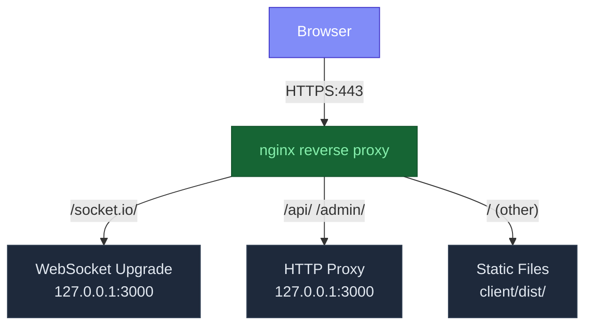

---

## 6. Multi-Device Support

The server handles multiple connected devices simultaneously, but only the **most recently active paired device** controls the mouse. This prevents conflicts when multiple phones are connected.

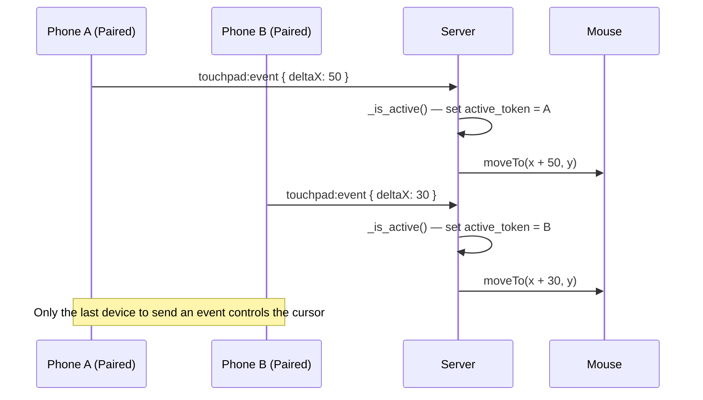

---

## 7. Environment Configuration Reference

```env
# === Server ===
TOUCHMORPH_HOST=0.0.0.0        # Bind address (0.0.0.0 = all interfaces)
TOUCHMORPH_PORT=3000            # Port number (auto-fallback if busy)

# === SMTP Email (for tunnel URL delivery) ===
SMTP_HOST=smtp.gmail.com        # SMTP server hostname
SMTP_PORT=587                   # SMTP port (587 = STARTTLS)
SMTP_USER=your.email@gmail.com  # SMTP username (usually full email)
SMTP_PASS=your-app-password     # SMTP password or app password
EMAIL_FROM=your.email@gmail.com # From: header
EMAIL_TO=recipient@example.com  # Recipient email address

# === Admin Dashboard Security ===
ADMIN_PASSWORD=                 # Leave blank = no auth required
ADMIN_SECRET=touchmorph-dev-secret-change-me  # Session signing key
```

### Configuration Precedence

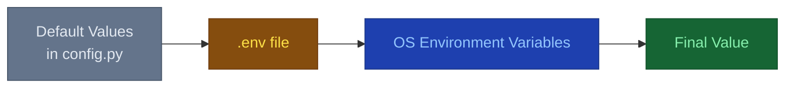

Environment variables in `.env` override defaults in `config.py`. OS environment variables override `.env` values. This allows Docker and systemd to set configuration via environment variables directly.

---

## 8. Security Recommendations

| Scenario | Recommendation |
|----------|---------------|
| LAN only (home Wi-Fi) | Default setup is sufficient. Set `ADMIN_PASSWORD` if untrusted users share the network. |
| LAN only (office/work) | Always set `ADMIN_PASSWORD`. Consider running behind a reverse proxy with TLS. |
| Cloudflare Tunnel | The tunnel provides TLS encryption. No additional setup needed. |
| Public network | Never use without a tunnel or TLS. Use Cloudflare Tunnel or reverse proxy with HTTPS. |
| Production / Docker | Set `ADMIN_SECRET` to a random value. Keep `.env` out of version control. |

---

## 9. Monitoring

### Health Check Endpoint

```bash
curl http://localhost:3000/health
# {"status": "ok"}
```

### Uptime Monitoring

Use the health endpoint with any uptime monitoring service:

```bash
# Simple cron-based check (every minute)
* * * * * curl -f http://localhost:3000/health || systemctl restart touchmorph
```

### Log Monitoring

```bash
# Python server logs to stdout
# Docker
docker compose logs -f --tail 50

# systemd
journalctl -u touchmorph.service -f

# Database logs (via admin dashboard)
curl http://localhost:3000/api/logs
```

---

## 10. Backup and Restore

### Database Backup

The SQLite database contains all session data and event logs:

```bash
# Backup while server is running (SQLite supports concurrent reads)
cp server/touchmorph.db server/touchmorph.db.backup

# Or use sqlite3 for a safe backup
sqlite3 server/touchmorph.db ".backup server/touchmorph.db.safe"
```

### Automated Backup (cron)

```bash
# Daily backup — add to crontab
0 3 * * * cp /home/user/Remote_Mouse/server/touchmorph.db /home/user/backups/touchmorph-$(date +\%Y\%m\%d).db

# Keep last 30 days, compress old ones
0 4 * * * find /home/user/backups/ -name "touchmorph-*.db" -mtime +30 -delete
```

### Full Configuration Backup

```bash
# Backup everything needed to restore
tar -czf touchmorph-backup.tar.gz \
  server/touchmorph.db \
  .env \
  server/config.py
```

### Restore

```bash
# Stop the server, restore database, restart
cp touchmorph.db.backup server/touchmorph.db
python server/main.py
```

---

## 11. Rolling Updates

### Blue-Green Deployment

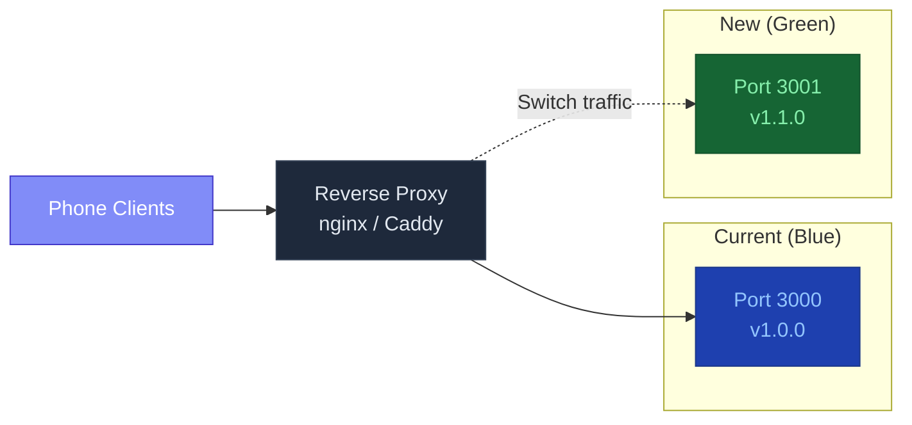

**Procedure:**
1. Deploy new version alongside current version (different port)
2. Test new version internally
3. Switch reverse proxy to new version
4. Monitor for errors
5. Remove old version

### Zero-Downtime Database Migrations

SQLite schema changes are additive only (ALTER TABLE ADD COLUMN). The current schema:

```sql
CREATE TABLE sessions (
    token TEXT PRIMARY KEY,
    device_name TEXT,
    ip TEXT,
    paired INTEGER DEFAULT 0,
    mode TEXT DEFAULT 'mouse',
    last_active REAL,
    created REAL
);
```

To add a new column (e.g., `favorite_color`):

```sql
ALTER TABLE sessions ADD COLUMN favorite_color TEXT DEFAULT '';
```

This is safe to run while the server is running — SQLite locks the table briefly, and existing rows get the default value.

---

## 12. Capacity Planning

### Concurrent Users

The server handles multiple concurrent WebSocket connections:

| Users | CPU Usage | RAM Usage | Notes |
|-------|-----------|-----------|-------|
| 1-5 | <5% | ~25 MB | Typical home use |
| 5-20 | 5-15% | ~30 MB | Office / small team |
| 20-100 | 15-40% | ~50 MB | Classroom use |
| 100+ | 40%+ | ~100 MB+ | May need load balancing |

**Bottlenecks:**
- pyautogui calls are sequential (one cursor movement at a time)
- SQLite writes serialize (for logging)
- Python async event loop handles thousands of concurrent connections

### Memory Profile

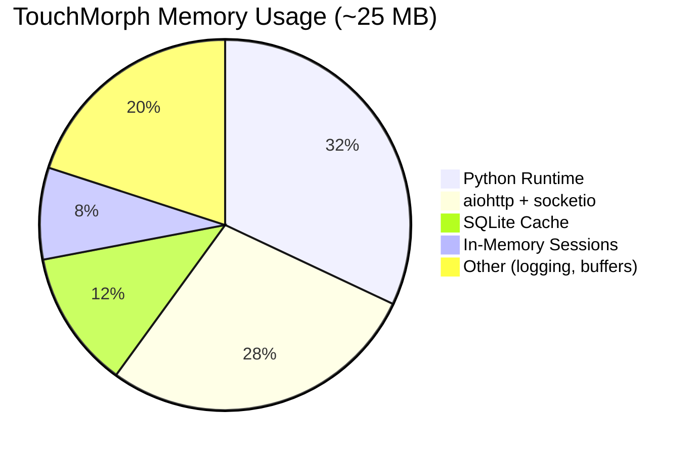

### Network Bandwidth

| Scenario | Data Rate |
|----------|-----------|
| Idle (connected, no input) | ~1 KB/min (heartbeat only) |
| Active mouse dragging | ~5 KB/s |
| Active touchpad scrolling | ~3 KB/s |
| Admin dashboard polling | ~10 KB/request (every 3s) |
| 10 concurrent devices (idle) | ~10 KB/min |
| 10 concurrent devices (active) | ~50 KB/s |

---

## 13. Integration with Other Tools

### Home Assistant

```yaml
# Example: Automate sleep mode when phone disconnects
automation:
  - alias: "PC Sleep when phone disconnects"
    trigger:
      platform: webhook
      webhook_id: touchmorph_disconnect
    action:
      service: shell_command.sleep_pc

shell_command:
  sleep_pc: "rundll32.exe powrprof.dll,SetSuspendState 0,1,0"
```

### IFTTT / Webhooks

```bash
# On device disconnect, trigger a webhook
curl -X POST https://maker.ifttt.com/trigger/touchmorph_disconnect/with/key/YOUR_KEY
```

### Slack / Discord Notifications

```bash
# Send admin dashboard alerts to Slack
curl -X POST https://hooks.slack.com/services/YOUR/WEBHOOK/URL \
  -H "Content-Type: application/json" \
  -d '{"text":"TouchMorph device kicked: '${TOKEN}'"}'
```

---

## 14. Advanced Networking

### VLAN Configuration

For secure multi-network setups:

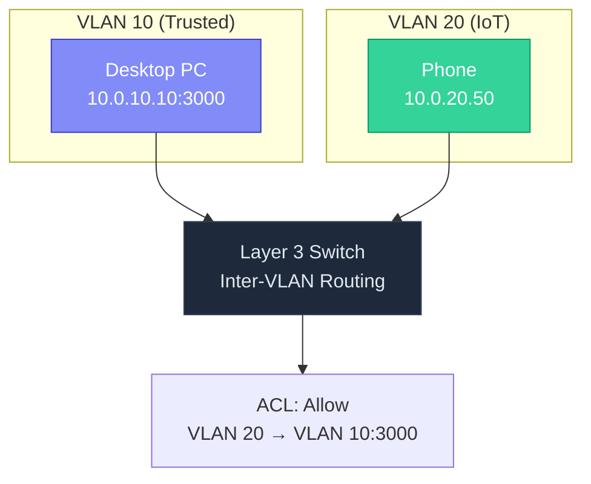

### IPv6 Support

TouchMorph binds to `0.0.0.0` by default, which accepts both IPv4 and IPv6 connections on dual-stack systems. To explicitly use IPv6:

```env
TOUCHMORPH_HOST=::
```

On IPv6 networks, clients can connect using the IPv6 address:
```
http://[2001:db8::42]:3000/
```

### Multicast DNS (mDNS) — Planned

mDNS/Bonjour discovery allows automatic detection without typing the IP address. Planned implementation:

```python
# Future: Register _touchmorph._tcp service via mDNS
# Phone would see "TouchMorph on Living Room PC" automatically
import socket
# Register service with zeroconf / avahi
```

---

## 15. Production Checklist

Use this checklist before deploying TouchMorph in a production environment:

### Security
- [ ] `ADMIN_PASSWORD` set to a strong password (not left blank)
- [ ] `ADMIN_SECRET` changed from default to a random value
- [ ] `.env` file not committed to version control
- [ ] `.env` file permissions set to 600 (owner read/write only)
- [ ] Firewall configured to restrict access to trusted IPs (optional)
- [ ] Cloudflare Tunnel or reverse proxy with TLS for remote access

### Performance
- [ ] Client built with `npm run build` (not using Vite dev server)
- [ ] Server bound to `0.0.0.0` (not `127.0.0.1`)
- [ ] pyautogui installed and working (check with `python -c "import pyautogui; pyautogui.moveTo(100,100)"`)
- [ ] Port 3000 is free (or server can fall back)

### Reliability
- [ ] Server configured as system service (auto-restart on boot/crash)
- [ ] Logging configured (redirect stdout to file if needed)
- [ ] Database backup scheduled
- [ ] Health check endpoint monitored (if uptime-critical)

### Monitoring
- [ ] Health check endpoint accessible
- [ ] Admin dashboard reachable
- [ ] Test connection from a phone on the network
- [ ] Test email delivery: `python server/email_service.py --test`

---

## 16. Deployment Architecture Decision Records

### ADR-1: Why Port 3000?

**Context:** The server needs a default port that is unlikely to conflict with common services.

| Port | Common Service | Conflict Risk |
|------|---------------|---------------|
| 3000 | Node.js dev servers, Rails | Medium |
| 8080 | HTTP alt, Tomcat, Jenkins | High |
| 5000 | Flask dev, AirPlay | Medium |
| 3000 | Less common than 8080/5000 | Acceptable |

**Decision:** Default to 3000 with automatic fallback to 3001-3009.

### ADR-2: Why SQLite Instead of PostgreSQL?

**Context:** Need persistent session storage without adding infrastructure dependencies.

**Decision:** SQLite for single-server deployment. The session data volume is small (hundreds of sessions, not millions). PostgreSQL support can be added by replacing `session_store.py` with a SQLAlchemy-based implementation.

### ADR-3: Why Server-Sent Events Instead of Client Polling for Dashboard?

**Context:** Admin dashboard needs real-time device list updates.

**Decision:** The dashboard polls every 3 seconds via `setInterval(fetch, 3000)`. This is simpler than implementing SSE or WebSocket for the dashboard, and the polling overhead is negligible (10KB every 3 seconds = ~3 KB/s).

### ADR-4: Why `tryio()` Instead of Explicit URL for Socket.IO?

**Context:** The client needs to connect to the correct server URL.

**Decision:** Using `io()` without arguments connects to the same origin that served the page. In production (server serves client), this auto-detects the correct server. In development (Vite serves client), the proxy forwards to the Python server. No URL configuration needed.
