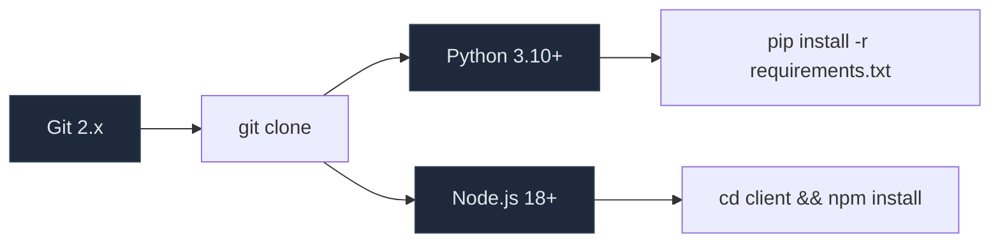
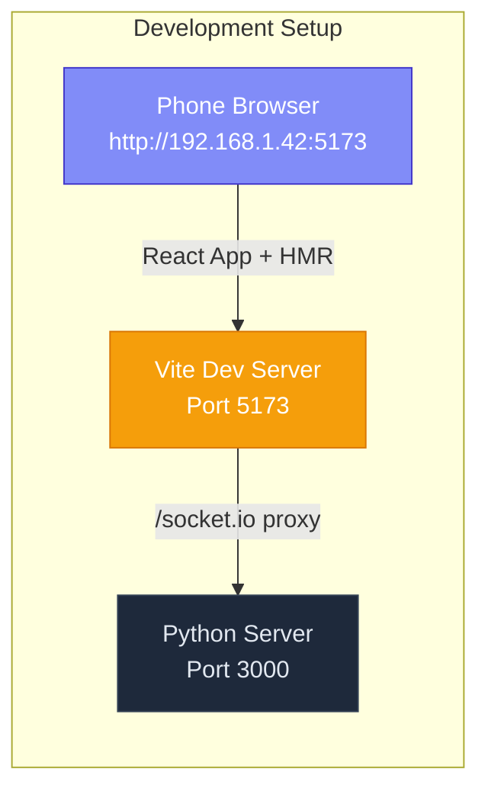
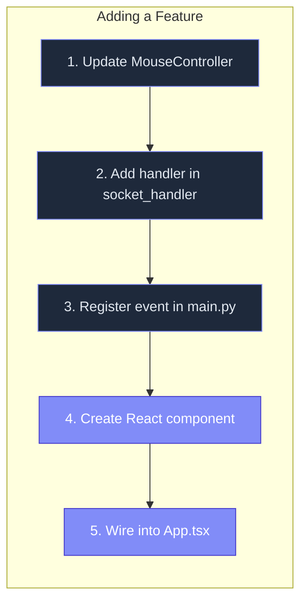
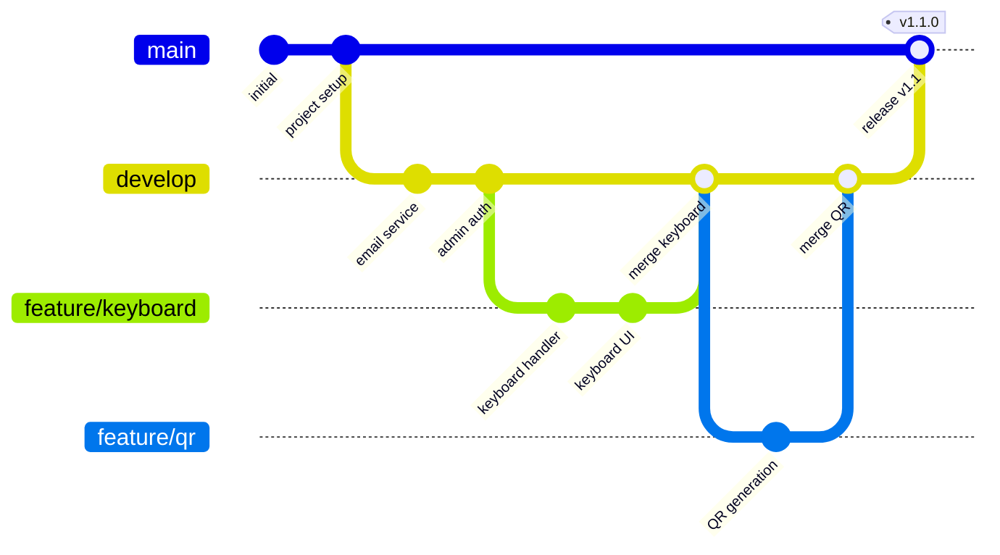

# Development Guide

This guide covers how to set up a development environment, understand the codebase structure, make changes, run tests, and contribute effectively.

---

## Development Setup

### Prerequisites



### Two-Terminal Development Workflow

For development, run both servers for hot-reload:

**Terminal 1 — Python Server:**
```bash
cd server
python main.py
```

**Terminal 2 — Vite Dev Server:**
```bash
cd client
npm run dev
```

The Vite dev server runs on **port 5173** with:
- **HMR (Hot Module Replacement)** — React components update instantly on save
- **Proxy** — `/socket.io` traffic forwarded to Python server on port 3000
- **Host mode** — Accessible from other devices on the LAN

Access the app at `http://localhost:5173` during development.



### Production Build (Single Process)

```bash
cd client && npm run build && cd ..
python server/main.py
```

The server serves the built client from `client/dist/` at `http://localhost:3000`.

---

## Project Structure

```
Remote_Mouse/
│
├── client/                          # React + Vite + TypeScript frontend
│   ├── dist/                        # Production build (generated by npm run build)
│   ├── src/
│   │   ├── components/
│   │   │   └── BottomNav.tsx        # 6-tab bottom navigation bar
│   │   ├── hooks/
│   │   │   └── useSocket.ts         # Socket.IO + session + screen dimensions
│   │   ├── pages/
│   │   │   ├── MouseMode.tsx        # Pointer + clicks + long-press drag
│   │   │   ├── TouchpadMode.tsx     # Relative move + smart scroll
│   │   │   ├── AirMouseMode.tsx     # Gyro-based pointer (calibration, dead zone)
│   │   │   ├── PresentationMode.tsx # Slide control + laser pointer
│   │   │   ├── MediaController.tsx  # Play/pause/volume keys
│   │   │   └── Settings.tsx         # Sensitivity, gesture reference, about
│   │   ├── App.tsx                  # Root component with 6-mode routing
│   │   ├── main.tsx                 # React entry point
│   │   ├── index.css                # TailwindCSS imports + global styles
│   │   └── vite-env.d.ts           # Vite type declarations
│   ├── index.html                   # HTML entry point
│   ├── package.json                 # NPM dependencies
│   ├── vite.config.ts               # Vite configuration + proxy
│   ├── tailwind.config.js           # TailwindCSS theme (morph colors)
│   ├── postcss.config.js            # PostCSS plugins
│   └── tsconfig.json                # TypeScript configuration
│
├── server/                          # Python aiohttp + Socket.IO backend
│   ├── main.py                      # Entry point, routes, admin auth, cleanup task, graceful shutdown
│   ├── socket_handler.py            # WebSocket event handlers (35+ events) with input validation + rate limiting + audit logging
│   ├── session_store.py             # SQLite persistence + audit_logs table
│   ├── mouse_controller.py          # pyautogui wrapper (move, click, scroll, media keys, system shortcuts)
│   ├── gesture_processor.py         # Multi-touch gesture engine (swipe, pinch, long-press, shake)
│   ├── email_service.py             # SMTP email sender for tunnel URL
│   ├── config.py                    # Environment variable loader
│   ├── requirements.txt             # Python dependencies
│   └── touchmorph.db                # SQLite database (auto-created at runtime)
│
├── scripts/
│   ├── start-tunnel.ps1             # Cloudflare Tunnel launcher (Windows)
│   └── start.sh                     # Cloudflare Tunnel launcher (Linux)
│
├── wiki/                            # Documentation
│   ├── 01-Getting-Started.md
│   ├── 02-Architecture.md
│   ├── 03-API-Reference.md
│   ├── 04-Deployment.md
│   ├── 05-Development.md
│   └── 06-Troubleshooting.md
│
├── start.py                         # One-command launcher (build + start)
├── .env.example                     # Environment configuration template
├── .gitignore
├── README.md
└── LICENSE
```

---

## Understanding the Code

### Server Entry Point (`server/main.py`)

```python
# 1. Create Socket.IO server (attached to aiohttp)
sio = socketio.AsyncServer(async_mode="aiohttp", cors_allowed_origins="*")
app = web.Application()
sio.attach(app)

# 2. Create event handler instance
handler = TouchMorphSocket()

# 3. Register Socket.IO event handlers
@sio.event
async def connect(sid, environ, auth):
    await handler.on_connect(sid, environ)

@sio.on("mouse:event")
async def on_mouse_event(sid, data):
    await handler.on_mouse_event(sid, data)

# 4. Register HTTP routes
app.router.add_get("/health", health)
app.router.add_get("/admin", admin_dashboard)

# 5. Admin auth middleware
app.middlewares.append(auth_middleware)

# 6. Start with port fallback
async def main():
    runner = web.AppRunner(app)
    await runner.setup()
    site = web.TCPSite(runner, HOST, actual_port)
    await site.start()
```

### Event Handler (`server/socket_handler.py`)

The `TouchMorphSocket` class manages all WebSocket state:

```python
class TouchMorphSocket:
    def __init__(self):
        self.sessions = {}      # sid -> session metadata
        self.sid_to_token = {}  # sid -> session token
        self.mouse = MouseController()
        self.gesture = GestureProcessor()
        self.active_token = None
```

**Key design decisions:**
- Sessions stored in-memory (`self.sessions`) for fast lookups
- SQLite used for persistence across restarts
- `active_token` tracks the most recently active paired device
- All mouse/touchpad events check `_is_active()` before executing

### Session Store (`server/session_store.py`)

SQLite operations with module-level auto-initialization. Manages three tables: `sessions`, `logs`, and `audit_logs`.

```python
_init()  # Runs on import — creates tables if not exist

def create_session(): ...
def restore_session(token): ...
def update_session(token, **kwargs): ...
def list_sessions(): ...
def delete_session(token): ...
def log_event(token, event): ...
def get_logs(limit=50): ...
def cleanup_stale_sessions(max_age_hours=24): ...  # Deletes sessions older than threshold
def trim_logs(max_rows=1000): ...                   # Keeps only the latest N log rows
def audit_log(token, category, event, detail='{}', ip='', device_name='', severity='info'): ...
def query_audit_logs(token=None, category=None, severity=None, search=None, since=None, until=None, limit=50, offset=0): ...
def count_audit_logs(...): ...
def get_audit_stats(): ...
def trim_audit_logs(max_rows=10000): ...
```

### Mouse Controller (`server/mouse_controller.py`)

Abstraction layer over pyautogui with preview fallback:

```python
class MouseController:
    def move(self, x, y):
        if HAVE_PYAUTOGUI:
            pyautogui.moveTo(x, y)
        else:
            logger.info(f"[Preview] moveTo({x}, {y})")

    def click(self, button="left"): ...
    def double_click(self): ...
    def scroll(self, dx, dy): ...
    def position(self): ...
```

### Gesture Processor (`server/gesture_processor.py`)

Touch gesture recognition from coordinate history:

```python
class GestureProcessor:
    def start(self, touch_id, x, y):
        # Record touch start position

    def move(self, touch_id, x, y):
        # Append to history (max 10 points)

    def detect_swipe(self, touch_id):
        # Check distance > 30px AND velocity > 0.3
        # Returns direction: swipe_up/down/left/right

    def detect_tap(self, x, y):
        # Check time since last tap < 400ms
        # AND distance from last tap < 30px
        # Returns "tap" or "double_tap"
```

### Client Socket Hook (`client/src/hooks/useSocket.ts`)

The heart of the client-side logic:

```typescript
export function useSocket() {
  // State
  const [connected, setConnected] = useState(false);
  const [pairStatus, setPairStatus] = useState(false);
  const [pairCode, setPairCode] = useState<string | null>(null);

  // Connection lifecycle
  useEffect(() => {
    const socket = io({ transports: ['websocket', 'polling'] });

    socket.on('connect', () => {
      // 1. Mark as connected
      // 2. Attempt session restore from localStorage
      // 3. Start heartbeat ping (25s interval)
      // 4. Request Wake Lock (keep screen on)
    });

    socket.on('session:created', ({ token }) => {
      localStorage.setItem(TOKEN_KEY, token);  // Persist
    });

    socket.on('session:restored', ({ token, paired }) => {
      localStorage.setItem(TOKEN_KEY, token);
      setPairStatus(paired);
    });

    // Cleanup on unmount
    return () => { socket.disconnect(); };
  }, []);
}
```

---

## Adding a New Feature

### Example: Add Keyboard Input

This example walks through adding keyboard input support.

**Step 1 — Add pyautogui keyboard method** (`server/mouse_controller.py`):

```python
def type_text(self, text: str):
    if HAVE_PYAUTOGUI:
        pyautogui.typewrite(text)
    else:
        logger.info(f"[Preview] typewrite({text!r})")

def press_key(self, key: str):
    if HAVE_PYAUTOGUI:
        pyautogui.press(key)
    else:
        logger.info(f"[Preview] press({key!r})")
```

**Step 2 — Add Socket.IO event handler** (`server/socket_handler.py`):

```python
async def on_keyboard_event(self, sid, data):
    if not self._is_active(sid):
        return
    event_type = data.get("type", "")
    if event_type == "type":
        self.mouse.type_text(data.get("text", ""))
    elif event_type == "key":
        self.mouse.press_key(data.get("key", ""))
    self._log(sid, f"keyboard:{event_type}")
```

**Step 3 — Register the event** (`server/main.py`):

```python
@sio.on("keyboard:event")
async def on_keyboard_event(sid, data):
    await handler.on_keyboard_event(sid, data)
```

**Step 4 — Add client component** (`client/src/pages/KeyboardMode.tsx`):

```tsx
import { useState } from 'react';

export default function KeyboardMode({ emit }: { emit: (e: string, d?: any) => void }) {
  const [text, setText] = useState('');

  return (
    <div>
      <input value={text} onChange={e => setText(e.target.value)}
        placeholder="Type something..." />
      <button onClick={() => emit('keyboard:event', { type: 'type', text })}>
        Send
      </button>
    </div>
  );
}
```

**Step 5 — Wire it up** in `App.tsx`:

```tsx
// Add import
import KeyboardMode from './pages/KeyboardMode';
// Add to type
type Mode = 'mouse' | 'touchpad' | 'keyboard';
// Add Navbar button
// Add conditional render
```



---

## Extending the Gesture System

The `GestureProcessor` can be extended to support additional gestures.

### Current Gesture Parameters

```python
SWIPE_THRESHOLD = 30      # Minimum pixel distance to trigger swipe
TAP_TIMEOUT = 0.3         # Max touch duration for tap detection
DOUBLE_TAP_TIMEOUT = 0.4  # Max gap between taps for double-tap
LONG_PRESS_TIMEOUT = 0.8  # Not yet implemented
```

### Adding a Pinch Gesture

```python
def detect_pinch(self, touch_id_1, touch_id_2):
    points_1 = self.history.get(touch_id_1, [])
    points_2 = self.history.get(touch_id_2, [])
    if len(points_1) < 2 or len(points_2) < 2:
        return None

    start_dist = ((points_1[0][0] - points_2[0][0]) ** 2 +
                  (points_1[0][1] - points_2[0][1]) ** 2) ** 0.5
    end_dist = ((points_1[-1][0] - points_2[-1][0]) ** 2 +
                (points_1[-1][1] - points_2[-1][1]) ** 2) ** 0.5

    ratio = end_dist / start_dist if start_dist > 0 else 1
    if ratio > 1.3:
        return "pinch_out"  # Zoom in
    elif ratio < 0.7:
        return "pinch_in"   # Zoom out
    return None
```

---

## Database Management

### Resetting the Database

```bash
# Delete the SQLite database (auto-recreated on next start)
rm server/touchmorph.db
```

### Inspecting the Database

```bash
# Using sqlite3 CLI
sqlite3 server/touchmorph.db

.tables
# sessions  logs

SELECT * FROM sessions;
SELECT * FROM logs ORDER BY id DESC LIMIT 10;
```

### Manual Cleanup of Stale Sessions

```bash
sqlite3 server/touchmorph.db "
  DELETE FROM sessions WHERE last_active < strftime('%s', 'now', '-7 days');
  VACUUM;
"
```

---

## Port Coordination

```mermaid
sequenceDiagram
    participant Server as Python Server
    participant Vite as Vite Dev Server
    participant File as .port File
    participant Tunnel as Tunnel Script

    Server->>Server: Try port from .env (default 3000)
    Server->>Server: If busy, try +1 (up to +9)
    Server->>File: Write actual port to .port
    Server-->>Server: Print URLs

    Vite->>File: Read .port (if exists)
    Vite->>Vite: Configure proxy target
    Vite-->>Vite: Start dev server on 5173

    Tunnel->>File: Read .port (if exists)
    Tunnel->>Tunnel: Fallback to 3000
    Tunnel->>Tunnel: Start cloudflared to localhost:{port}

    Style Server fill:#1e293b,stroke:#334155,color:#e2e8f0
    Style Vite fill:#f59e0b,stroke:#d97706,color:#fff
    Style File fill:#854d0e,stroke:#713f12,color:#fde047
    Style Tunnel fill:#7c3aed,stroke:#6d28d9,color:#ddd6fe
```

---

## Logging and Debugging

### Log Levels

The server uses Python's standard `logging` module:

| Logger Name | Level | Purpose |
|-------------|-------|---------|
| `touchmorph.ws` | INFO | WebSocket connections, disconnections, pairing |
| `touchmorph.mouse` | ERROR | pyautogui failures |
| `touchmorph.session` | INFO | SQLite operations |
| `touchmorph.gesture` | DEBUG | Gesture recognition |
| `touchmorph.email` | INFO | SMTP operations |

### Enabling Debug Logging

```bash
# Set log level in environment
export TOUCHMORPH_LOG_LEVEL=DEBUG
python server/main.py
```

Or modify `main.py` temporarily:

```python
logging.basicConfig(level=logging.DEBUG)
```

### Debugging WebSocket Traffic

```bash
# Using websocat to inspect raw WebSocket frames
websocat ws://localhost:3000/socket.io/?EIO=4&transport=websocket
```

---

## TypeScript Type Definitions

The client uses TypeScript. Key types to be aware of:

```typescript
// Socket.IO event payload types
interface SessionCreated { token: string; }
interface SessionRestored { token: string; paired: boolean; mode: string; }
interface PairCode { code: string; }
interface PairResult { message: string; }
interface ModeSwitched { mode: 'mouse' | 'touchpad'; }
interface MouseEvent {
  type: 'move' | 'click' | 'doubleclick' | 'scroll';
  x?: number;
  y?: number;
  button?: 'left' | 'right';
  deltaX?: number;
  deltaY?: number;
}
interface TouchpadEvent {
  type: 'move' | 'tap' | 'two_finger_scroll';
  deltaX?: number;
  deltaY?: number;
  fingerCount?: number;
}
```

---

## Testing

### Manual Testing Checklist

After making changes, verify:

1. **Server starts without errors** — `python server/main.py`
2. **Port fallback works** — Occupy port 3000, verify server uses 3001
3. **Client builds** — `cd client && npm run build`
4. **Client served correctly** — Open `http://localhost:3000/`
5. **Health endpoint** — `curl localhost:3000/health` returns `{"status":"ok"}`
6. **WebSocket connects** — Browser shows "Connecting..." then pairing screen
7. **Pairing flow** — Generate code, enter code, verify success
8. **Mouse mode** — Drag moves cursor, buttons work
9. **Touchpad mode** — 1F moves, 2F scrolls, tap clicks
10. **Admin dashboard** — `/admin` shows devices, kick works
11. **Session persistence** — Refresh page, session restored automatically

### Automated Testing

The project currently relies on manual testing. To add automated tests:

```python
# Example pytest test for session_store.py
import pytest
from session_store import create_session, restore_session, delete_session

def test_create_and_restore_session():
    token = create_session()
    assert token is not None
    session = restore_session(token)
    assert session is not None
    assert session["token"] == token
    assert session["paired"] is False
    delete_session(token)
    assert restore_session(token) is None
```

---

## Common Development Tasks

### Adding a TailwindCSS Color

Edit `client/tailwind.config.js`:

```javascript
export default {
  theme: {
    extend: {
      colors: {
        morph: {
          400: '#818cf8',
          500: '#6366f1',
          600: '#4f46e5',
          700: '#4338ca',
        },
        // Add custom colors here
      },
    },
  },
};
```

### Changing the Pairing Code Length

In `server/socket_handler.py`:

```python
# Change 6-digit to 8-digit
code = str(random.randint(10000000, 99999999))
```

### Changing the Heartbeat Interval

In `client/src/hooks/useSocket.ts`:

```typescript
const PING_INTERVAL = 25000;  // Change to 50000 for 50s interval
```

---

## Contributing

### Pull Request Checklist

- [ ] Code follows existing style conventions
- [ ] No new external dependencies without justification
- [ ] `python server/main.py` starts without errors
- [ ] `cd client && npm run build` succeeds
- [ ] All manual testing checklist items pass
- [ ] Documentation updated (README or wiki)
- [ ] `.env.example` updated if new environment variables added

### Code Style

**Python:**
- Follow PEP 8
- Use type hints for function signatures
- Use f-strings for string formatting
- Prefer `async/await` over callbacks

**TypeScript/React:**
- Use functional components with hooks (no class components)
- Use TypeScript strict mode
- Use TailwindCSS utility classes over custom CSS
- Use `clsx` for conditional class names

---

## Git Workflow

### Branching Strategy



| Branch | Purpose | Base |
|--------|---------|------|
| `main` | Production-ready releases | — |
| `develop` | Integration branch | `main` |
| `feature/*` | New features | `develop` |
| `fix/*` | Bug fixes | `develop` or `main` |
| `release/*` | Release candidates | `develop` |

### Commit Convention

```
<type>(<scope>): <description>

Types:
- feat: New feature
- fix: Bug fix
- docs: Documentation
- style: Formatting
- refactor: Code restructuring
- test: Testing
- chore: Maintenance
```

Examples:
```
feat(socket): add keyboard event handler
fix(mouse): handle multi-monitor DPI scaling
docs(api): update WebSocket event reference
```

---

## Advanced Development Topics

### Custom Socket.IO Namespaces

The current implementation uses the default namespace (`/socket.io`). For multi-tenant setups, namespaces can isolate traffic:

```python
# server/main.py
admin_ns = sio.register_namespace(AdminNamespace("/admin"))
control_ns = sio.register_namespace(ControlNamespace("/control"))
```

```typescript
// Client
const adminSocket = io("/admin");
const controlSocket = io("/control");
```

This allows separate authentication levels and event handlers for admin vs. control traffic.

### Adding Middleware

aiohttp middleware can intercept requests before they reach handlers:

```python
# Example: Rate limiting middleware
@web.middleware
async def rate_limit_middleware(request, handler):
    if request.path.startswith("/api/"):
        # Check rate limit
        ip = request.remote
        if is_rate_limited(ip):
            raise web.HTTPTooManyRequests()
    return await handler(request)

app.middlewares.append(rate_limit_middleware)
```

### Custom pyautogui Backend

For platforms where pyautogui doesn't work well, implement a custom backend:

```python
# server/mouse_controller.py
class MouseController:
    def __init__(self, backend="auto"):
        self.backend = self._select_backend(backend)

    def _select_backend(self, backend):
        if backend == "pyautogui":
            return PyAutoGUIBackend()
        elif backend == "xdotool":
            return XDoToolBackend()  # Linux only
        elif backend == "powershell":
            return PowerShellBackend()  # Windows only
        elif backend == "applescript":
            return AppleScriptBackend()  # macOS only
        else:
            return AutoDetectBackend()

class XDoToolBackend:
    def move(self, x, y):
        subprocess.run(["xdotool", "mousemove", str(x), str(y)])

    def click(self, button="left"):
        btn = "1" if button == "left" else "3"
        subprocess.run(["xdotool", "click", btn])
```

---

## TypeScript Deep Dive

### Generic Event Handler Type

```typescript
// Extending emit for type safety
type EventMap = {
  'mouse:event': MouseEvent;
  'touchpad:event': TouchpadEvent;
  'click:left': void;
  'click:right': void;
  // ...
};

function emitTyped<E extends keyof EventMap>(
  socket: ReturnType<typeof io>,
  event: E,
  data: EventMap[E]
) {
  socket.emit(event, data);
}
```

### Custom React Hook Patterns

```typescript
// Example: useThrottledEmit
import { useRef, useCallback } from 'react';

function useThrottledEmit(
  emit: (event: string, data?: any) => void,
  delay: number = 16  // ~60fps
) {
  const last = useRef(0);

  return useCallback((event: string, data?: any) => {
    const now = Date.now();
    if (now - last.current >= delay) {
      last.current = now;
      emit(event, data);
    }
  }, [emit, delay]);
}
```

---

## Testing Strategy

### Unit Tests (pytest)

```python
# test_session_store.py
import pytest
import time
from session_store import create_session, restore_session, delete_session, log_event, get_logs

class TestSessionStore:
    def test_create_session(self):
        token = create_session()
        assert token is not None
        assert len(token) == 36  # UUID format

    def test_restore_nonexistent(self):
        result = restore_session("nonexistent-token")
        assert result is None

    def test_restore_existing(self):
        token = create_session()
        result = restore_session(token)
        assert result is not None
        assert result["token"] == token
        assert result["paired"] is False

    def test_delete_session(self):
        token = create_session()
        delete_session(token)
        assert restore_session(token) is None

    def test_paired_flag(self):
        token = create_session()
        from session_store import update_session
        update_session(token, paired=1)
        session = restore_session(token)
        assert session["paired"] is True

    def test_log_event(self):
        token = create_session()
        log_event(token, "test_event")
        logs = get_logs()
        assert len(logs) >= 1
        assert logs[0]["event"] == "test_event"
```

### Integration Tests

```python
# test_integration.py
import asyncio
import socketio

class TestWebSocketEvents:
    @pytest.fixture
    async def client(self):
        sio = socketio.AsyncClient()
        await sio.connect("http://localhost:3000")
        yield sio
        await sio.disconnect()

    async def test_connect_receives_session(self, client):
        events = []
        @client.on("session:created")
        def on_created(data):
            events.append(data)

        await asyncio.sleep(0.5)
        assert len(events) == 1
        assert "token" in events[0]

    async def test_pairing_flow(self, client):
        code_received = asyncio.Event()
        code_value = None

        @client.on("pair:code")
        def on_code(data):
            nonlocal code_value
            code_value = data["code"]
            code_received.set()

        await client.emit("pair:request")
        await asyncio.wait_for(code_received.wait(), timeout=2)

        assert code_value is not None
        assert len(code_value) == 6
```

### Manual Test Script

```python
# scripts/manual_test.py
import socketio
import time

sio = socketio.Client()

@sio.event
def connect():
    print("✓ Connected to server")
    sio.emit("session:restore", {"token": ""})

@sio.on("session:created")
def on_created(data):
    print(f"✓ Session created: {data['token'][:8]}...")

@sio.on("session:restored")
def on_restored(data):
    print(f"✓ Session restored: paired={data['paired']}")

@sio.event
def disconnect():
    print("✗ Disconnected")

# Test mouse move
def test_mouse_move():
    print("Testing mouse move...")
    sio.emit("mouse:event", {"type": "move", "x": 500, "y": 300})
    time.sleep(0.5)
    sio.emit("mouse:event", {"type": "move", "x": 600, "y": 400})
    print("✓ Mouse move test complete")

# Test click
def test_clicks():
    print("Testing clicks...")
    sio.emit("click:left")
    time.sleep(0.2)
    sio.emit("click:right")
    time.sleep(0.2)
    sio.emit("click:double")
    print("✓ Click test complete")

sio.connect("http://localhost:3000")
time.sleep(1)
test_mouse_move()
test_clicks()
sio.disconnect()
```

---

## CI/CD Pipeline

### GitHub Actions Example

```yaml
# .github/workflows/ci.yml
name: CI

on:
  push:
    branches: [main, develop]
  pull_request:
    branches: [main]

jobs:
  lint:
    runs-on: ubuntu-latest
    steps:
      - uses: actions/checkout@v4
      - uses: actions/setup-python@v5
        with:
          python-version: "3.12"
      - run: pip install flake8
      - run: flake8 server/ --max-line-length=120

  typecheck:
    runs-on: ubuntu-latest
    steps:
      - uses: actions/checkout@v4
      - uses: actions/setup-node@v4
        with:
          node-version: "20"
      - run: cd client && npm ci
      - run: cd client && npx tsc --noEmit

  build:
    runs-on: ubuntu-latest
    steps:
      - uses: actions/checkout@v4
      - uses: actions/setup-node@v4
        with:
          node-version: "20"
      - run: cd client && npm ci
      - run: cd client && npm run build
      - uses: actions/upload-artifact@v4
        with:
          name: client-dist
          path: client/dist/

  test:
    runs-on: ubuntu-latest
    needs: build
    steps:
      - uses: actions/checkout@v4
      - uses: actions/setup-python@v5
        with:
          python-version: "3.12"
      - uses: actions/download-artifact@v4
        with:
          name: client-dist
          path: client/dist/
      - run: pip install -r server/requirements.txt
      - run: |
          cd server
          python -c "
          import asyncio
          from main import app, HOST, PORT
          from aiohttp import web
          async def test():
              runner = web.AppRunner(app)
              await runner.setup()
              site = web.TCPSite(runner, '127.0.0.1', 0)
              await site.start()
              print('Server started')
          asyncio.run(test())
          "
```

---

## Code Review Checklist

### Reviewing Python Code

- [ ] Type hints on all function parameters and return values
- [ ] No bare `except:` clauses — catch specific exceptions
- [ ] Async functions use `await` correctly (no blocking calls in event loop)
- [ ] SQLite connections are properly closed (context manager or explicit close)
- [ ] Logging uses appropriate levels (debug/info/warning/error)
- [ ] No hardcoded secrets or tokens
- [ ] f-strings used instead of `.format()` or `%`
- [ ] Function names follow `snake_case`
- [ ] Class names follow `PascalCase`

### Reviewing TypeScript/React Code

- [ ] TypeScript strict mode passes (no implicit `any`)
- [ ] React hooks follow rules (no conditional hooks, proper dependency arrays)
- [ ] `useCallback`/`useMemo` used for expensive computations
- [ ] Event handlers properly cleaned up in `useEffect` returns
- [ ] TailwindCSS classes follow project convention
- [ ] `clsx` used for conditional classes
- [ ] Component is properly typed (props interface)
- [ ] No unnecessary re-renders

### Reviewing Documentation

- [ ] New features documented in wiki
- [ ] API changes reflected in API reference
- [ ] `.env.example` updated for new configuration options
- [ ] Mermaid diagrams updated to reflect architecture changes

---

## Environment Variable Reference for Development

```env
# === Development-specific variables ===

# Set log level for debugging
TOUCHMORPH_LOG_LEVEL=DEBUG

# Skip client build (use Vite dev server)
# Just run: python server/main.py (without building client)

# Use a specific port for testing
TOUCHMORPH_PORT=3000

# Disable admin auth during development
# (Don't set ADMIN_PASSWORD at all)

# Test with a different admin secret
ADMIN_SECRET=dev-secret-key

# Test SMTP without actual email
# (Leave SMTP_* unset — console fallback)
```

---

## Performance Profiling

### Profiling the Server

```bash
# Install profiling tools
pip install py-spy

# Profile running server
py-spy record -o profile.svg --pid $(pgrep -f "python main.py")

# Or profile from startup
py-spy record -o profile.svg -- python main.py
```

### Profiling the Client

Open Chrome DevTools and use the Performance tab:

1. Connect from phone to Chrome DevTools via `chrome://inspect`
2. Record performance while using touchpad
3. Identify long-running tasks or layout thrashing

### Memory Leak Detection

```python
# Add memory tracking to main.py
import gc
import objgraph

@sio.on("mouse:event")
async def on_mouse_event(sid, data):
    # Track object counts
    if random.random() < 0.001:  # Sample rarely
        objgraph.show_growth()
    # ... existing handler ...
```

---

## Building for Different Environments

### Development Environment

```bash
# Two terminals:
# Terminal 1
cd server && python main.py

# Terminal 2
cd client && npm run dev
```

### Staging Environment

```bash
# Same as production but with debug logging
cd client && npm run build
cd server && TOUCHMORPH_LOG_LEVEL=DEBUG python main.py
```

### Production Environment

```bash
# Single process, optimized
cd client && npm run build
cd server && python main.py
```

### Docker Environment

```bash
# Build and run in container
docker build -t touchmorph .
docker run -d --network host --name touchmorph touchmorph
```

---

## Adding Internationalization (i18n)

The UI is currently English-only. To add language support:

1. Install i18n library:
```bash
cd client && npm install react-i18next i18next
```

2. Create language files:
```json
// client/src/i18n/en.json
{
  "connecting": "Connecting...",
  "pairDevice": "Pair Your Device",
  "generateCode": "Generate Code",
  "mouse": "Mouse",
  "touchpad": "Touchpad",
}
```

3. Use translations:
```tsx
import { useTranslation } from 'react-i18next';

function App() {
  const { t } = useTranslation();
  return <div>{t('connecting')}</div>;
}
```

The server-side strings (admin dashboard, email) can use Python's `gettext` module for translation.
