# Troubleshooting Guide

Common issues, error messages, and solutions for TouchMorph.

---

## Quick Diagnostic Flow

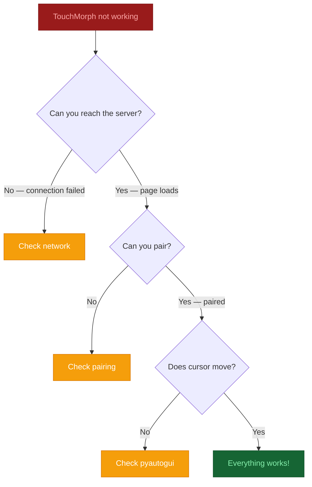

---

## 1. Server Won't Start

### "Port X in use"

The server tries port 3000 by default. If it's occupied, it auto-falls back to 3001, 3002, etc.

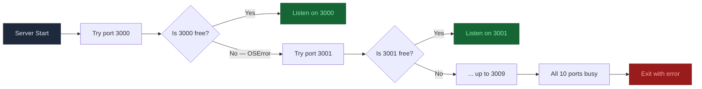

**If all ports are busy:**

```bash
# Find what's using the ports
netstat -ano | findstr :3000

# Windows — kill the process
kill <PID>

# Linux / macOS
lsof -i :3000
kill -9 <PID>
```

### "ImportError: No module named '...'"

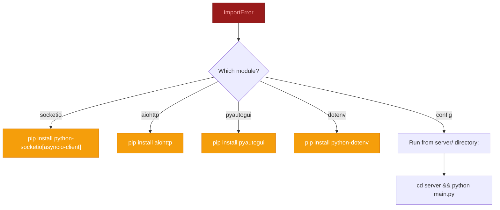

### "NameError: name 'Path' is not defined"

This was a bug in earlier versions where `Path` was imported inside `if __name__ == "__main__":` but used at module level.

**Fix:** Update to the latest code. The import is now at the top of `main.py`:
```python
from pathlib import Path
```

---

## 2. Client App Not Found (Blank Page / 404)

### Root URL Shows Setup Page Instead of App

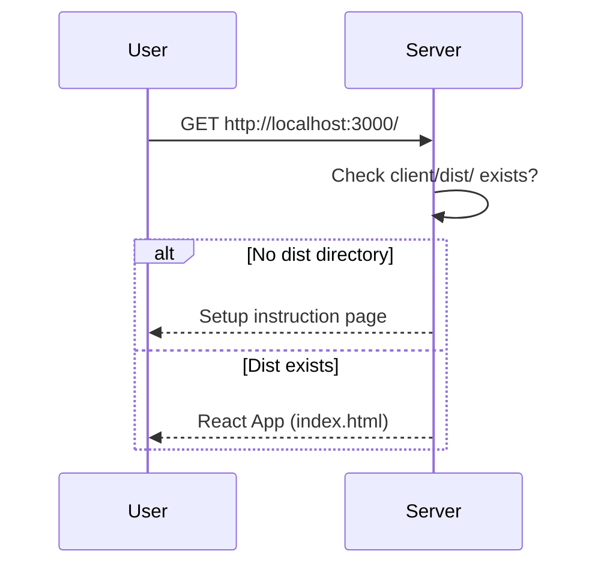

**Solution:** Build the client app:
```bash
# Option 1: One-command launcher
python start.py

# Option 2: Manual build
cd client
npm install   # (if you haven't already)
npm run build
cd ..
python server/main.py
```

### Vite Dev Server Shows Blank Page

If using `npm run dev` and the page is blank:

```bash
# Check the browser console for errors
# Common issues:
# 1. Port conflict — Vite defaults to 5173
# 2. Proxy misconfiguration — check vite.config.ts
# 3. Node modules missing

# Fix:
cd client
rm -rf node_modules
npm install
npm run dev
```

---

## 3. Can't Connect from Phone

### Phone Shows "Connecting..." Indefinitely

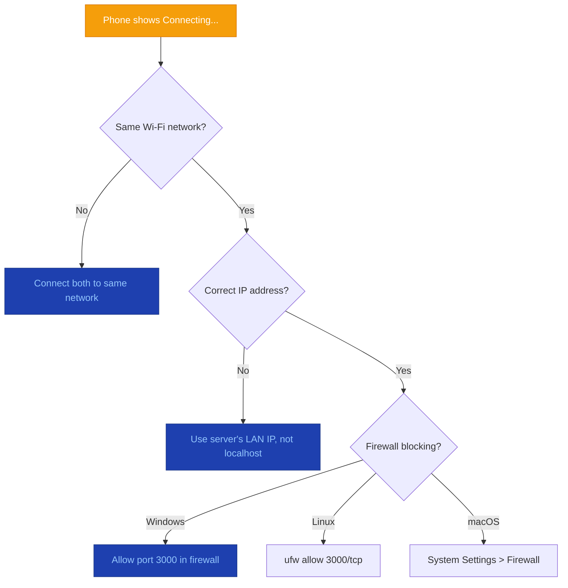

**Windows Firewall — Add Rule:**

```powershell
New-NetFirewallRule -DisplayName "TouchMorph" -Direction Inbound -Protocol TCP -LocalPort 3000 -Action Allow
```

**Linux (ufw):**

```bash
sudo ufw allow 3000/tcp
```

### Phone Shows "Refused to Connect"

| Cause | Solution |
|-------|----------|
| Server not running | `python server/main.py` |
| Wrong port | Check terminal for actual port (e.g., 3001 if 3000 was busy) |
| Phone on different network | Both devices must share the same LAN |
| Server bound to 127.0.0.1 | Check `TOUCHMORPH_HOST=0.0.0.0` in `.env` |
| IPv6 issue | Use IPv4 address explicitly (e.g., `192.168.x.x`) |

### Connection Drops After a Few Minutes

Mobile browsers aggressively suspend background tabs. This is normal behavior.

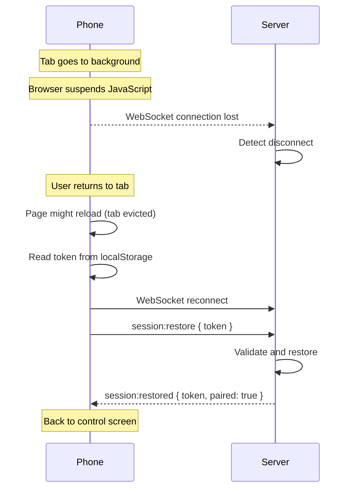

**Mitigations built in:**

| Mechanism | What It Does | Effectiveness |
|-----------|-------------|---------------|
| **localStorage** | Token survives tab eviction | High — session restored after page reload |
| **Heartbeat ping** (25s) | Keeps connection alive while tab is active | Medium — works if tab is visible |
| **Wake Lock API** | Prevents screen from sleeping | High on Chrome/Safari, unsupported on Firefox |
| **Pairing persistence** | Once paired, stays paired across restarts | High — no need to re-pair |

---

## 4. Pairing Issues

### "Invalid pairing code"

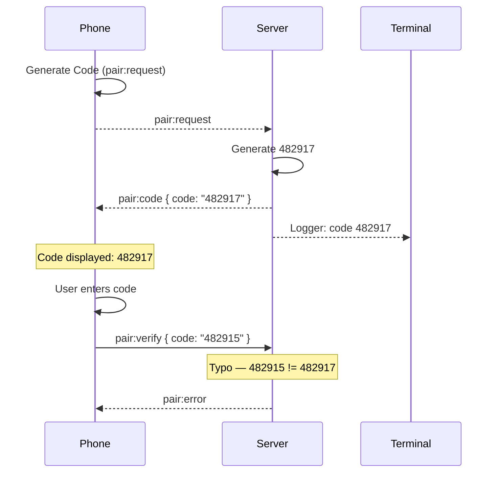

**Common causes:**

| Cause | Solution |
|-------|----------|
| Typo in the code | Re-enter carefully. Codes are 6 digits. |
| Code expired | Tap "Generate Code" again to get a fresh code. |
| Multiple devices | Each device has its own code. Make sure you're entering the code shown on the same device. |
| Case sensitivity | Codes are numeric only. No letters to confuse. |

### Pairing Succeeds But No Control

After pairing, if the touchpad/mouse doesn't work:

1. **Check terminal** — Do you see log entries like `touchpad:move` or `click:left`?
   - If yes: pyautogui issue (see Section 5)
   - If no: WebSocket issue

2. **Multiple paired devices** — Only the most recently active device controls the mouse. Make sure your phone is the one sending events.

3. **Network latency** — On Cloudflare Tunnel, expect 50-200ms latency. Movements may feel slightly delayed.

---

## 5. Mouse Not Moving (pyautogui Issues)

### pyautogui Not Installed

The server logs: `pyautogui not installed — running in preview mode`

**Install:**
```bash
pip install pyautogui==0.9.54
```

The server will automatically detect it on next restart.

### macOS Accessibility Permissions

On macOS, pyautogui requires Accessibility permissions:

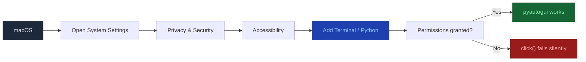

**Steps:**
1. Open **System Settings** > **Privacy & Security** > **Accessibility**
2. Click the lock icon to make changes
3. Click **+** and add your terminal app (Terminal, iTerm2, VS Code, etc.)
4. Make sure the checkbox next to it is checked
5. Restart the server

### Linux — No X Display

```bash
# Error: "no display name" or "cannot open display"
# pyautogui on Linux requires an X11 display

# If running via SSH, forward the display:
export DISPLAY=:0
python server/main.py

# For systemd service, add:
Environment=DISPLAY=:0
Environment=XAUTHORITY=/home/user/.Xauthority
```

### Windows — DPI Scaling Issues

On high-DPI displays, the absolute coordinates from the phone may not map correctly:

```python
# In mouse_controller.py, scale coordinates by DPI factor
import ctypes
def get_dpi_scale():
    try:
        user32 = ctypes.windll.user32
        user32.SetProcessDPIAware()
        return user32.GetDpiForWindow(user32.GetDesktopWindow()) / 96.0
    except:
        return 1.0
```

### FAILSAFE Triggering

If the cursor jumps to a corner and pyautogui raises `pyautogui.FailSafeException`:

The server already disables FAILSAFE:
```python
pyautogui.FAILSAFE = False
```

If this setting isn't taking effect, check that the import is working correctly:

```bash
python -c "import pyautogui; print(pyautogui.FAILSAFE)"
# Should print: False
```

---

## 6. Admin Dashboard Issues

### "302 Redirect to /admin/login"

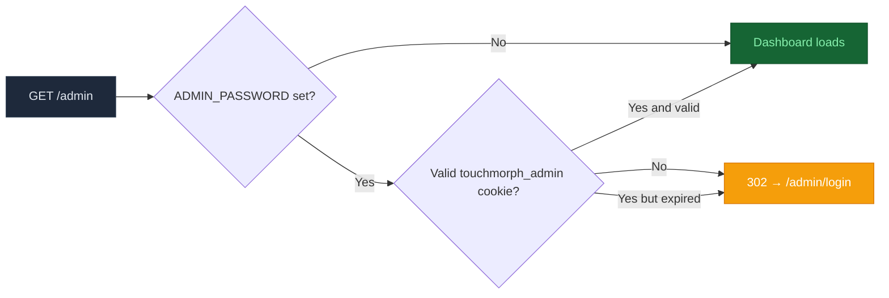

**Login loop (redirects back to login after successful login):**

| Cause | Solution |
|-------|----------|
| Cookie domain mismatch | Access via same hostname (e.g., `localhost` → `localhost`, not `127.0.0.1`) |
| Cookie blocked by browser | Check browser settings — third-party cookies might be disabled |
| Cookie expired | Log in again. Sessions last 24 hours. |
| `ADMIN_SECRET` changed | Invalidates all existing sessions. Log in again. |

### Dashboard Shows No Devices

| Cause | Solution |
|-------|----------|
| No phones have connected | Open the app from a phone first |
| Database empty | `server/touchmorph.db` was deleted or does not exist (auto-created) |
| Device kicked | Check the event log for "kicked" events |

---

## 7. Cloudflare Tunnel Issues

### "cloudflared not found"

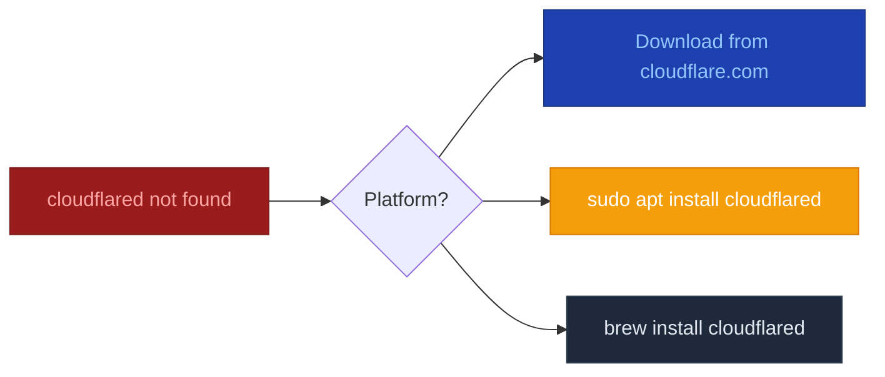

**Downloads:**
- All platforms: [https://developers.cloudflare.com/cloudflare-one/connections/connect-networks/downloads/](https://developers.cloudflare.com/cloudflare-one/connections/connect-networks/downloads/)
- Linux: `sudo apt install cloudflared` (Debian/Ubuntu) or download the binary
- macOS: `brew install cloudflared`

### Tunnel URL Not Detected

The script searches for `https://xxxx.trycloudflare.com` in cloudflared output.

| Issue | Solution |
|-------|----------|
| cloudflared starts but no URL appears after 15 seconds | Check `tunnel.log` for error messages |
| Already have a tunnel running | Stop it first, or use a different port |
| Network blocks cloudflared | Corporate firewalls may block outbound connections to Cloudflare |

### Email Not Sent

The email service has a `--test` flag:

```bash
# Test SMTP configuration
python server/email_service.py --test

# Output:
# Testing SMTP: user@gmail.com @ smtp.gmail.com:587 -> recipient@example.com
# OK — test email sent successfully.
```

**If test fails:**

| Error | Cause | Solution |
|-------|-------|----------|
| `SMTP not configured` | Missing env vars | Check SMTP_HOST, SMTP_USER, SMTP_PASS, EMAIL_FROM, EMAIL_TO |
| `Authentication failed` | Wrong password | For Gmail, use an App Password, not your regular password |
| `Connection refused` | Wrong host/port | Check SMTP_HOST and SMTP_PORT |
| `Timeout` | Network blocked | Port 587 (STARTTLS) must be outbound allowed |
| `STARTTLS not supported` | Wrong port | Try port 465 (SSL) or check provider docs |

---

## 8. Port Conflicts

### What's Using Port 3000?

```bash
# Windows
netstat -ano | findstr :3000

# Linux / macOS
lsof -i :3000
```

### Common Culprits

| Process | How to Stop |
|---------|-------------|
| **Previous TouchMorph instance** | Kill using PID from `netstat` output |
| **Node.js / Vite** | `npx kill-port 3000` or kill the node process |
| **Local web server** (Apache, nginx, IIS) | Stop the service |
| **Docker container** | `docker stop <container>` |
| **Another Python app** | Kill using PID from `netstat` output |

### Prevention

The server auto-falls back to the next available port (up to 3009). This minimizes disruption:

```bash
# Example: Port 3000 is busy
[TouchMorph] Port 3000 in use, trying 3001 ...
[TouchMorph] Server running on 0.0.0.0:3001
```

The `.port` file ensures all related scripts (Vite, tunnel) use the correct port.

---

## 9. Performance Issues

### Laggy Mouse Movement


**Breakdown of latency sources:**

| Source | LAN | Cloudflare Tunnel |
|--------|-----|-------------------|
| Network round-trip | 1-3ms | 30-150ms |
| Server processing | <1ms | <1ms |
| pyautogui (moveTo) | <1ms | <1ms |
| OS display refresh | ~16ms (60Hz) | ~16ms (60Hz) |
| **Total perceived** | **~20ms** | **~50-170ms** |

**Optimizations:**

- **Reduce touch event frequency** — The client sends events on every `pointermove`. Consider throttling:
  ```typescript
  // In MouseMode.tsx — throttle to 60fps
  const throttledMove = useCallback(throttle(move, 16), [emit]);
  ```

- **Use LAN instead of tunnel** — For same-network use, connect via LAN IP. The tunnel adds 30-150ms.

- **Disable mouse acceleration** — OS-level mouse acceleration can make remote cursor feel inconsistent.

---

## 10. Database Issues

### "database is locked" Error

SQLite can handle concurrent reads but blocks concurrent writes from multiple processes.

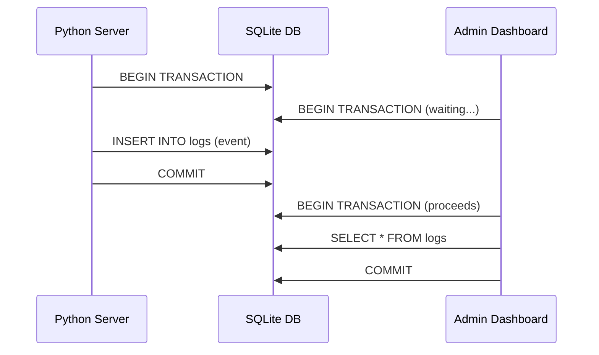

**Solutions:**

| Issue | Solution |
|-------|----------|
| Only one server process | TouchMorph uses a single process — unlikely to hit this |
| If it occurs | Switch to write-ahead logging (WAL) mode in `session_store.py` |
| Manual fix | `sqlite3 server/touchmorph.db "PRAGMA journal_mode=WAL;"` |

To enable WAL mode permanently, add to `session_store.py`:

```python
def _init():
    conn = sqlite3.connect(str(DB_PATH))
    conn.execute("PRAGMA journal_mode=WAL")
    conn.execute("PRAGMA busy_timeout=5000")
    # ... table creation ...
```

### Database Size Growth

The `logs` table grows unboundedly. For long-running servers:

```bash
# Manual cleanup — archive logs older than 30 days
sqlite3 server/touchmorph.db "
  DELETE FROM logs WHERE ts < strftime('%s', 'now', '-30 days');
  VACUUM;
"
```

Or add an auto-cleanup in `log_event()`:

```python
def log_event(token, event):
    conn = sqlite3.connect(str(DB_PATH))
    conn.execute("INSERT INTO logs (token, event, ts) VALUES (?, ?, ?)",
                 (token, event, time.time()))
    # Auto-cleanup: keep last 10000 entries
    conn.execute("""
        DELETE FROM logs WHERE id NOT IN (
            SELECT id FROM logs ORDER BY id DESC LIMIT 10000
        )
    """)
    conn.commit()
    conn.close()
```

---

## 11. Error Reference

### Server Errors

| Error Message | Cause | Solution |
|---------------|-------|----------|
| `Port X in use, trying X+1` | Port occupied | Automatic — server picks next free port |
| `Could not find available port` | All 10 ports busy | Free up a port (3000-3009) |
| `pyautogui not installed` | Missing Python package | `pip install pyautogui` |
| `moveTo failed` | pyautogui exception | Check display/permissions (see Section 5) |
| `Failed to send email` | SMTP error | Run `python server/email_service.py --test` |
| `No module named 'config'` | Run from wrong directory | `cd server && python main.py` |

### Client Errors

| Console Error | Cause | Solution |
|---------------|-------|----------|
| `Failed to load resource: net::ERR_CONNECTION_REFUSED` | Server not running on expected port | Check server is running and on the right port |
| `WebSocket connection to 'ws://...' failed` | Socket.IO proxy misconfigured | Check `vite.config.ts` proxy target |
| `Uncaught TypeError: Cannot read properties of null` | React root element missing | Check `index.html` has `<div id="root">` |
| `socket.io-client deprecated` | Outdated socket.io-client | `npm update socket.io-client` |

### Cloudflare Tunnel Errors

| Error | Cause | Solution |
|-------|-------|----------|
| `Failed to connect to localhost:3000` | Python server not running | Start the server first |
| `Unable to reach the origin` | Server stopped during tunnel | Restart server and tunnel |
| `ERR_TIMEOUT` | Tunnel connection timed out | Check network connectivity |

---

## 12. Platform-Specific Issues

### Windows

| Issue | Solution |
|-------|----------|
| `DLL load failed` | Install Visual C++ Redistributable (required by some Python packages) |
| Antivirus blocking pyautogui | Add Python to antivirus exclusions |
| PowerShell execution policy blocks scripts | `Set-ExecutionPolicy -Scope CurrentUser RemoteSigned` |

### macOS

| Issue | Solution |
|-------|----------|
| `click()` doesn't work | Grant Accessibility permissions (see Section 5) |
| `moveTo()` works, `click()` doesn't | Same — Accessibility permissions are per-function |
| "Python" wants to control this computer | Click "Allow" in the dialog, or add to System Settings > Privacy > Accessibility |
| `Operation not permitted` | Run from Terminal (not from VS Code's integrated terminal) |

### Linux

| Issue | Solution |
|-------|----------|
| `No display name` | Set `DISPLAY=:0` environment variable |
| `Xlib: extension "RANDR" missing` | Install X11 extensions: `sudo apt install xorg` |
| Wayland issues | pyautogui works best with X11. Switch to X11 session or use `xdotool` |
| Permissions for `/dev/uinput` | Run without virtual input (standard pyautogui doesn't need it) |

---

## 13. Getting Help

If the troubleshooting guide doesn't resolve your issue:

1. **Check the server logs** — The terminal output often contains the specific error.
2. **Check the admin dashboard** — `/admin` shows connected devices and event history.
3. **Run the email test** — `python server/email_service.py --test` to verify SMTP.
4. **Start fresh** — Delete `touchmorph.db` and restart.

### Reporting a Bug

When reporting a bug, include:

- Server terminal output (copy-paste the full log)
- OS and Python version (`python --version`)
- Browser and phone model
- Network setup (LAN or Cloudflare Tunnel)
- Steps to reproduce

---

## Quick Command Reference

```bash
# Start development (with hot reload)
cd server && python main.py          # Terminal 1
cd client && npm run dev             # Terminal 2

# Start production (single process)
python start.py

# Build client only
cd client && npm run build

# Test SMTP configuration
python server/email_service.py --test

# Start Cloudflare Tunnel
.\scripts\start-tunnel.ps1           # Windows
./scripts/start.sh                   # Linux/macOS

# Inspect database
sqlite3 server/touchmorph.db ".tables"
sqlite3 server/touchmorph.db "SELECT * FROM sessions;"

# Reset everything
rm server/touchmorph.db              # Delete database
```

---

## 14. Diagnostic Commands Reference

### Server Diagnostics

```bash
# Check server is running
curl -s http://localhost:3000/health

# Check server port and process
# Windows
netstat -ano | findstr :3000
# Linux / macOS
lsof -i :3000

# Check Python version
python --version

# Check pyautogui works
python -c "import pyautogui; pyautogui.moveTo(100, 100); print('OK')"

# Check SQLite database integrity
sqlite3 server/touchmorph.db "PRAGMA integrity_check;"

# View database contents
sqlite3 server/touchmorph.db ".tables"
sqlite3 server/touchmorph.db "SELECT count(*) FROM sessions;"
sqlite3 server/touchmorph.db "SELECT count(*) FROM logs;"

# Check Python package versions
pip list | findstr -i "socketio aiohttp pyautogui dotenv"

# Test email configuration
python server/email_service.py --test
```

### Client Diagnostics

```bash
# Check client builds
cd client && npm run build

# Check TypeScript compilation
cd client && npx tsc --noEmit

# Check Vite configuration
cd client && npx vite optimize

# List Node.js package versions
cd client && npm list --depth=0

# Check for outdated packages
cd client && npm outdated
```

### Network Diagnostics

```bash
# Check if port is reachable from another machine
# Windows
Test-NetConnection -ComputerName 192.168.1.42 -Port 3000

# Linux / macOS
nc -zv 192.168.1.42 3000

# Trace route to server
tracert 192.168.1.42        # Windows
traceroute 192.168.1.42     # Linux / macOS

# Check DNS resolution
nslookup localhost

# Check firewall rules
# Windows
netsh advfirewall firewall show rule name="TouchMorph"

# Linux
sudo ufw status
sudo iptables -L -n | grep 3000

# macOS
sudo pfctl -s rules | grep 3000
```

---

## 15. Error Log Decoder

### Server Log Patterns

Most server log lines follow this format:

```
[TouchMorph] <action>: <details>
```

| Log Pattern | Meaning | Next Step |
|-------------|---------|-----------|
| `Server running on 0.0.0.0:3000` | Server started successfully | Connect from phone |
| `Port 3000 in use, trying 3001` | Port occupied, using fallback | Use the printed alternate URL |
| `Client connected: abc123 from 192.168.1.100` | Phone connected via WebSocket | Check pairing |
| `Session restored for abc123: token` | Returning device reconnected | Should work immediately |
| `Pairing code generated for abc123: 482917` | Code generated | Enter code on phone |
| `Device paired: abc123` | Pairing successful | Start using touchpad/mouse |
| `Client disconnected: abc123` | Phone disconnected | Reconnect from phone |
| `Kicked device with token` | Admin kicked a device | Device must re-pair |
| `pyautogui not installed` | Missing dependency | `pip install pyautogui` |
| `moveTo failed: ...` | pyautogui error | Check display/permissions |
| `SMTP not configured` | No email settings | URL printed to console instead |
| `Failed to send email: ...` | Email error | Run `--test` for details |

### Python Traceback Decoder

```python
Traceback (most recent call last):
  File "E:\GitHub Projects\Remote_Mouse\server\main.py", line 172, in <module>    # ← Which file and line
    web.run_app(app, host=HOST, port=PORT)                                        # ← The failing code
  File "...\aiohttp\web.py", line 123, in run_app
    ...
OSError: [Errno 48] Address already in use                                        # ← The actual error
```

| Traceback Section | What It Tells You |
|-------------------|-------------------|
| File + line number | Exact location in source code |
| The failing line | The operation that failed |
| Error type | Category of failure (OSError, ImportError, etc.) |
| Error message | Human-readable description of what went wrong |

### WebSocket Frame Dump

To inspect raw WebSocket traffic for debugging:

```bash
# Using websocat
websocat ws://localhost:3000/socket.io/?EIO=4&transport=websocket

# Using wscat
npx wscat -c ws://localhost:3000/socket.io/?EIO=4&transport=websocket

# Using Python
python -c "
import asyncio, websockets
async def dump():
    async with websockets.connect('ws://localhost:3000/socket.io/?EIO=4&transport=websocket') as ws:
        async for msg in ws:
            print(msg)
asyncio.run(dump())
"
```

---

## 16. Recovery Procedures

### Complete Reset

If the server is in an unrecoverable state:

```bash
# 1. Stop the server (Ctrl+C)

# 2. Reset the database (loses all sessions and logs)
del server\touchmorph.db          # Windows
rm server/touchmorph.db           # Linux / macOS

# 3. Remove stale .port file
del .port                          # Windows
rm .port                           # Linux / macOS

# 4. Rebuild the client (optional — if client was modified)
cd client && npm run build && cd ..

# 5. Restart
python start.py
```

### Emergency Kill (When Server Won't Stop)

```bash
# Windows — force kill Python process
taskkill /F /IM python.exe

# Linux / macOS
pkill -9 -f "python main.py"
```

### Database Recovery

If the database is corrupted:

```bash
# Check integrity
sqlite3 server/touchmorph.db "PRAGMA integrity_check;"

# Attempt recovery
sqlite3 server/touchmorph.db ".recover" > recovered.sql
sqlite3 server/touchmorph-recovered.db < recovered.sql

# If recovery fails, delete and restart (sessions lost)
rm server/touchmorph.db
# Auto-recreated on next start
```

---

## 17. Debugging Mode

### Enable Debug Logging

```bash
# Set environment variable before starting
export TOUCHMORPH_LOG_LEVEL=DEBUG
python server/main.py
```

Or modify `main.py` temporarily:

```python
import logging
logging.basicConfig(level=logging.DEBUG)

# Or for a specific logger
logging.getLogger("touchmorph.gesture").setLevel(logging.DEBUG)
```

### Verbose WebSocket Logging

Enable Socket.IO debug logging:

```python
import logging
logging.getLogger("socketio").setLevel(logging.DEBUG)
logging.getLogger("engineio").setLevel(logging.DEBUG)
```

### Debugging the Client

Open the browser's developer tools:

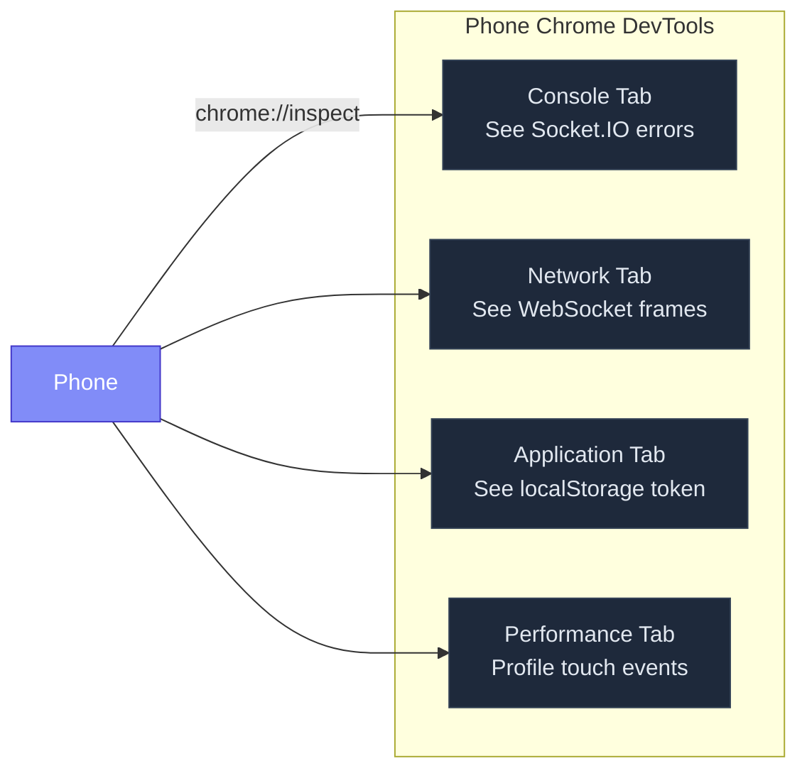

**On Android (Chrome):**
1. Connect phone to PC via USB
2. Enable Developer Options + USB Debugging on phone
3. Open `chrome://inspect` on PC Chrome
4. Select your phone and click "Inspect"

**On iOS (Safari):**
1. Enable Web Inspector on iPhone: Settings > Safari > Advanced > Web Inspector
2. Connect to PC via USB
3. Open Safari > Develop > [Your iPhone] > [TouchMorph tab]

### Client-Side Debug Shortcuts

Add to browser console:

```javascript
// Check session token
localStorage.getItem('touchmorph_session_token')

// Manually emit a mouse move
socket.emit('mouse:event', { type: 'move', x: 500, y: 300 })

// Force disconnect
socket.disconnect()

// Check connection status
socket.connected
```

---

## 18. Known Issues and Workarounds

### Issue: pyautogui Cursor Position Off on Multi-Monitor Setups

**Symptoms:** Cursor moves to wrong monitor or offset position.

**Cause:** pyautogui uses absolute screen coordinates. The phone's touch coordinates (0-phone_width, 0-phone_height) don't directly map to the screen.

**Workaround:** Map phone coordinates to screen coordinates in the server:

```python
# In socket_handler.py, on_mouse_event():
import tkinter as tk

def map_coordinates(phone_x, phone_y, phone_w, phone_h):
    root = tk.Tk()
    screen_w = root.winfo_screenwidth()
    screen_h = root.winfo_screenheight()
    root.destroy()
    
    mapped_x = int(phone_x * screen_w / phone_w)
    mapped_y = int(phone_y * screen_h / phone_h)
    return mapped_x, mapped_y
```

### Issue: Background Tab Disconnects After 5 Minutes on iOS

**Symptoms:** Connection drops after phone screen locks or app switches.

**Cause:** iOS aggressively suspends background tabs after ~5 minutes. The Wake Lock API on iOS 16+ helps but isn't guaranteed.

**Workaround:** None on iOS. The session persists in localStorage — when the user returns to the tab, it auto-reconnects and restores the pairing.

### Issue: Firefox Doesn't Support Wake Lock API

**Symptoms:** Screen locks during use, connection may drop.

**Cause:** Firefox has not implemented the Wake Lock API.

**Workaround:** Keep the phone awake via OS settings:
- **Android:** Settings > Display > Screen timeout > 10 minutes (or "Never" during use)
- **iOS:** Settings > Display & Brightness > Auto-Lock > 5 minutes (maximum)

### Issue: Cloudflare Tunnel URL Changes Every Time

**Symptoms:** New URL every time tunnel is started.

**Cause:** The free `trycloudflare.com` service assigns random subdomains.

**Workaround:** Use a paid Cloudflare plan with a custom domain and fixed subdomain. Or accept the random URLs — the email service delivers the URL automatically.

### Issue: High CPU Usage on Server

**Symptoms:** Fan spins up, CPU 50%+.

**Causes and Solutions:**
| Cause | Solution |
|-------|----------|
| Too many touch events per second | Throttle events client-side (60fps max) |
| Admin dashboard polling | Increase interval from 3s to 10s |
| SQLite writes on every event | Batch log writes (e.g., every 10 events) |
| Multiple active phone connections | Each phone adds minimal CPU — check for runaway processes |

---

## 19. Support Bundle

When requesting help, generate a support bundle:

```bash
# Windows
@echo off
echo === Version Info === > support.txt
python --version >> support.txt
node --version >> support.txt
echo. >> support.txt
echo === Server Output === >> support.txt
netstat -ano | findstr :3000 >> support.txt
echo. >> support.txt
echo === Database Stats === >> support.txt
sqlite3 server\touchmorph.db "SELECT count(*) as sessions FROM sessions;" >> support.txt
sqlite3 server\touchmorph.db "SELECT count(*) as logs FROM logs;" >> support.txt
echo. >> support.txt
echo === Environment === >> support.txt
type .env >> support.txt 2>nul
echo Support bundle saved to support.txt

# Linux / macOS
#!/bin/bash
cat > support.txt << EOF
=== Version Info ===
$(python --version 2>&1)
$(node --version 2>&1)
$(cloudflared --version 2>&1)

=== Server Status ===
$(curl -s http://localhost:3000/health 2>&1)

=== Port Status ===
$(lsof -i :3000 2>&1)

=== Database ===
Sessions: $(sqlite3 server/touchmorph.db "SELECT count(*) FROM sessions;" 2>&1)
Logs: $(sqlite3 server/touchmorph.db "SELECT count(*) FROM logs;" 2>&1)

=== Last 10 Log Entries ===
$(sqlite3 server/touchmorph.db "SELECT event, ts FROM logs ORDER BY id DESC LIMIT 10;" 2>&1)
EOF
echo "Support bundle: support.txt"
```

---

## 20. Version Compatibility

| TouchMorph Version | Python | aiohttp | python-socketio | pyautogui | Node.js | React | Vite |
|-------------------|--------|---------|-----------------|-----------|---------|-------|------|
| 1.0.0 | 3.10+ | 3.11+ | 5.12.1 | 0.9.54 | 18+ | 18.3 | 5.2+ |

### Breaking Changes

| Version | Change | Migration |
|---------|--------|-----------|
| — | (First release) | — |

### Future Compatibility Notes

- **Python 3.13:** aiohttp supports Python 3.13 (check latest version).
- **Node.js 22:** Vite 5.x supports Node.js 22.
- **Socket.IO v5:** python-socketio 5.x is compatible with socket.io-client 4.x.
- **pyautogui on M-series Macs:** Works via Rosetta 2; native ARM support available in newer versions.
